# Rockchip rkipc应用开发说明

文件标识：RK-KF-YF-937

发布版本：V1.6.0

日期：2022-12-02

文件密级：□绝密   □秘密   □内部资料   ■公开

**免责声明**

本文档按“现状”提供，瑞芯微电子股份有限公司（“本公司”，下同）不对本文档的任何陈述、信息和内容的准确性、可靠性、完整性、适销性、特定目的性和非侵权性提供任何明示或暗示的声明或保证。本文档仅作为使用指导的参考。

由于产品版本升级或其他原因，本文档将可能在未经任何通知的情况下，不定期进行更新或修改。

**商标声明**

“Rockchip”、“瑞芯微”、“瑞芯”均为本公司的注册商标，归本公司所有。

本文档可能提及的其他所有注册商标或商标，由其各自拥有者所有。

**版权所有 © 2022瑞芯微电子股份有限公司**

超越合理使用范畴，非经本公司书面许可，任何单位和个人不得擅自摘抄、复制本文档内容的部分或全部，并不得以任何形式传播。

瑞芯微电子股份有限公司

Rockchip Electronics Co., Ltd.

地址：     福建省福州市铜盘路软件园A区18号

网址：     [www.rock-chips.com](http://www.rock-chips.com)

客户服务电话： +86-4007-700-590

客户服务传真： +86-591-83951833

客户服务邮箱： [fae@rock-chips.com](mailto:fae@rock-chips.com)

---

**前言**

**概述**

本文档提供RKIPC应用开发说明。

**产品版本**

| **芯片名称**                       | **内核版本**    |
| ---------------------------------- | --------------- |
| RV1126/RV1109                      | Linux 4.19      |
| RK3588                             | Linux 5.10      |
| RV1103/RV1106                      | Linux 5.10      |

**读者对象**

本文档（本指南）主要适用于以下工程师：

技术支持工程师

软件开发工程师

**修订记录**

| **版本号** | **作者** | **修改日期** | **修改说明**                                                 |
| ---------- | -------- | :----------- | ------------------------------------------------------------ |
| V0.1.0     | 林刘迪铭 | 2021-09-23   | 初始版本                                                     |
| V0.2.0     | 林刘迪铭 | 2021-10-23   | 增加模块API介绍                                              |
| V0.3.0     | 林刘迪铭 | 2021-11-12   | 增加媒体流框图说明                                           |
| V0.4.0     | 林刘迪铭 | 2022-01-14   | 增加isp模块API介绍                                           |
| V0.5.0     | 林刘迪铭 | 2022-01-26   | 更新代码结构和产品类型                                       |
| V0.6.0     | 林刘迪铭 | 2022-02-21   | 更新RV1106信息                                               |
| V0.7.0     | 林刘迪铭 | 2022-05-05   | 更新RV1106电池类IPC框图                                      |
| V0.8.0     | 林刘迪铭 | 2022-05-11   | 添加ini参数说明                                              |
| V0.9.0     | 林刘迪铭 | 2022-05-16   | 修改RV1106 IPC框图                                           |
| V1.0.0     | 林刘迪铭 | 2022-05-19   | 调试ini中的isp相关参数                                       |
| V1.0.1     | 陈委问   | 2022-05-20   | 更新产品版本信息                                             |
| V1.1.0     | 林刘迪铭 | 2022-07-15   | 新增ini中的avs相关参数                                       |
| V1.2.0     | 林刘迪铭 | 2022-08-18   | 修改RV1106 IPC框图，去除卷绕部分。</br>新增RV1103 IPC框图。  |
| V1.3.0     | 林刘迪铭 | 2022-08-31   | 修改RK3588 Multi-IPC框图，JPEG改用VGS预处理，</br>AVS后增加VPSS用于cover。 |
| V1.4.0     | 林刘迪铭 | 2022-10-10   | 修改RV1106 IPC和RV1103 IPC的IVS模块流程框图，</br>rv1106_battery_ipc细分为rv1106_battery_ipc_client和rv1106_battery_ipc_tuya。 |
| V1.5.0     | 林刘迪铭 | 2022-10-25   | 修改ini模块参数说明，新增音视频模块API介绍。                 |
| V1.6.0     | 林刘迪铭 | 2022-12-02   | 新增RV1106 Dual-IPC框图。                                    |

---

**目录**

[TOC]

---

## 整体框架

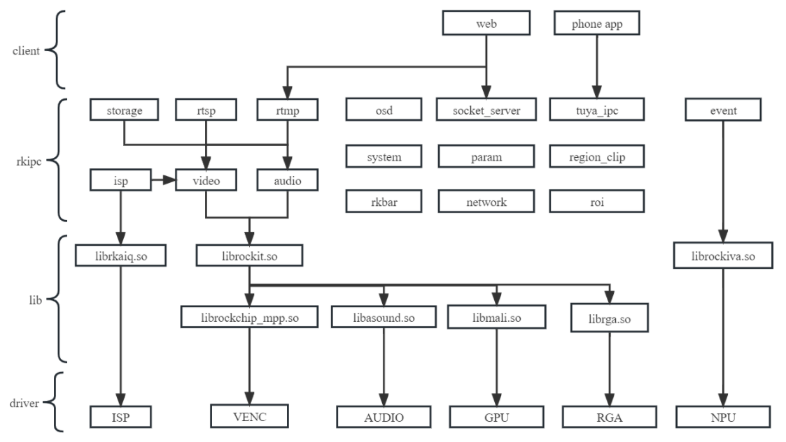

## 产品类型

| 源码目录                  | 依赖外部库       | 功能                                                         |
| ------------------------- | ---------------- | ------------------------------------------------------------ |
| rv1103_ipc                | rockit、rkaiq    | 针对rv1103平台的IPC产品，支持网页和rtsp/rtmp预览，参数动态修改，默认开启卷绕。 |
| rv1106_ipc                | rockit、rkaiq    | 针对rv1106平台的IPC产品，支持网页和rtsp/rtmp预览，参数动态修改，关闭卷绕。 |
| rv1106_battery_ipc_client | rockit、rkaiq    | 针对rv1103/rv1106平台的电池类产品，支持网页和rtsp/rtmp预览，参数动态修改，做为快速启动双进程的client。 |
| rv1106_battery_ipc_tuya   | rockit、rkaiq    | 针对rv1103/rv1106平台的电池类产品，支持涂鸦云手机APP预览，休眠唤醒功能。 |
| rv1106_dual_ipc           | rockit、rkaiq    | 针对rv1103/rv1106平台的双目拼接类产品，支持网页和rtsp/rtmp预览，参数动态修改。 |
| rk3588_ipc                | rockit、rkaiq    | 针对rk3588平台的单目IPC产品，支持网页和rtsp/rtmp预览，参数动态修改。 |
| rk3588_muliti_ipc         | rockit、rkaiq    | 针对rk3588平台的多目IPC产品，支持网页和rtsp/rtmp预览，参数动态修改。 |
| rv1126_ipc_rkmedia        | rockit、rkaiq    | 针对rv1126/rv1109平台的IPC产品，使用rkmedia，支持网页和rtsp/rtmp预览，参数动态修改。 |
| rv1126_ipc_rockit         | easymedia、rkaiq | 针对rv1126/rv1109平台的IPC产品，使用rockit，支持网页和rtsp/rtmp预览，参数动态修改。 |
| rv1126_battery_ipc        | rockit、rkaiq    | 针对rv1126/rv1109平台的电池类产品，支持涂鸦云手机APP预览，休眠唤醒功能。 |
| rv1126_snapshot           | easymedia、rkaiq | 针对rv1126/rv1109平台的抓拍类型产品，支持离线帧，本地拍照/录像，屏幕显示，插值放大(TODO)。 |

### RV1103 IPC

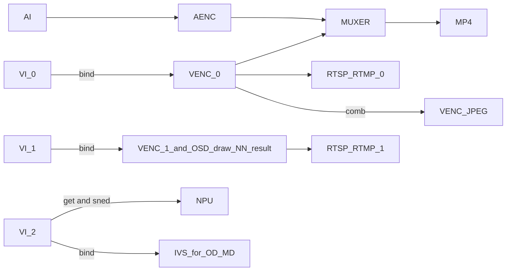

### RV1106 IPC

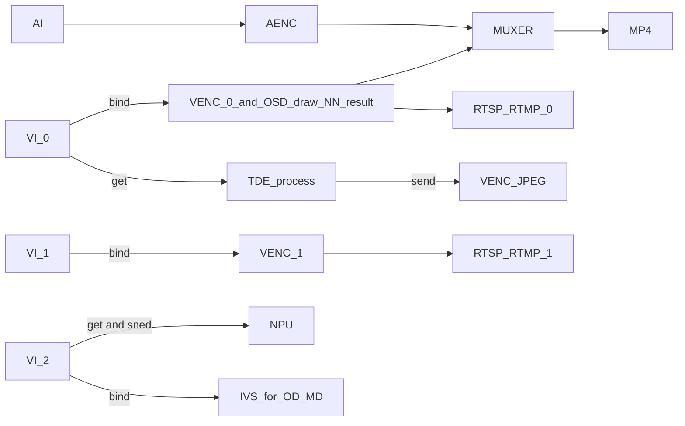

### RV1106 Battery IPC Client

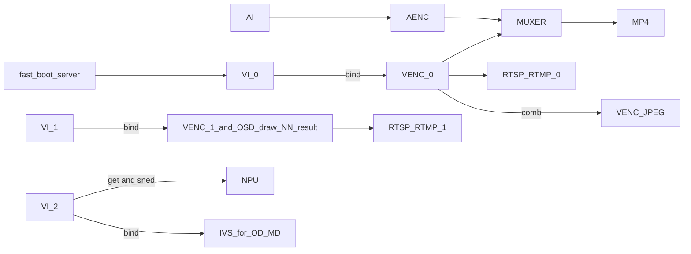

### RV1106 Battery IPC Tuya

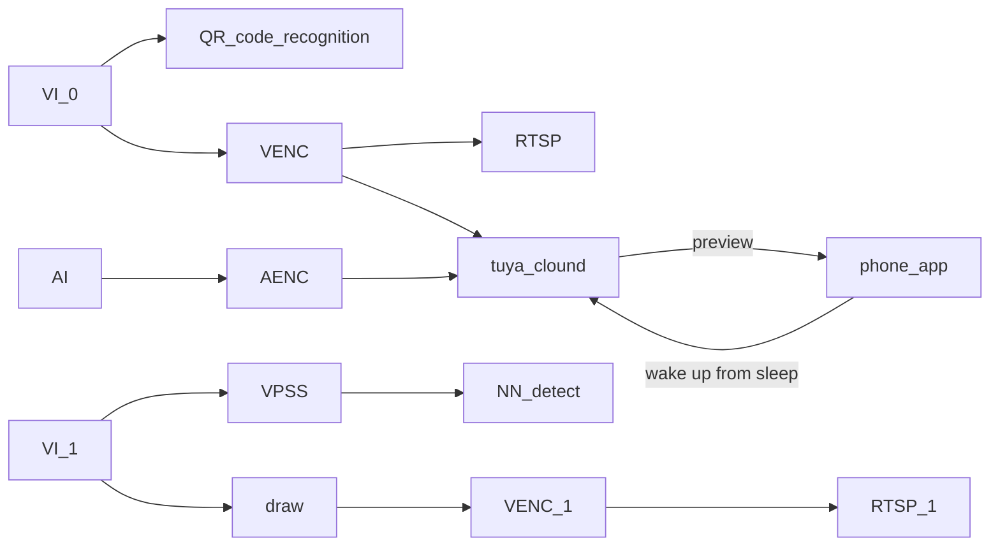

### RV1106 Dual-IPC
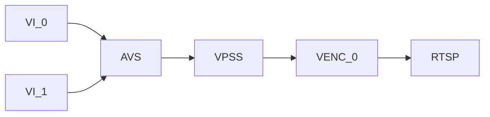

### RK3588 IPC

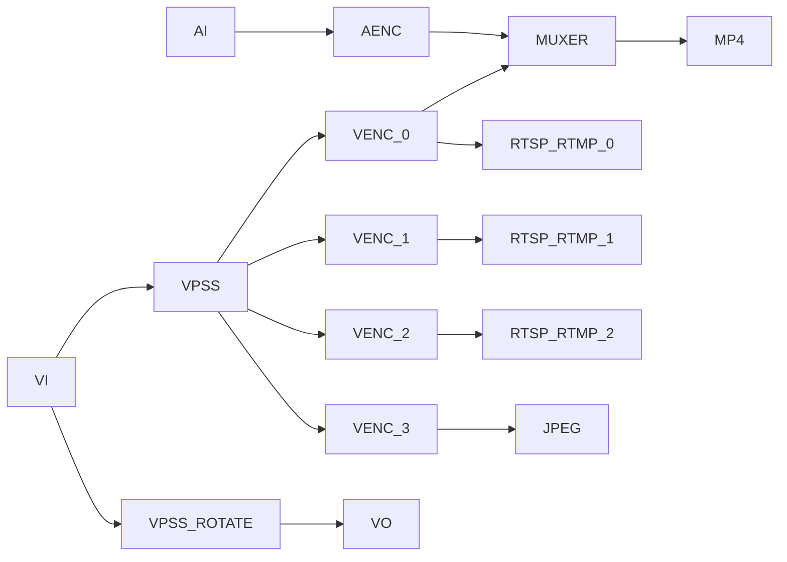

### RK3588 Multi-IPC

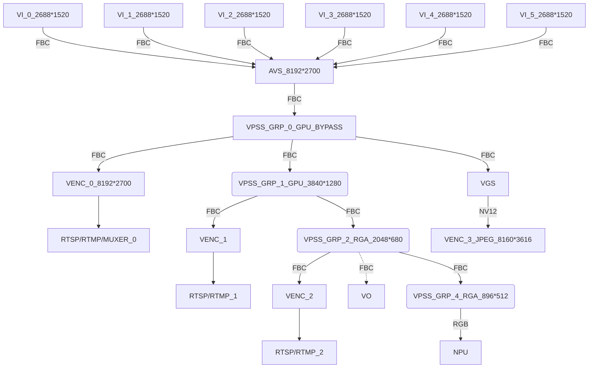

### RV1126 IPC Rkmedia

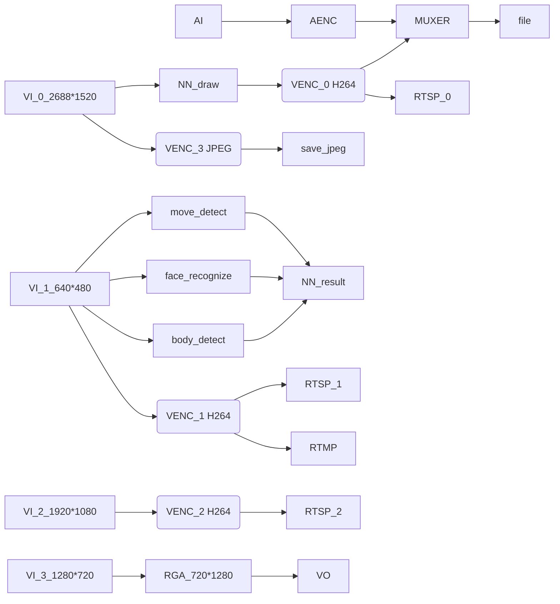

### RV1126 IPC Rockit


### RV1126 Battery IPC

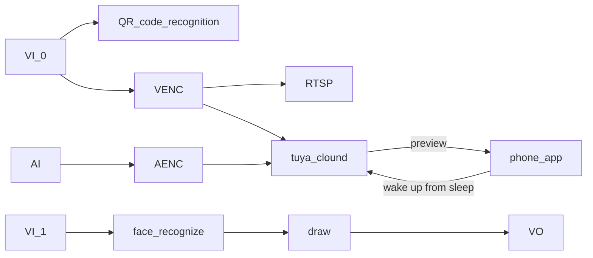

### RV1126 Snapshot

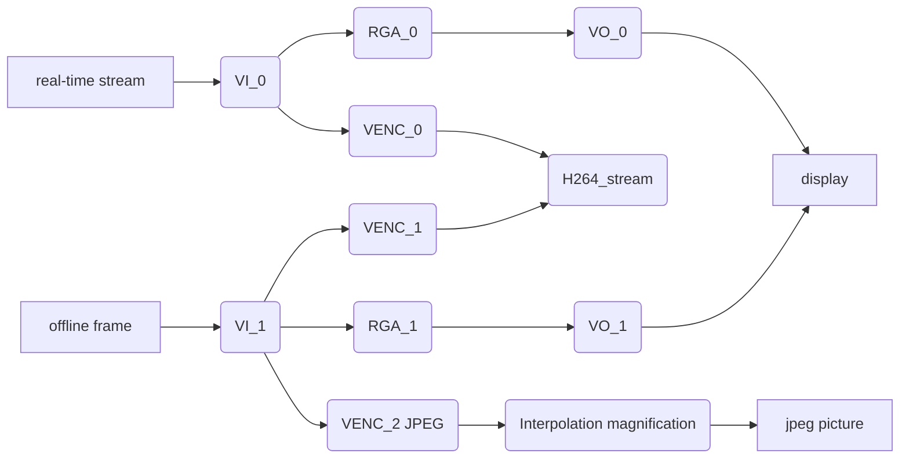

## 代码结构

```shell
├── CMakeLists.txt
├── common # 通用模块
│   ├── common.h # 一些通用函数功能
│   ├── event # 事件处理模块：移动侦测，人脸人形识别
│   ├── isp # 图像处理模块
│   │   ├── rk3588
│   │   ├── rv1106
│   │   └── rv1126
│   ├── log.h # 日志管理
│   ├── network # 网络模块
│   ├── osd # OSD模块
│   │   ├── image.bmp # logo图片
│   │   └── simsun_en.ttf # 字体库
│   ├── param # 参数管理模块
│   ├── rkbar # 二维码识别模块
│   ├── rockiva # 周界算法模块
│   ├── rtmp # rtmp推流模块
│   ├── rtsp # rtsp推流模块
│   ├── storage # 存储模块
│   └── system # 系统管理模块
│   └── tuya_ipc # 涂鸦IPC模块
├── format.sh # 格式化脚本
├── lib # 存放32/64位版本，不同工具链的预编译库
│   ├── aarch64-rockchip1031-linux-gnu
│   └── arm-rockchip830-linux-gnueabihf
├── LICENSE # 版权声明
└── src
    ├── low_memory_ipc
    ├── rk3588_ipc
    │   ├── audio # 音频业务逻辑
    │   ├── CMakeLists.txt
    │   ├── main.c
    │   ├── rkipc.ini # 参数文件
    │   ├── server # socket服务端
    │   └── video # 视频业务逻辑
    │       ├── video.c
    │       └── video.h
    ├── rk3588_muliti_ipc
    ├── rv1126_battery_ipc
    ├── rv1126_ipc_rkmedia
    ├── rv1126_ipc_rockit
    └── rv1126_snapshot
```

## 开发原则

0、**纯C代码实现**。

1、**模块化**，main函数尽量简洁，只调用各个模块的init和deinit函数。各个模块功能自己管理，差异化部分由注册回调函数实现。

2、**参数管理使用iniparser**，不做复杂封装，各个模块自行决定哪些参数在何时读写ini。

3、**log统一使用common/log.h。**

4、能通用的尽量放到common中，如果由于平台差异和业务逻辑无法通用，则每个src目录都放一份，避免加平台宏判断。

5、优先使用源码编译，其次使用静态库，最后才是选择用动态库。

## 新增参数开发流程

**web前端→web后端→rkipc→底层模块→保存参数**

以色调为例，前端基本已经实现不用改，web后端在app/ipcweb-backend/src/image_api.cpp里会收到"iHue":50，这样的json字符串。

然后调用app/ipcweb-backend/src/socket_client里封装好的函数，远程调用到rkipc中。

rkipc也要在app/rkipc/src/server中封装对应的函数，来进行设置生效并保存。

**建议新增函数时按get/set成对增加。**

rkipc主要封装函数供外部调用，以及初始化时设置。

举例如下:

### ini文件新增hue字段：

```ini
[isp.0.adjustment]
hue = 50
```

### isp模块新增set/get函数

```diff
diff --git a/src/isp/isp.c b/src/isp/isp.c
index e59fdd3..7877ae9 100644
--- a/src/isp/isp.c
+++ b/src/isp/isp.c
@@ -165,6 +165,22 @@ int rk_isp_set_sharpness(int cam_id, int value) {
   return ret;
 }

+int rk_isp_get_hue(int cam_id, int *value) {
+  RK_ISP_CHECK_CAMERA_ID(cam_id);
+  int ret = rk_aiq_uapi_getHue(g_aiq_ctx[cam_id], value);
+  *value = (int)(*value / 2.55);
+
+  return ret;
+}
+
+int rk_isp_set_hue(int cam_id, int value) {
+  RK_ISP_CHECK_CAMERA_ID(cam_id);
+  int ret = rk_aiq_uapi_setHue(g_aiq_ctx[cam_id], (int)(value * 2.55)); // value[0,255]
+  rk_param_set_int("isp.0.adjustment:hue", value);
+
+  return ret;
+}
+
 // exposure
 // night_to_day
 // blc
@@ -180,6 +196,7 @@ int rk_isp_set_from_ini(int cam_id) {
   rk_isp_set_brightness(cam_id, iniparser_getint(g_ini_d_, "isp.0.adjustment:brightness", 50));
   rk_isp_set_saturation(cam_id, iniparser_getint(g_ini_d_, "isp.0.adjustment:saturation", 50));
   rk_isp_set_sharpness(cam_id, iniparser_getint(g_ini_d_, "isp.0.adjustment:sharpness", 50));
+  rk_isp_set_hue(cam_id, iniparser_getint(g_ini_d_, "isp.0.adjustment:hue", 50));
   LOG_INFO("end\n");

   return ret;
diff --git a/src/isp/isp.h b/src/isp/isp.h
index e77c9fc..0d3835a 100644
--- a/src/isp/isp.h
+++ b/src/isp/isp.h
@@ -9,4 +9,6 @@ int rk_isp_get_saturation(int cam_id, int *value);
 int rk_isp_set_saturation(int cam_id, int value);
 int rk_isp_get_sharpness(int cam_id, int *value);
 int rk_isp_set_sharpness(int cam_id, int value);
+int rk_isp_get_hue(int cam_id, int *value);
+int rk_isp_set_hue(int cam_id, int value);
 // exposure
```

### server模块封装socket函数

```diff
diff --git a/src/server/server.c b/src/server/server.c
index 6613b90..52692c9 100644
--- a/src/server/server.c
+++ b/src/server/server.c
@@ -236,6 +236,40 @@ int ser_rk_isp_set_sharpness(int fd) {
   return 0;
 }

+int ser_rk_isp_get_hue(int fd) {
+  int err = 0;
+  int cam_id;
+  int value;
+
+  if (sock_read(fd, &cam_id, sizeof(cam_id)) == SOCKERR_CLOSED)
+    return -1;
+  err = rk_isp_get_hue(cam_id, &value);
+  LOG_DEBUG("value is %d\n", value);
+  if (sock_write(fd, &value, sizeof(value)) == SOCKERR_CLOSED)
+    return -1;
+  if (sock_write(fd, &err, sizeof(int)) == SOCKERR_CLOSED)
+    return -1;
+
+  return 0;
+}
+
+int ser_rk_isp_set_hue(int fd) {
+  int err = 0;
+  int cam_id;
+  int value;
+
+  if (sock_read(fd, &cam_id, sizeof(cam_id)) == SOCKERR_CLOSED)
+    return -1;
+  if (sock_read(fd, &value, sizeof(value)) == SOCKERR_CLOSED)
+    return -1;
+  LOG_DEBUG("value is %d\n", value);
+  err = rk_isp_set_hue(cam_id, value);
+  if (sock_write(fd, &err, sizeof(int)) == SOCKERR_CLOSED)
+    return -1;
+
+  return 0;
+}
+
 static const struct FunMap map[] = {
     {(char *)"rk_isp_set", &ser_rk_isp_set},
     {(char *)"rk_video_set", &ser_rk_video_set},
@@ -247,7 +281,9 @@ static const struct FunMap map[] = {
     {(char *)"rk_isp_get_saturation", &ser_rk_isp_get_saturation},
     {(char *)"rk_isp_set_saturation", &ser_rk_isp_set_saturation},
     {(char *)"rk_isp_get_sharpness", &ser_rk_isp_get_sharpness},
-    {(char *)"rk_isp_set_sharpness", &ser_rk_isp_set_sharpness}
+    {(char *)"rk_isp_set_sharpness", &ser_rk_isp_set_sharpness},
+    {(char *)"rk_isp_get_hue", &ser_rk_isp_get_hue},
+    {(char *)"rk_isp_set_hue", &ser_rk_isp_set_hue}
 };

 static void *rec_thread(void *arg) {
```

### web后端新增相关判断

ipcweb-backend主要判断web前端传入的数据，进而Get/Set数据，修改如下

```diff
diff --git a/src/image_api.cpp b/src/image_api.cpp
index 475e17d..edac2de 100644
--- a/src/image_api.cpp
+++ b/src/image_api.cpp
@@ -20,15 +20,17 @@ nlohmann::json image_specific_resource_get(std::string string) {
       nlohmann::json::object(); /* one of all the same resources */
   minilog_debug("%s: string is %s\n", __func__, string.c_str());
   if (!string.compare(PATH_IMAGE_ADJUSTMENT)) {
-    int brightness, contrast, saturation, sharpness;
+    int brightness, contrast, saturation, sharpness, hue;
     rk_isp_get_brightness(0, &brightness);
     rk_isp_get_contrast(0, &contrast);
     rk_isp_get_saturation(0, &saturation);
     rk_isp_get_sharpness(0, &sharpness);
+    rk_isp_get_hue(0, &hue);
     specific_resource.emplace("iBrightness", brightness);
     specific_resource.emplace("iContrast", contrast);
     specific_resource.emplace("iSaturation", saturation);
     specific_resource.emplace("iSharpness", sharpness);
+    specific_resource.emplace("iHue", hue);
   } else if (!string.compare(PATH_IMAGE_EXPOSURE)) {

   } else if (!string.compare(PATH_IMAGE_NIGHT_TO_DAY)) {
@@ -84,6 +86,10 @@ void image_specific_resource_set(std::string string, nlohmann::json data) {
       value = atoi(data.at("iSharpness").dump().c_str());
       rk_isp_set_sharpness(0, value);
     }
+    if (data.dump().find("iHue") != data.dump().npos) {
+      value = atoi(data.at("iHue").dump().c_str());
+      rk_isp_set_hue(0, value);
+    }
   } else if (!string.compare(PATH_IMAGE_EXPOSURE)) {

   } else if (!string.compare(PATH_IMAGE_NIGHT_TO_DAY)) {
diff --git a/src/socket_client/client.cpp b/src/socket_client/client.cpp
index 448e847..7f84b4f 100644
--- a/src/socket_client/client.cpp
+++ b/src/socket_client/client.cpp
@@ -182,4 +182,36 @@ int rk_isp_set_sharpness(int cam_id, int value) {
   cli_end(fd);

   return ret;
 }
+
+int rk_isp_get_hue(int cam_id, int *value) {
+  int fd;
+  int ret = 0;
+
+  fd = cli_begin((char *)__func__);
+  /* Transmission parameters */
+  sock_write(fd, &cam_id, sizeof(cam_id));
+  sock_read(fd, value, sizeof(value));
+
+  sock_read(fd, &ret, sizeof(ret));
+  /* End transmission parameters */
+  cli_end(fd);
+
+  return ret;
+}
+
+int rk_isp_set_hue(int cam_id, int value) {
+  int fd;
+  int ret = 0;
+
+  fd = cli_begin((char *)__func__);
+  /* Transmission parameters */
+  sock_write(fd, &cam_id, sizeof(cam_id));
+  sock_write(fd, &value, sizeof(value));
+
+  sock_read(fd, &ret, sizeof(ret));
+  /* End transmission parameters */
+  cli_end(fd);
+
+  return ret;
+}
diff --git a/src/socket_client/client.h b/src/socket_client/client.h
index 11fdd1c..0c09913 100644
--- a/src/socket_client/client.h
+++ b/src/socket_client/client.h
@@ -8,4 +8,6 @@ int rk_isp_set_brightness(int cam_id, int value);
 int rk_isp_get_saturation(int cam_id, int *value);
 int rk_isp_set_saturation(int cam_id, int value);
 int rk_isp_get_sharpness(int cam_id, int *value);
 int rk_isp_set_sharpness(int cam_id, int value);
+int rk_isp_get_hue(int cam_id, int *value);
+int rk_isp_set_hue(int cam_id, int value);
\ No newline at end of file
```

### web前端新增相关判断

web前端修改html和ts文件，新增选项布局和get/set。

代码可参考app/ipcweb-ng/src/app/config/shared/isp中的html和ts，主要部分如下：

```html
<form class="form" [formGroup]="imageForm">
      <div id=ispGrp role="tablist">
        <div class="card" *ngFor="let cardTitle of cardList">
          <div id="ispGrp1Header" class="card-header" (click)="onSelectCard(cardTitle)">
            <label>{{ groupNameDict[cardTitle] | translate }}</label>
          </div>
          <div class="card-body card-block form-group" [id]="cardTitle" [formGroupName]="groupNameDict[cardTitle]">
            <ng-container *ngIf="capDict[cardTitle][layoutKey]">
              <ng-container *ngFor="let layoutItem of capDict[cardTitle][layoutKey][cardTitle]">
                <div class="form-row my-1" *ngIf="checkType(capDict[cardTitle][pageLayoutKey][layoutItem], 'range')">
                  <label class="col-3">{{ transferControlName(layoutItem) | translate }}</label>
                  <input class="col-6 custom-range" [formControlName]="layoutItem" type="range" (ngModelChange)="onRangeChange($event, cardTitle, layoutItem)" (mouseup)="onSubmitPart(cardTitle, layoutItem, 'range')" [min]="getRange(capDict[cardTitle][pageLayoutKey][layoutItem], 'min')" [max]="getRange(capDict[cardTitle][pageLayoutKey][layoutItem], 'max')" [step]="getRange(capDict[cardTitle][pageLayoutKey][layoutItem], 'step')">
                  <input class="col-2 form-control" [formControlName]="layoutItem" type="number" (ngModelChange)="onRangeChange($event, cardTitle, layoutItem)" (blur)="onSubmitPart(cardTitle, layoutItem, 'number')" [id]="layoutItem">
                  <label class="alarm-tip pat1" *ngIf="imageForm.get(groupNameDict[cardTitle]).get(layoutItem).errors?.min || imageForm.get(groupNameDict[cardTitle]).get(layoutItem).errors?.max || imageForm.get(groupNameDict[cardTitle]).get(layoutItem).errors?.isNumberJudge">{{'ranges' | translate}}({{getRange(capDict[cardTitle][pageLayoutKey][layoutItem], 'min')}}~{{getRange(capDict[cardTitle][pageLayoutKey][layoutItem], 'max')}})</label>
                </div>
                <div class="form-row my-1" *ngIf="checkType(capDict[cardTitle][pageLayoutKey][layoutItem], 'options') && isItemEnable(layoutItem)">
                  <label class="col-3 form-group-text mt-1">{{ transferControlName(layoutItem) | translate }}</label>
                  <select class="custom-select col-md-8" [formControlName]="layoutItem" (ngModelChange)="updateDynamicCap(cardTitle, layoutItem, $event)" [id]="layoutItem">
                    <option *ngFor="let opItem of htmlOptionFilter(layoutItem, capDict[cardTitle][pageLayoutKey][layoutItem]['options'])" [value]="opItem">{{ htmlOptionTransfer(layoutItem, opItem) | translate }}</option>
                  </select>
                </div>
                <div class="form-row my-1" *ngIf="checkType(capDict[cardTitle][pageLayoutKey][layoutItem], 'input') && capDict[cardTitle][pageLayoutKey][layoutItem]['input']==='time'">
                  <label class="col-3">{{ transferControlName(layoutItem) | translate }}</label>
                  <input type="time" step=1 [formControlName]="layoutItem" (blur)="onSubmitPart(cardTitle, layoutItem, 'time')" [id]="layoutItem">
                </div>
              </ng-container>
            </ng-container>
          </div>
        </div>
      </div>
    </form>
```

```typescript
imageForm = this.fb.group({
    id: [''],
    imageAdjustment: this.fb.group({
      iBrightness: [''],
      iContrast: [''],
      iSaturation: [''],
      iSharpness: [''],
      iHue: ['']
    })
});

get imageAdjustment(): FormGroup {
    return this.imageForm.get('imageAdjustment') as FormGroup;
}

submitOne(groupName: string, isReboot: boolean = false, isAppRestart = false) {
    if (!this.isInit || this.lock.checkLock('submitOne')) {
      return;
    }
    this.lock.lock('submitOne');
    this.pfs.formatInt(this.imageForm.value[groupName]);
    const path = this.group2path[groupName];
    this.cfgService.setImageInterfacePart(this.imageForm.value[groupName], path, this.imageForm.value['id']).subscribe(
      res => {
        this.resError.analyseRes(res, 'saveFail');
        this.setAlarmTip(res, groupName);
        this.imageForm.get(groupName).patchValue(res);
        if (isReboot) {
          this.tips.setCTPara('restart');
        } else if (isAppRestart) {
          this.tips.setRbTip('appRestart');
        } else {
          this.tips.showSaveSuccess();
        }
        this.lock.unlock('submitOne');
      },
      err => {
        if (isReboot) {
          this.tips.setCTPara('close');
        }
        this.tips.showSaveFail();
        this.lock.unlock('submitOne');
      }
    );
  }
```

## 模块API介绍

### 网络模块

| 函数名称                        | 功能                      |
| ------------------------------- | ------------------------- |
| rk_network_init                 | 网络模块初始化            |
| rk_network_deinit               | 网络模块反初始化          |
| rk_network_ipv4_set             | 设置IPv4                  |
| rk_network_ipv4_get             | 获取IPv4配置              |
| rk_network_dns_get              | 取得当前有线网卡使用的dns |
| rk_network_dns_set              | 设置当前有线网卡使用的dns |
| rk_network_get_mac              | 获取设备MAC地址           |
| rk_network_set_mac              | 设置设备MAC地址           |
| rk_network_nicspeed_get         | 获取网卡速率              |
| rk_network_nicspeed_set         | 设置网卡速率              |
| rk_network_nicspeed_support_get | 获取网卡支持速率          |
| rk_ethernet_power_set           | 开关以太网                |
| rk_nic_state_get                | 取得当前网卡状态          |
| rk_wifi_power_get               | 获取当前wifi状态          |
| rk_wifi_power_set               | 开关wifi                  |
| rk_wifi_scan_wifi               | 立即扫描wifi              |
| rk_wifi_get_list                | 获取wifi列表              |
| rk_wifi_connect_with_ssid       | 连接wifi                  |
| rk_wifi_forget_with_ssid        | 删除wifi                  |

### 封装模块

| 函数名称                  | 功能             |
| ------------------------- | ---------------- |
| rkmuxer_init              | 封装模块初始化   |
| rkmuxer_deinit            | 封装模块反初始化 |
| rkmuxer_write_video_frame | 视频帧写入       |
| rkmuxer_write_audio_frame | 音频帧写入       |

### 存储模块

| 函数名称                     | 功能             |
| ---------------------------- | ---------------- |
| rk_storage_init              | 存储模块初始化   |
| rk_storage_deinit            | 存储模块反初始化 |
| rk_storage_write_video_frame | 视频帧写入       |
| rk_storage_write_audio_frame | 音频帧写入       |
| rk_storage_record_start      | 录像开始         |
| rk_storage_record_stop       | 录像停止         |
| rk_storage_record_status_get | 录像状态获取     |

### OSD模块

由于rkmedia和rockit库中，对OSD的具体实现方式不一样，为了使OSD模块业务逻辑抽象化，和video模块解耦合，使用了回调函数注册的方式。

通过注册相关函数，可以采用不同的实现，而上层逻辑保持相同。

| 函数名称                               | 功能                   |
| -------------------------------------- | ---------------------- |
| rk_osd_cover_create_callback_register  | 创建遮罩的回调函数注册 |
| rk_osd_cover_destroy_callback_register | 销毁遮罩的回调函数注册 |
| rk_osd_bmp_create_callback_register    | 创建bmp的回调函数注册  |
| rk_osd_bmp_destroy_callback_register   | 销毁bmp的回调函数注册  |
| rk_osd_bmp_change_callback_register    | 更改bmp的回调函数注册  |
| rk_osd_init                            | osd模块初始化          |
| rk_osd_deinit                          | osd模块反初始化        |
| rk_osd_restart                         | osd模块重启            |
| fill_image                             | 填充图像               |
| fill_text                              | 生成文字图像并填充     |
| generate_date_time                     | 生成宽字符型时间戳     |
| rk_osd_get_font_size                   | 获取字体大小           |
| rk_osd_set_font_size                   | 设置字体大小           |
| rk_osd_get_font_color                  | 获取字体颜色           |
| rk_osd_set_font_color                  | 设置字体颜色           |
| rk_osd_get_font_path                   | 获取字体文件路径       |
| rk_osd_set_font_path                   | 设置字体文件路径       |
| rk_osd_get_enabled                     | 获取使能状态           |
| rk_osd_set_enabled                     | 设置使能状态           |
| rk_osd_get_position_x                  | 获取横坐标             |
| rk_osd_set_position_x                  | 设置横坐标             |
| rk_osd_get_position_y                  | 获取纵坐标             |
| rk_osd_set_position_y                  | 设置纵坐标             |
| rk_osd_get_height                      | 获取高度               |
| rk_osd_set_height                      | 设置高度               |
| rk_osd_get_width                       | 获取宽度               |
| rk_osd_set_width                       | 设置宽度               |
| rk_osd_get_display_text                | 获取显示文本           |
| rk_osd_set_display_text                | 设置显示文本           |
| rk_osd_get_image_path                  | 获取图像文件路径       |
| rk_osd_set_image_path                  | 设置图像文件路径       |

### 系统模块

目前初始ini文件默认为/usr/share/rkipc.ini，启动脚本判断/userdata中无rkipc.ini时，会拷贝到其中。

恢复出厂设置时，会把/usr/share/rkipc.ini拷贝为/userdata/rkipc.ini。

| 函数名称                 | 功能             |
| ------------------------ | ---------------- |
| rk_system_init           | 系统模块初始化   |
| rk_system_deinit         | 系统模块反初始化 |
| rk_system_reboot         | 重启             |
| rk_system_factory_reset  | 恢复出厂设置     |
| rk_system_export_log     | 导出日志         |
| rk_system_export_db      | 导出配置文件     |
| rk_system_import_db      | 导入配置文件     |
| rk_system_upgrade        | 系统升级         |
| rk_system_get_user_num   | 获取用户数       |
| rk_system_set_user_num   | 设置用户数       |
| rk_system_get_user_level | 获取用户权限     |
| rk_system_set_user_level | 设置用户权限     |
| rk_system_get_user_name  | 获取用户名       |
| rk_system_set_user_name  | 设置用户名       |
| rk_system_get_password   | 获取密码(已加密) |
| rk_system_set_password   | 设置密码(已加密) |
| rk_system_add_user       | 新增用户         |
| rk_system_del_user       | 删除用户         |

### 事件模块

目前仅支持rv1126_ipc_rkmedia

| 函数名称                          | 功能                   |
| --------------------------------- | ---------------------- |
| rk_event_init                     | 事件模块初始化         |
| rk_event_deinit                   | 事件模块反初始化       |
| rk_event_ri_get_enabled           | 获取区域入侵使能状态   |
| rk_event_ri_set_enabled           | 设置区域入侵使能状态   |
| rk_event_ri_get_position_x        | 获取区域入侵的x坐标    |
| rk_event_ri_set_position_x        | 设置区域入侵的x坐标    |
| rk_event_ri_get_position_y        | 获取区域入侵的y坐标    |
| rk_event_ri_set_position_y        | 设置区域入侵的x坐标    |
| rk_event_ri_get_width             | 获取区域入侵的宽度     |
| rk_event_ri_set_width             | 设置区域入侵的宽度     |
| rk_event_ri_get_height            | 获取区域入侵的高度     |
| rk_event_ri_set_height            | 设置区域入侵的高度     |
| rk_event_ri_get_proportion        | 获取区域入侵的占比     |
| rk_event_ri_set_proportion        | 设置区域入侵的占比     |
| rk_event_ri_get_sensitivity_level | 获取区域入侵的灵敏度   |
| rk_event_ri_set_sensitivity_level | 设置区域入侵的灵敏度   |
| rk_event_ri_get_time_threshold    | 获取区域入侵的时间阈值 |
| rk_event_ri_set_time_threshold    | 设置区域入侵的时间阈值 |

### rtmp推流模块

| 函数名称                  | 功能             |
| ------------------------- | ---------------- |
| rk_rtmp_init              | rtmp模块初始化   |
| rk_rtmp_deinit            | rtmp模块反初始化 |
| rk_rtmp_write_video_frame | 写视频帧         |
| rk_rtmp_write_audio_frame | 写音频帧         |

### rtsp推流模块

| 函数名称           | 功能              |
| ------------------ | ----------------- |
| create_rtsp_demo   | 创建句柄          |
| rtsp_new_session   | 根据URL，创建会话 |
| rtsp_set_video     | 设置视频流格式    |
| rtsp_set_audio     | 设置音频流格式    |
| rtsp_sync_video_ts | 同步视频时间戳    |
| rtsp_sync_audio_ts | 同步音频时间戳    |
| rtsp_del_session   | 删除会话          |
| rtsp_del_demo      | 删除句柄          |
| rtsp_tx_video      | 送视频帧          |
| rtsp_tx_audio      | 送音频帧          |
| rtsp_do_event      | 执行操作          |

### ISP模块

| 函数名称                             | 功能             |
| ------------------------------------ | ---------------- |
| rk_isp_init                          | 单摄像头初始化   |
| rk_isp_deinit                        | 单摄像头反初始化 |
| rk_isp_group_init                    | 多摄像头初始化   |
| rk_isp_group_deinit                  | 多摄像头反初始化 |
| rk_isp_set_frame_rate                | 设置帧率         |
| rk_isp_get_contrast                  | 获取对比度       |
| rk_isp_set_contrast                  | 设置对比度       |
| rk_isp_get_brightness                | 获取亮度         |
| rk_isp_set_brightness                | 设置亮度         |
| rk_isp_get_saturation                | 获取饱和度       |
| rk_isp_set_saturation                | 设置饱和度       |
| rk_isp_get_sharpness                 | 获取锐度         |
| rk_isp_set_sharpness                 | 设置锐度         |
| rk_isp_get_hue                       | 获取色调         |
| rk_isp_set_hue                       | 设置色调         |
| rk_isp_get_exposure_mode             | 获取曝光模式     |
| rk_isp_set_exposure_mode             | 设置曝光模式     |
| rk_isp_get_gain_mode                 | 获取增益模式     |
| rk_isp_set_gain_mode                 | 设置增益模式     |
| rk_isp_get_exposure_time             | 获取曝光时间     |
| rk_isp_set_exposure_time             | 设置曝光时间     |
| rk_isp_get_exposure_gain             | 获取增益         |
| rk_isp_set_exposure_gain             | 设置增益         |
| rk_isp_get_hdr                       | 获取高动态模式   |
| rk_isp_set_hdr                       | 设置高动态模式   |
| rk_isp_get_blc_region                | 获取背光模式     |
| rk_isp_set_blc_region                | 设置背光模式     |
| rk_isp_get_hlc                       | 获取强光抑制模式 |
| rk_isp_set_hlc                       | 设置强光抑制模式 |
| rk_isp_get_hdr_level                 | 获取高动态级别   |
| rk_isp_set_hdr_level                 | 设置高动态级别   |
| rk_isp_get_blc_strength              | 获取背光强度     |
| rk_isp_set_blc_strength              | 设置背光强度     |
| rk_isp_get_hlc_level                 | 获取强光抑制等级 |
| rk_isp_set_hlc_level                 | 设置强光抑制等级 |
| rk_isp_get_dark_boost_level          | 获取暗区增强等级 |
| rk_isp_set_dark_boost_level          | 设置暗区增强等级 |
| rk_isp_get_white_blance_style        | 获取白平衡模式   |
| rk_isp_set_white_blance_style        | 设置白平衡模式   |
| rk_isp_get_white_blance_red          | 获取白平衡R增益  |
| rk_isp_set_white_blance_red          | 设置白平衡R增益  |
| rk_isp_get_white_blance_green        | 获取白平衡G增益  |
| rk_isp_set_white_blance_green        | 设置白平衡G增益  |
| rk_isp_get_white_blance_blue         | 获取白平衡B增益  |
| rk_isp_set_white_blance_blue         | 设置白平衡B增益  |
| rk_isp_get_noise_reduce_mode         | 获取降噪模式     |
| rk_isp_set_noise_reduce_mode         | 设置降噪模式     |
| rk_isp_get_dehaze                    | 获取去雾模式     |
| rk_isp_set_dehaze                    | 设置去雾模式     |
| rk_isp_get_gray_scale_mode           | 获取灰度范围     |
| rk_isp_set_gray_scale_mode           | 设置灰度范围     |
| rk_isp_get_distortion_correction     | 获取畸变矫正模式 |
| rk_isp_set_distortion_correction     | 设置畸变矫正模式 |
| rk_isp_get_spatial_denoise_level     | 获取空域降噪等级 |
| rk_isp_set_spatial_denoise_level     | 设置空域降噪等级 |
| rk_isp_get_temporal_denoise_level    | 获取时域降噪等级 |
| rk_isp_set_temporal_denoise_level    | 设置时域降噪等级 |
| rk_isp_get_dehaze_level              | 获取去雾等级     |
| rk_isp_set_dehaze_level              | 设置去雾等级     |
| rk_isp_get_ldch_level                | 获取LDCH等级     |
| rk_isp_set_ldch_level                | 设置LDCH等级     |
| rk_isp_get_power_line_frequency_mode | 获取视频制式     |
| rk_isp_set_power_line_frequency_mode | 设置视频制式     |
| rk_isp_get_image_flip                | 获取镜像翻转     |
| rk_isp_set_image_flip                | 设置镜像翻转     |
| rk_isp_get_af_mode                   | 获取自动对焦模式 |
| rk_isp_set_af_mode                   | 设置自动对焦模式 |
| rk_isp_get_zoom_level                | 获取放大缩小等级 |
| rk_isp_set_zoom_level                | 设置放大缩小等级 |
| rk_isp_af_zoom_in                    | 放大             |
| rk_isp_af_zoom_out                   | 缩小             |
| rk_isp_af_focus_in                   | 聚焦             |
| rk_isp_af_focus_out                  | 失焦             |

### 音频模块

| 函数名称                 | 功能                   |
| ------------------------ | ---------------------- |
| rkipc_audio_rtsp_init    | rtsp音频初始化         |
| rkipc_audio_init         | 音频模块初始化         |
| rkipc_audio_deinit       | 音频模块反初始化       |
| rk_audio_restart         | 重启音频模块           |
| rk_audio_get_bit_rate    | 获取比特率             |
| rk_audio_set_bit_rate    | 设置比特率             |
| rk_audio_get_sample_rate | 获取采样率             |
| rk_audio_set_sample_rate | 设置采样率             |
| rk_audio_get_volume      | 获取音量               |
| rk_audio_set_volume      | 设置音量               |
| rk_audio_get_enable_vqe  | 获取音频3A算法是否使能 |
| rk_audio_set_enable_vqe  | 设置音频3A算法是否使能 |
| rk_audio_get_encode_type | 获取编码类型           |
| rk_audio_set_encode_type | 设置编码类型           |

### 视频模块

| 函数名称                      | 功能                    |
| ----------------------------- | ----------------------- |
| rk_video_init                 | 视频模块初始化          |
| rk_video_deinit               | 视频模块反初始化        |
| rk_video_restart              | 重启视频模块            |
| rk_video_get_gop              | 获取I帧间隔             |
| rk_video_set_gop              | 设置I帧间隔             |
| rk_video_get_max_rate         | 获取最大码率            |
| rk_video_set_max_rate         | 设置最大码率            |
| rk_video_get_RC_mode          | 获取码率控制类型        |
| rk_video_set_RC_mode          | 设置码率控制类型        |
| rk_video_get_output_data_type | 获取编码类型            |
| rk_video_set_output_data_type | 设置编码类型            |
| rk_video_get_rc_quality       | 获取码率控制质量        |
| rk_video_set_rc_quality       | 设置码率控制质量        |
| rk_video_get_smart            | 获取智能编码状态        |
| rk_video_set_smart            | 设置智能编码状态        |
| rk_video_get_gop_mode         | 获取gop模式             |
| rk_video_set_gop_mode         | 设置gop模式             |
| rk_video_get_stream_type      | 获取码流名称            |
| rk_video_set_stream_type      | 设置码流名称            |
| rk_video_get_h264_profile     | 获取h264的profile       |
| rk_video_set_h264_profile     | 设置h264的profile       |
| rk_video_get_resolution       | 获取分辨率              |
| rk_video_set_resolution       | 设置分辨率              |
| rk_video_get_frame_rate       | 获取输入帧率            |
| rk_video_set_frame_rate       | 设置输入帧率            |
| rk_video_get_frame_rate_in    | 获取输出帧率            |
| rk_video_set_frame_rate_in    | 设置输出帧率            |
| rk_video_get_rotation         | 获取旋转角度            |
| rk_video_set_rotation         | 设置旋转角度            |
| rk_video_get_smartp_viridrlen | 获取smartP的虚拟I帧长度 |
| rk_video_set_smartp_viridrlen | 设置smartP的虚拟I帧长度 |

#### IVS模块

| 函数名称                    | 功能                 |
| --------------------------- | -------------------- |
| rk_video_get_md_switch      | 获取移动侦测开关状态 |
| rk_video_set_md_switch      | 设置移动侦测开关状态 |
| rk_video_get_md_sensebility | 获取移动侦测灵敏度   |
| rk_video_set_md_sensebility | 设置移动侦测灵敏度   |
| rk_video_get_od_switch      | 获取隐私遮挡开关状态 |
| rk_video_set_od_switch      | 设置隐私遮挡开关状态 |

#### JPEG模块

| 函数名称                           | 功能                 |
| ---------------------------------- | -------------------- |
| rk_video_get_enable_cycle_snapshot | 获取定时抓拍开关状态 |
| rk_video_set_enable_cycle_snapshot | 设置定时抓拍开关状态 |
| rk_video_get_image_quality         | 获取图像质量         |
| rk_video_set_image_quality         | 设置图像质量         |
| rk_video_get_snapshot_interval_ms  | 获取抓拍间隔         |
| rk_video_set_snapshot_interval_ms  | 设置抓拍间隔         |
| rk_video_get_jpeg_resolution       | 获取jpeg分辨率       |
| rk_video_set_jpeg_resolution       | 设置jpeg分辨率       |
| rk_take_photo                      | 抓拍一次             |

### 参数管理模块

| 函数名称            | 功能                        |
| ------------------- | --------------------------- |
| rk_param_get_int    | 获取整型参数                |
| rk_param_set_int    | 设置整型参数                |
| rk_param_get_string | 获取字符型参数              |
| rk_param_set_string | 设置字符型参数              |
| rk_param_save       | 将当前参数保存为文件        |
| rk_param_init       | 从指定ini文件初始化         |
| rk_param_deinit     | 反初始化                    |
| rk_param_reload     | 不保存当前参数，重新加载ini |

## ini参数说明

**注意：由于各个产品类型定义不同，部分参数是特有的，部分参数的含义也可能不同，此处仅供参考，以实际ini文件中的注释为准。**

### 音频模块

```ini
[audio.0]
enable = 1 ; 是否使能音频功能
card_name = hw:0,0 ; 声卡名称
encode_type = G711A ; 编码类型
format = S16 ; 格式
sample_rate = 8000 ; 采样率
channels = 2 ; 声道数
frame_size = 1152 ; 采样大小
bit_rate = 16000 ; 比特率
input = mic_in ; 输入类型，目前仅支持mic_in
volume = 50 ; 输入音量
enable_aed = 0 ; 是否使能声音检测
enable_bcd = 0 ; 是否使能哭声检测
enable_vqe = 1 ; 是否使能音频3A算法
vqe_cfg = /oem/usr/share/vqefiles/config_aivqe.json ; 音频3A算法配置文件路径
rt_audio_period_size = 1024 ; 音频period_size
```

### 视频模块

video.source用于控制一些数据流和模块功能的开关，以及旋转这种会应用到所有流上的功能。

video.x则是各个模块的详细参数，取决于应用场景。

```ini
[video.source]
enable_aiq = 1 ; 是否使能aiq功能
enable_vo = 0 ; 是否使能屏幕显示功能
vo_dev_id = 3 ; VO设备ID，0代表hdmi, 3代表mipi，不同平台可能有差异
enable_jpeg = 1 ; 是否使能jpeg拍照功能
enable_venc_0 = 1 ; 是否开启第一路码流
enable_venc_1 = 1 ; 是否开启第二路码流
enable_venc_2 = 0 ; 是否开启第三路码流
enable_npu = 1 ; 是否使能npu算法
npu_fps = 10 ; npu算法输入帧率
enable_wrap = 1 ; 是否使能卷绕功能
buffer_line = 720 ; 卷绕的行数，默认为高度一半，半帧卷绕
enable_rtsp = 1 ; 是否使能rtsp预览
enable_rtmp = 1 ; 是否使能rtmp预览
rotation = 0 ; 旋转角度，可选值为0、90、180、270

[video.0]
buffer_size = 1843200 ; 输出buffer大小，建议值为 w * h / 2
buffer_count = 4 ; 输出buffer个数
enable_refer_buffer_share = 1 ； 是否开启参考帧和重构帧共享
stream_type = mainStream ; 码流名称，供web判断使用
video_type = compositeStream ; 码流类型，供web判断使用
max_width = 2560 ; 主码流的最大宽度，用于预先按最大分辨率申请buffer
max_height = 1440 ; 主码流的最大高度，用于预先按最大分辨率申请buffer
width = 2560
height = 1440
rc_mode = CBR ; 码率控制类型
rc_quality = high ; 码率控制质量
src_frame_rate_den = 1 ; 输入帧率分母
src_frame_rate_num = 25 ; 输入帧率分子
dst_frame_rate_den = 1 ; 输出帧率分母
dst_frame_rate_num = 25 ; 输出帧率分子
target_rate = 0 ; 目标码率，目前未使用
mid_rate = 2048 ; 中间码率，详细请参考rockit文档说明
max_rate = 3072 ; 最大码率，详细请参考rockit文档说明
min_rate = 0 ; 最小码率，详细请参考rockit文档说明
output_data_type = H.265 ; 视频编码类型
smart = close ; 是否开启智能编码，注意不是smartp，目前只支持RV1103、RV1106
h264_profile = high ; h264的profile
gop = 50 ; I帧间隔
smartp_viridrlen = 25 ; smartP的虚拟I帧长度
gop_mode = normalP ; gop模式
stream_smooth = 50 ; 码流平滑度，目前未使用
enable_motion_deblur = 1 ; 运动去模糊
enable_motion_static_switch = 0 ; 动静切换开关，用于完全静态场景节省码率，请注意完全静态场景下的质量
frame_min_i_qp = 26 ; 帧级I帧最小QP
frame_min_qp = 28 ; 帧级最小QP
frame_max_i_qp = 51 ; 帧级I帧最大QP
frame_max_qp = 51 ; 帧级最大QP
scalinglist = 0 ; 详细请参考rockit文档说明

[video.1]
input_buffer_count = 1 ; 输入buffer个数，RV1106比较特殊，卷绕模式下，子码流支持单个buffer

```

#### IVS模块

```ini
[ivs]
smear = 0 ; 详细请参考rockit文档说明
weightp = 0 ; 详细请参考rockit文档说明
md = 1 ; 移动侦测
od = 1 ; 遮挡检测
md_sensibility = 3 ; 移动侦测灵敏度，可选值: 1 2 3
```

#### JPEG模块

```ini
[video.jpeg]
width = 1920 ; jpeg的宽度，卷绕模式下无效
height = 1080 ; jpeg的高度，卷绕模式下无效
jpeg_buffer_size = 1048576 ; 1024KB
jpeg_qfactor = 70 ; jpeg图像质量
enable_cycle_snapshot = 0 ; 使能定时抓拍
snapshot_interval_ms = 1000 ; 定时抓拍间隔，单位为毫秒
```

### ISP模块

isp.0中的0代表场景编号，场景编号scenario_id = cam_id * MAX_SCENARIO_NUM + current_scenario_id。例如：当MAX_SCENARIO_NUM为2时，摄像头0的场景2，编号为`0*2+2=2`，摄像头2的场景1，编号为`2*2+1=5`

init_form_ini主要用于IQ调试，值为0时，不会读取ini的参数进行初始化，实际生效的是IQ文件的参数。

```ini
[isp]
scenario = normal ; normal or custom1
init_form_ini = 1 ; 是否使用ini参数覆盖IQ参数进行初始化
normal_scene = day ; 对应IQ文件中第一个场景的sub_scene字段
custom1_scene = night ; 对应IQ文件中第二个场景的sub_scene字段

; isp.0
[isp.0.adjustment]
contrast    = 50 ; 对比度
brightness  = 50 ; 亮度
saturation  = 50 ; 饱和度
sharpness  = 50 ; 锐度
fps = 25 ; 帧率
hue = 50 ; 色调

[isp.0.exposure]
iris_type = auto
exposure_mode = auto ; 曝光模式
gain_mode = auto ; 曝光增益模式
auto_iris_level = 5
auto_exposure_enabled = 1
audo_gain_enabled = 1
exposure_time = 1/6 ; 曝光时间
exposure_gain = 1 ; 曝光增益

[isp.0.night_to_day]
night_to_day = day ; 日夜模式
night_to_day_filter_level = 5 ; 日夜转换灵敏度，暂未使用
night_to_day_filter_time = 5 ; 日夜转换过滤时间，暂未使用
dawn_time = 07:00:00 ; 日出时间，暂未使用
dusk_time = 18:00:00 ; 日落时间，暂未使用
ircut_filter_action = day ; ircut触发状态，暂未使用
over_exposure_suppress = open ; 防补光过曝，暂未使用
over_exposure_suppress_type = auto ; 防补光过曝模式，暂未使用
fill_light_mode = IR ; 补光灯类型，红外IR或LED
brightness_adjustment_mode = auto ; 亮度调节模式，暂未使用
light_brightness = 1 ; 补光灯亮度
distance_level = 1 ; 距离等级，暂未使用

[isp.0.blc]
blc_region = close ; 背光补偿
blc_strength = 1 ; 背光补偿强度
wdr = close ; 宽动态模式，暂未使用
wdr_level = 0 ; 宽动态强度，暂未使用
hdr = close ; 高动态模式
hdr_level = 1 ; 高动态强度
hlc = close ; 强光抑制
hlc_level = 0 ; 强光抑制强度
dark_boost_level = 0 ; 暗区增强级别
position_x = 0 ; 背光补偿区域x坐标
position_y = 0 ; 背光补偿区域y坐标
blc_region_width = 120 ; 背光补偿区域宽度
blc_region_high = 92 ; 背光补偿区域高度

[isp.0.white_blance]
white_blance_style = autoWhiteBalance ; 白平衡类型
white_blance_red = 50 ; 白平衡红色分量
white_blance_green = 50 ; 白平衡绿色分量
white_blance_blue = 50 ; 白平衡蓝色分量

[isp.0.enhancement]
noise_reduce_mode = close ; 降噪模式
denoise_level = 50 ; 降噪等级
spatial_denoise_level = 50 ; 空域降噪等级
temporal_denoise_level = 50 ; 时域降噪等级
dehaze = close ; 去雾模式
dehaze_level = 0 ; 去雾等级
dis = close ; 电子防抖，暂未使用
gray_scale_mode = [0-255] ; 灰度范围
image_rotation = close ; 图像旋转角，暂未使用
distortion_correction = close ; 畸变矫正
ldch_level = 0 ; 横向镜头畸变校正

[isp.0.video_adjustment]
image_flip = close ; 镜像功能
scene_mode = indoor ; 场景模式,室内或室外
power_line_frequency_mode = PAL(50HZ) ; 视频制式

[isp.0.auto_focus]
af_mode = semi-auto ; 自动对焦模式
zoom_level = 0 ; 放大/缩小级别
focus_level = 0 ; 聚焦/失焦级别
```

### 存储模块

```ini
[storage]
mount_path = /userdata ; 存储路径
free_size_del_min = 500 ; 剩余空间小于此值，则开始自动删除文件，单位为MB
free_size_del_max = 1000 ; 剩余空间大于此值，则停止自动删除文件，单位为MB
num_limit_enable = 1; 是否通过文件数量来限制，优先级高于剩余空间的限制

[storage.0]
enable = 0 ; 是否使能对应码流录像
folder_name = video0 ; 文件夹名称
file_format = mp4 ; 文件格式，例如mp4,flv,ts
file_duration = 60 ; 文件时长，单位为秒
video_quota = 30 ; 视频配额，暂未使用
file_max_num = 300 ; 最大文件数量
```

### 设备信息模块

用于存储一些设备信息，基本上不变。

```ini
[system.device_info]
deivce_name = RK IP Camera
telecontrol_id = 88
model = RK-003
serial_number = RK-003-A
firmware_version = V0.2.6 build 202108
encoder_version = V1.0 build 202108
web_version = V2.12.2 build 202108
plugin_version = V1.0.0.0
channels_number = 1
hard_disks_number = 1
alarm_inputs_number = 0
alarm_outputs_number = 0
firmware_version_info = CP-3-B
manufacturer = Rockchip
hardware_id = c3d9b8674f4b94f6
user_num = 1
```

### 能力集模块

​    此处能力集提供给web前端使用，如果要修改网页上参数的选项和范围，可以手动转换成json，添加后再拆分开，填入ini。由于ini每行默认1024长度的限制，所以有做拆分。

```ini
[capability.video]
0 = {"disabled":[{"name":"sStreamType","options":{"subStream":{"sSmart":"close"},"thirdStream":{"sSmart":"close"}},"type":"disabled/limit"},{"name":"sSmart","options":{"open":{"iGOP":null,"iStreamSmooth":null,"sH264Profile":null,"sRCMode":null,"sRCQuality":null,"sSVC":null}},"type":"disabled"},{"name":"sRCMode","options":{"CBR":{"sRCQuality":null}},"type":"disabled"},{"name":"sOutputDataType","options":{"H.265":{"sH264Profile":null}},"type":"disabled"},{"name":"unspport","options":{"iStreamSmooth":null,"sVideoType":null},"type":"disabled"}],"dynamic":{"sSmart":{"open":{"iMinRate":{"dynamicRange":{"max":"iMaxRate","maxRate":1,"min":"iMaxRate","minRate":0.125},"type":"dynamicRange"}}},"sStreamType":{"mainStream":{"iMaxRate":{"options":[256,512,1024,2048,3072,4096,6144],"type":"options"},"sResolution":{"options":["2560*1440","1920*1080","1280*720"],"type":"options"}},"subStream":{"iMaxRate"
1 = :{"options":[128,256,512],"type":"options"},"sResolution":{"options":["704*576","640*480","352*288","320*240"],"type":"options"}},"thirdStream":{"iMaxRate":{"options":[256,512],"type":"options"},"sResolution":{"options":["416*416"],"type":"options"}}}},"layout":{"encoder":["sStreamType","sVideoType","sResolution","sRCMode","sRCQuality","sFrameRate","sOutputDataType","sSmart","sH264Profile","sSVC","iMaxRate","iMinRate","iGOP","iStreamSmooth"]},"static":{"iGOP":{"range":{"max":400,"min":1},"type":"range"},"iStreamSmooth":{"range":{"max":100,"min":1,"step":1},"type":"range"},"sFrameRate":{"dynamicRange":{"max":"sFrameRateIn","maxRate":1},"options":["1/16","1/8","1/4","1/2","1","2","4","6","8","10","12","14","16","18","20","25","30"],"type":"options/dynamicRange"},"sH264Profile":{"options":["high","main","baseline"],"type":"options"},"sOutputDataType":{"options"
2 = :["H.264","H.265"],"type":"options"},"sRCMode":{"options":["CBR","VBR"],"type":"options"},"sRCQuality":{"options":["lowest","lower","low","medium","high","higher","highest"],"type":"options"},"sSVC":{"options":["open","close"],"type":"options"},"sSmart":{"options":["open","close"],"type":"options"},"sStreamType":{"options":["mainStream","subStream","thirdStream"],"type":"options"},"sVideoType":{"options":["videoStream","compositeStream"],"type":"options"}}}

[capability.image_adjustment]
0 = {"layout":{"image_adjustment":["iBrightness","iContrast","iSaturation","iSharpness","iHue"]},"static":{"iBrightness":{"range":{"max":100,"min":0,"step":1},"type":"range"},"iContrast":{"range":{"max":100,"min":0,"step":1},"type":"range"},"iHue":{"range":{"max":100,"min":0,"step":1},"type":"range"},"iSaturation":{"range":{"max":100,"min":0,"step":1},"type":"range"},"iSharpness":{"range":{"max":100,"min":0,"step":1},"type":"range"}}}

[capability.image_blc]
0 = {"disabled":[{"name":"sHLC","options":{"open":{"sBLCRegion":null}},"type":"disabled"},{"name":"sBLCRegion","options":{"open":{"iDarkBoostLevel":null,"iHLCLevel":null,"sHLC":null}},"type":"disabled"}],"dynamic":{"sBLCRegion":{"open":{"iBLCStrength":{"range":{"max":100,"min":0,"step":1},"type":"range"}}},"sHDR":{"HDR2":{"iHDRLevel":{"options":[1,2,3,4],"type":"options"}},"close":{"sBLCRegion":{"options":["close","open"],"type":"options"},"sHLC":{"options"
1 = :["close","open"],"type":"options"}}},"sHLC":{"open":{"iDarkBoostLevel":{"range":{"max":100,"min":0,"step":1},"type":"range"},"iHLCLevel":{"range":{"max":100,"min":0,"step":1},"type":"range"}}},"sWDR":{"open":{"iWDRLevel":{"range":{"max":100,"min":0,"step":1},"type":"range"}}}},"layout":{"image_blc":["sHDR","iHDRLevel","sBLCRegion","iBLCStrength","sHLC","iHLCLevel"]},"static":{"sHDR":{"options":["close","HDR2"],"type":"options"}}}

[capability.image_enhancement]
0 = {"dynamic":{"sDehaze":{"open":{"iDehazeLevel":{"range":{"max":10,"min":0,"step":1},"type":"range"}}},"sDistortionCorrection":{"FEC":{"iFecLevel":{"range":{"max":100,"min":0,"step":1},"type":"range"}},"LDCH":{"iLdchLevel":{"range":{"max":100,"min":0,"step":1},"type":"range"}}},"sNoiseReduceMode":{"2dnr":{"iSpatialDenoiseLevel":{"range":{"max":100,"min":0,"step":1},"type":"range"}},"3dnr":{"iTemporalDenoiseLevel":{"range":{"max":100,"min":0,"step":1},"type":"range"}},"mixnr":{"iSpatialDenoiseLevel":{"range":{"max":100,"min":0,"step":1},"type":"range"},"iTemporalDenoiseLevel":{"range":{"max":100,"min":0,"step":1},"type":"range"}}}},"layout"
1 = :{"image_enhancement":["sNoiseReduceMode","iSpatialDenoiseLevel","iTemporalDenoiseLevel","sDehaze","iDehazeLevel","sGrayScaleMode","sDistortionCorrection","iLdchLevel","iFecLevel","iImageRotation"]},"static":{"iImageRotation":{"options":[0,90,270],"type":"options"},"sDIS":{"options":["open","close"],"type":"options"},"sDehaze":{"options":["open","close","auto"],"type":"options"},"sDistortionCorrection":{"options":["LDCH","close"],"type":"options"},"sFEC":{"options":["open","close"],"type":"options"},"sGrayScaleMode":{"options":["[0-255]","[16-235]"],"type":"options"},"sNoiseReduceMode":{"options":["close","2dnr","3dnr","mixnr"],"type":"options"}}}

[capability.image_exposure]
0 = {"dynamic":{"sExposureMode":{"auto":{"iAutoIrisLevel":{"range":{"max":100,"min":0,"step":1},"type":"range"}},"manual":{"sExposureTime":{"options":["1","1/3","1/6","1/12","1/25","1/50","1/100","1/150","1/200","1/250","1/500","1/750","1/1000","1/2000","1/4000","1/10000","1/100000"],"type":"options"},"sGainMode":{"options":["auto","manual"],"type":"options"}}},"sGainMode":{"manual":{"iExposureGain":{"range":{"max":100,"min":1,"step":1},"type":"range"}}}},"layout":{"image_exposure":["sExposureMode","sExposureTime","sGainMode","iExposureGain"]},"static":{"sExposureMode":{"options":["auto","manual"],"type":"options"}}}

[capability.image_night_to_day]
0 = {"disabled":[{"name":"sNightToDay","options":{"day":{"iLightBrightness":null,"sFillLightMode":null},"night":{"iDarkBoostLevel":null,"iHDRLevel":null,"iHLCLevel":null,"sHDR":null,"sHLC":"close"}},"type":"disabled"}],"dynamic":{"sNightToDay":{"auto":{"iNightToDayFilterLevel":{"options":[0,1,2,3,4,5,6,7],"type":"options"},"iNightToDayFilterTime":{"range":{"max":10,"min":3,"step":1},"type":"range"}},"schedule":{"sDawnTime":{"input":"time","type":"input"},"sDuskTime":{"input":"time","type":"input"}}},"sOverexposeSuppress":{"open"
1 = :{"sOverexposeSuppressType":{"options":["auto","manual"],"type":"options"}}},"sOverexposeSuppressType":{"manual":{"iDistanceLevel":{"range":{"max":100,"min":0,"step":1},"type":"range"}}}},"layout":{"image_night_to_day":["sNightToDay","iNightToDayFilterLevel","iNightToDayFilterTime","sDawnTime","sDuskTime","sFillLightMode","iLightBrightness"]},"static":{"iLightBrightness":{"range":{"max":100,"min":0,"step":10},"type":"range"},"sNightToDay":{"options":["day","night"],"type":"options"},"sFillLightMode":{"type":"options","options":["IR"]}}}

[capability.image_video_adjustment]
0 = {"layout":{"image_video_adjustment":["sPowerLineFrequencyMode","sImageFlip"]},"static":{"sImageFlip":{"options":["close","flip","mirror","centrosymmetric"],"type":"options"},"sPowerLineFrequencyMode":{"options":["PAL(50HZ)","NTSC(60HZ)"],"type":"options"},"sSceneMode":{"options":["indoor","outdoor"],"type":"options"}}}

[capability.image_white_blance]
0 = {"dynamic":{"sWhiteBlanceStyle":{"manualWhiteBalance":{"iWhiteBalanceBlue":{"range":{"max":100,"min":0,"step":1},"type":"range"},"iWhiteBalanceGreen":{"range":{"max":100,"min":0,"step":1},"type":"range"},"iWhiteBalanceRed":{"range":{"max":100,"min":0,"step":1},"type":"range"}}}},"layout":{"image_white_blance":["sWhiteBlanceStyle","iWhiteBalanceRed","iWhiteBalanceGreen","iWhiteBalanceBlue"]},"static":{"sWhiteBlanceStyle":{"options":["manualWhiteBalance","autoWhiteBalance","lockingWhiteBalance","fluorescentLamp","incandescent","warmLight","naturalLight"],"type":"options"}}}

```

### 用户模块

```ini
[user.0]
user_name = admin ; 用户名
password = YWRtaW4= ; 加密后的用户密码
user_level = 1 ; 用户等级，administrator=0 operator=1 user=2
```

### OSD模块

```ini
[osd.common]
enable_osd = 1 ; 是否使能osd模块
is_presistent_text = 1
attribute = transparent/not-flashing ; 是否透明和闪烁，暂未使用
font_size = 32 ; 字体大小
font_color_mode = customize ; 字体颜色模式
font_color = fff799 ; 字体颜色
alignment = customize ; 对齐模式
boundary = 0 ; 对齐边界
font_path = /oem/usr/share/simsun_en.ttf ; 字库路径
normalized_screen_width = 704 ; web前端归一化宽度
normalized_screen_height = 480 ; web前端归一化高度

[osd.0]
type = channelName ; OSD区域类型为通道名称
enabled = 0 ; 是否使能此OSD区域
position_x = 1104 ; OSD区域x坐标
position_y = 640 ; OSD区域y坐标
display_text = Camera 01 ; 显示文本内容

[osd.1]
type = dateTime ; OSD区域类型为时间戳
enabled = 1
position_x = 16
position_y = 16
date_style = CHR-YYYY-MM-DD ; 日期格式
time_style = 24hour ; 24/12小时制
display_week_enabled = 0 ; 是否显示星期

[osd.2]
type = character ; OSD区域类型为自定义文本
enabled = 0
position_x = 0
position_y = 0
display_text = null

[osd.3]
type = character
enabled = 0
position_x = 0
position_y = 0
display_text = null

[osd.4]
type = privacyMask ; OSD区域类型为隐私遮盖
enabled = 0
position_x = 0
position_y = 0
width = 0
height = 0

[osd.5]
type = privacyMask
enabled = 0
position_x = 0
position_y = 0
width = 0
height = 0

[osd.6]
type = image ; OSD区域类型为图片
enabled = 0
position_x = 16
position_y = 640
image_path = /usr/share/image.bmp ; 图片路径
```

### 事件模块

```ini
[event.regional_invasion]
enabled = 1 ; 是否使能区域入侵
position_x = 0
position_y = 0
width = 700
height = 560
proportion = 1 ; 区域占比阈值，1~100
sensitivity_level = 90 ; 灵敏度，1~100
time_threshold = 1 ; 时间阈值，单位为秒
```

### ROI模块

```ini
[roi.0]
stream_type = mainStream ; 码流类型
id = 1 ; 区域id
enabled = 0
name = test ; 区域自定义名称
position_x = 0
position_y = 0
width = 0
height = 0
quality_level = 3 ; ROI提升等级
```

### 区域裁剪模块

```ini
[region_clip.1]
enabled = 0
position_x = 0
position_y = 0
width = 640
height = 480
```

### 涂鸦云平台模块

```ini
[tuya]
enable = 0 ; 是否使能涂鸦云平台功能
use_ini_key = 0 ; 是否使用ini内的设备三元组
product_key = 4wrrx6gmxh1czhcv
uuid = tuya943c2c4f36a4217c
auth_key = WZUXGSw3Mf0D8C1699rD0Tqi4JUO1M3B
```

### AVS拼接模块

注意：目前仅RK3588特有，部分选项与视频模块的[video.source]一致。

```ini
[avs]
format = 1 ; 是否为压缩格式，0 is nv12, 1 is fbc
sensor_num = 6 ; 摄像头个数
source_width = 2560 ; 每个摄像头宽度
source_height = 1520 ; 每个摄像头高度
; avs 2:5088*1520 4:5440*2700 6:8192*2700
avs_width = 8192 ; 拼接后宽度
avs_height = 2700 ; 拼接后高度
avs_mode = 0 ; avs拼接模式，0为融合拼接, 1为垂直非融合拼接, 2为水平非融合拼接, 3为田字形非融合拼接
sync = 1 ; avs同步模式，要求所有帧序列号同步
param_source = 0 ; 参数来源, 0 is LUT, 1 is CALIB
calib_file_path = /oem/usr/share/avs_calib/calib_file.pto ; pto文件路径
mesh_alpha_path = /oem/usr/share/avs_calib/ ; 生成的mesh表存放路径
middle_lut_path = /oem/usr/share/middle_lut/ ; middle_lut文件路径
projection_mode = 0 ; 0为等距柱面投影, 1为直线投影, 2为柱面投影, 3为立方体投影
center_x = 4096 ; 投影中心在输出图中的位置。一般设置为输出图像的中心点，表示投影中心和输出图像中心点重合。
center_y = 1800
fov_x = 36000 ; 拼接输出区域的视场角
fov_y = 8500
ori_rotation_roll = 0 ; 拼接输出起始旋转角度属性
ori_rotation_pitch = 0
ori_rotation_yaw = 0
rotation_roll = 0 ; 拼接输出旋转属性
rotation_pitch = 0
rotation_yaw = 0
enable_jpeg = 0
enable_venc_0 = 1
enable_venc_1 = 1
enable_venc_2 = 1
enable_vo = 0
vo_dev_id = 3 ; 0 is hdmi, 3 is mipi
enable_npu = 1
```

### 网络模块

```ini
[network.ntp]
enable = 1 ; 是否使能网络时间同步
refresh_time_s = 60 ; ntp刷新时间，单位秒
ntp_server = 119.28.183.184 ; ntp服务器地址
```

