# Rockchip RKIPC Application Developer Guide

ID: RK-KF-YF-937

Release Version: V1.6.6

Release Date: 2023-11-08

Security Level: □Top-Secret   □Secret   □Internal   ■Public

**DISCLAIMER**

THIS DOCUMENT IS PROVIDED “AS IS”. ROCKCHIP ELECTRONICS CO., LTD.(“ROCKCHIP”)DOES NOT PROVIDE ANY WARRANTY OF ANY KIND, EXPRESSED, IMPLIED OR OTHERWISE, WITH RESPECT TO THE ACCURACY, RELIABILITY, COMPLETENESS,MERCHANTABILITY, FITNESS FOR ANY PARTICULAR PURPOSE OR NON-INFRINGEMENT OF ANY REPRESENTATION, INFORMATION AND CONTENT IN THIS DOCUMENT. THIS DOCUMENT IS FOR REFERENCE ONLY. THIS DOCUMENT MAY BE UPDATED OR CHANGED WITHOUT ANY NOTICE AT ANY TIME DUE TO THE UPGRADES OF THE PRODUCT OR ANY OTHER REASONS.

**Trademark Statement**

"Rockchip", "瑞芯微", "瑞芯" shall be Rockchip’s registered trademarks and owned by Rockchip. All the other trademarks or registered trademarks mentioned in this document shall be owned by their respective owners.

**All rights reserved. ©2023 Rockchip Electronics Co., Ltd.**

Beyond the scope of fair use, neither any entity nor individual shall extract, copy, or distribute this document in any form in whole or in part without the written approval of Rockchip.

Rockchip Electronics Co., Ltd.

No.18 Building, A District, No.89, software Boulevard Fuzhou, Fujian,PRC

Website:     [www.rock-chips.com](http://www.rock-chips.com)

Customer service Tel:  +86-4007-700-590

Customer service Fax:  +86-591-83951833

Customer service e-Mail:  [fae@rock-chips.com](mailto:fae@rock-chips.com)

---

**Preface**

**Overview**

This document provides instructions for RKIPC application development.

**Product Version**

| **Chipset**   | **Kernel Version** |
| ------------- | ------------------ |
| RV1126/RV1109 | Linux 4.19         |
| RK3588        | Linux 5.10         |
| RV1103/RV1106 | Linux 5.10         |

**Intended Audience**

This document (this guide) is mainly intended for:

Technical support engineers

Software development engineers

**Revision History**

| **Version** | **Author** | **Date**   | **Change Description**                                       |
| ----------- | ---------- | :--------- | ------------------------------------------------------------ |
| V0.1.0      | Fenrir Lin | 2021-09-23 | Initial version                                              |
| V0.2.0      | Fenrir Lin | 2021-10-23 | Add module API introduction                                  |
| V0.3.0      | Fenrir Lin | 2021-11-12 | Added a description of the media stream <br/>block diagram   |
| V0.4.0      | Fenrir Lin | 2022-01-14 | Add isp module API introduction                              |
| V0.5.0      | Fenrir Lin | 2022-01-26 | Update code structure and product type                       |
| V0.6.0      | Fenrir Lin | 2022-02-21 | Update RV1106 information                                    |
| V0.7.0      | Fenrir Lin | 2022-05-05 | Update RV1106 battery class IPC block diagram                |
| V0.8.0      | Fenrir Lin | 2022-05-11 | Add ini parameter description                                |
| V0.9.0      | Fenrir Lin | 2022-05-16 | Modify RV1106 IPC block diagram                              |
| V1.0.0      | Fenrir Lin | 2022-05-19 | Debug isp related parameters in ini                          |
| V1.0.1      | CWW        | 2022-05-20 | Update product version information                           |
| V1.1.0      | Fenrir Lin | 2022-07-15 | Added avs related parameters in ini                          |
| V1.2.0      | Fenrir Lin | 2022-08-18 | Modify the RV1106 IPC block diagram and remove <br/>the winding part. Add RV1103 IPC block diagram. |
| V1.3.0      | Fenrir Lin | 2022-08-31 | Modify the RK3588 Multi-IPC block diagram, JPEG <br/>is preprocessed by VGS, and VPSS is added <br/>after AVS for cover. |
| V1.4.0      | Fenrir Lin | 2022-10-10 | Modify the IVS module flow diagram of RV1106 IPC <br/>and RV1103 IPC,rv1106_battery_ipc is subdivided into<br/> rv1106_battery_ipc_client and rv1106_battery_ipc_tuya. |
| V1.5.0      | Fenrir Lin | 2022-10-25 | Modify the ini module parameter description, <br/>and add the audio and video module API introduction. |
| V1.6.0      | Fenrir Lin | 2022-12-02 | Added RV1106 Dual-IPC block diagram.                         |
| V1.6.1      | Fenrir Lin | 2023-02-18 | Modify the RV1126 IPC block diagram.                         |
| V1.6.2      | Fenrir Lin | 2023-03-08 | Modify the RV1106 Dual IPC block diagram.                    |
| V1.6.3      | Ruby Zhang | 2023-08-22 | Update the format of the document.                           |
| V1.6.4      | Fenrir Lin | 2023-09-13 | Modify the RV1126 IPC Rkmedia block diagram.<br/>and add the RV1126 Dual-IPC block diagram. |
| V1.6.5      | Yu Zheng   | 2023-09-26 | Added RV1126 AIISP block diagram.                            |
| V1.6.6      | Fenrir Lin | 2023-11-08 | Added RV1106 AIISP block diagram.                            |

---

**Contents**

[TOC]

---

## Overall Framework


## Types of Product

| Source Directory          | External Dependencies | Functionality                                                |
| ------------------------- | --------------------- | ------------------------------------------------------------ |
| rv1103_ipc                | rockit, rkaiq         | IPC product for RV1103 platform, supports web and rtsp/rtmp preview, dynamic parameter modification, and wrapping is enabled by default. |
| rv1106_ipc                | rockit, rkaiq         | IPC product for RV1106 platform, supports web and rtsp/rtmp preview, dynamic parameter modification, with wrapping disabled. |
| rv1106_battery_ipc_client | rockit, rkaiq         | Battery-powered product for RV1103/RV1106 platforms, supports web and rtsp/rtmp preview, dynamic parameter modification, serves as a client for quick dual-process booting. |
| rv1106_battery_ipc_tuya   | rockit, rkaiq         | Battery-powered product for RV1103/RV1106 platforms, supports preview via Tuya mobile app, with sleep&wake functionality. |
| rv1106_dual_ipc           | rockit, rkaiq         | Binocular camera stitching product for RV1103/RV1106 platforms, supports web and rtsp/rtmp preview, dynamic parameter modification. |
| rk3588_ipc                | rockit, rkaiq         | Single camera IPC product for the RK3588 platform, supports web and rtsp/rtmp preview, dynamic parameter modification. |
| rk3588_muliti_ipc         | rockit, rkaiq         | Multi cameras IPC product for RK3588 platform, supports web and rtsp/rtmp preview, dynamic parameter modification. |
| rv1126_ipc_rkmedia        | rockit, rkaiq         | IPC product for RV1126/RV1109 platforms, based on rkmedia, supports web and rtsp/rtmp preview, dynamic parameter modification. |
| rv1126_ipc_rockit         | easymedia, rkaiq      | IPC product for RV1126/RV1109 platforms,based on rockit, supports web and rtsp/rtmp preview, dynamic parameter modification. |
| rv1126_battery_ipc        | rockit, rkaiq         | Battery-powered product for RV1126/RV1109 platforms, supports preview via Tuya mobile app, with sleep&wake functionality. |
| rv1126_dual_ipc           | rockit, rkaiq         | Binocular camera stitching product for RV1126/RV1109 platforms, supports web and rtsp/rtmp preview, dynamic parameter modification. |
| rv1126_snapshot           | easymedia, rkaiq      | Snapshot-type product for RV1126/RV1109 platforms, supports offline frames, local image/video capture, screen display. |
| rv1126_aiisp              | rockit、rkaiq         | IPC product for RV1126/RV1109 platforms,based on aiisp, supports web and rtsp/rtmp preview, dynamic parameter modification. |

### RV1103 IPC

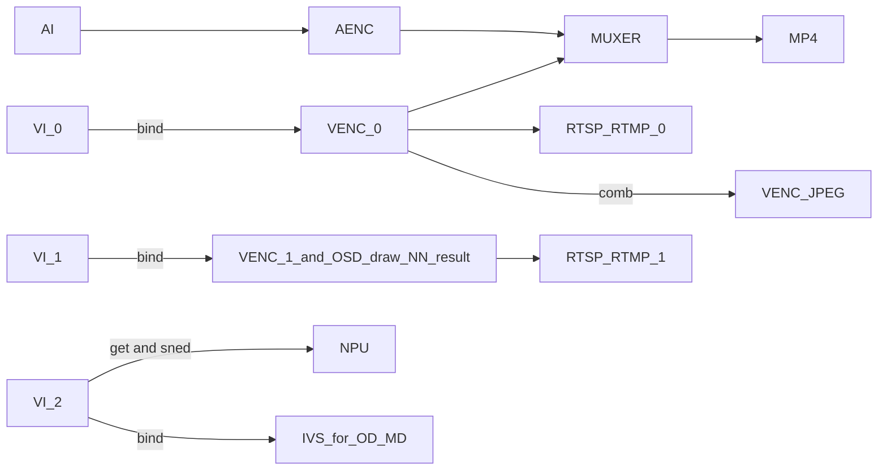

### RV1106 IPC

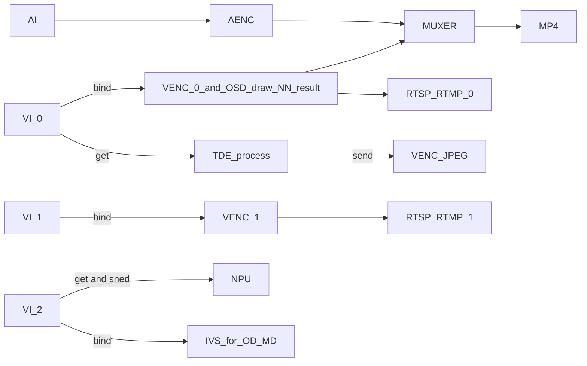

### RV1106 Battery IPC Client

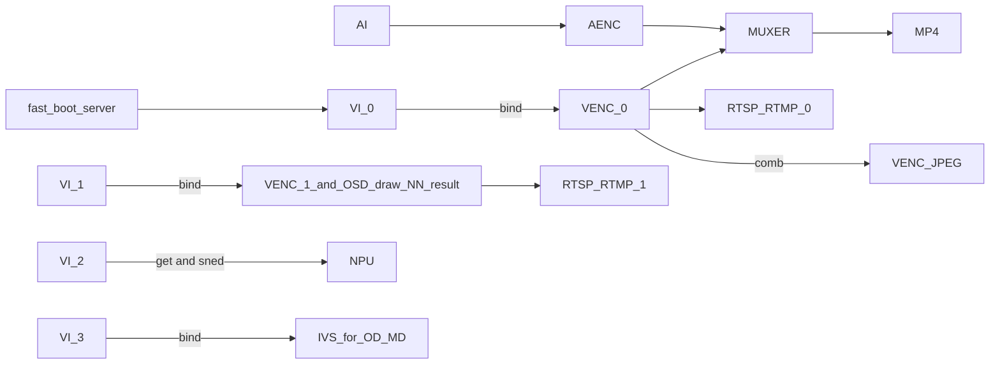

### RV1106 Battery IPC Tuya

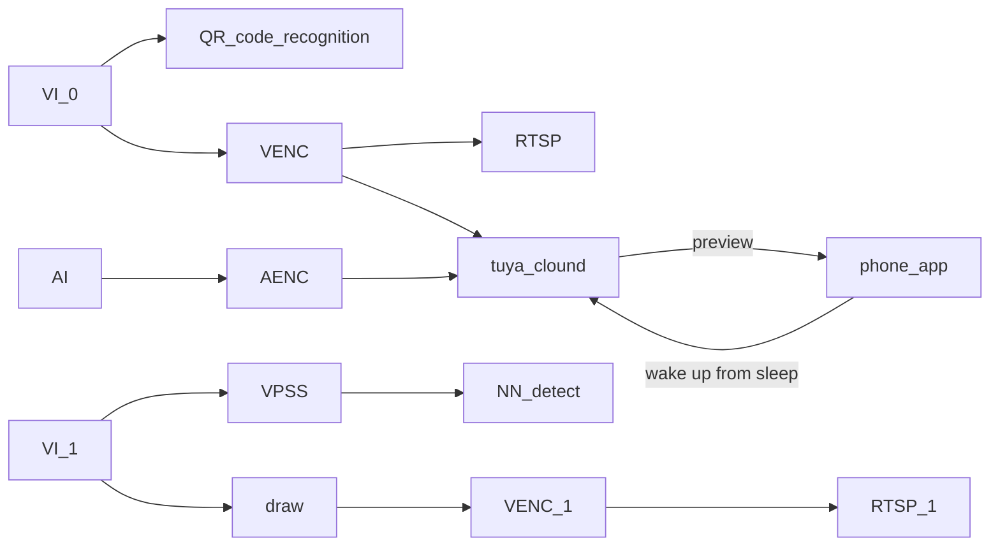

### RV1106 Dual-IPC

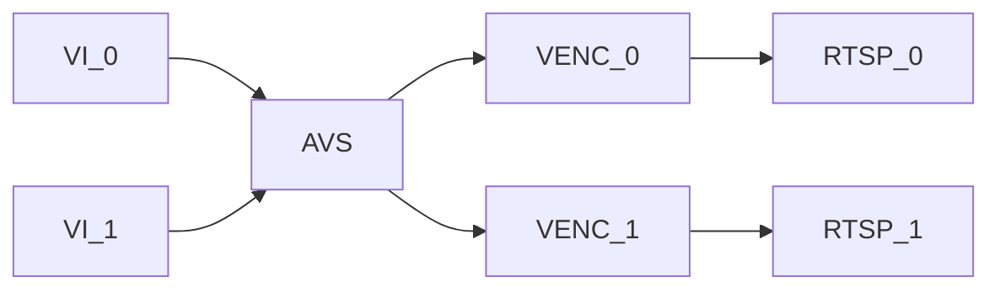

### RV1106 AIISP

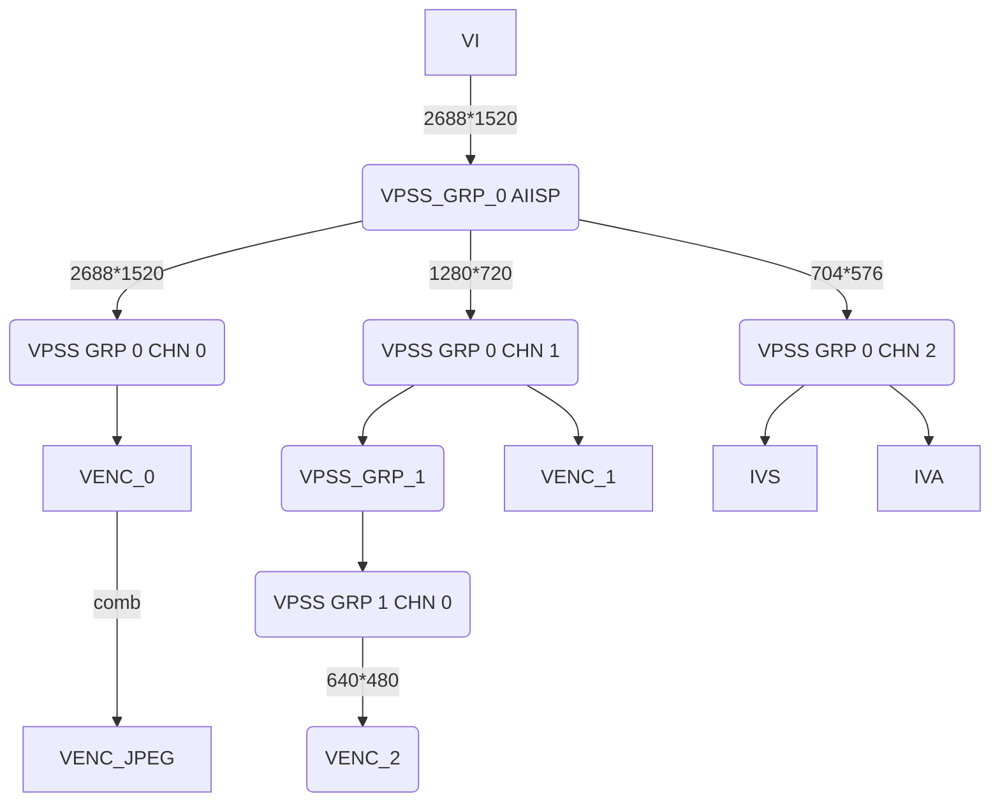

### RK3588 IPC

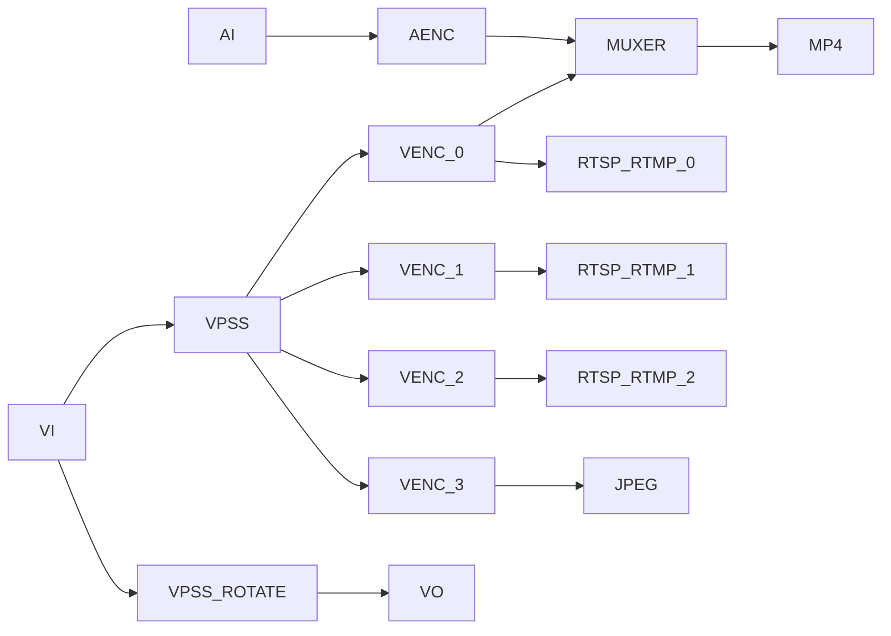

### RK3588 Multi-IPC

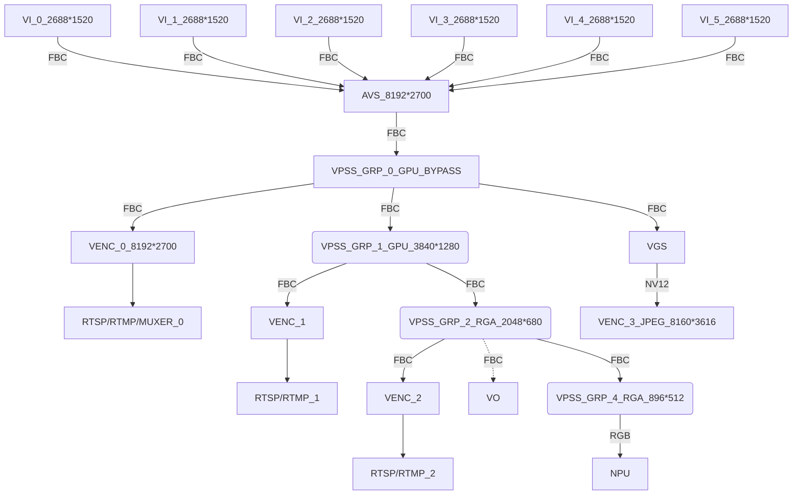

### RV1126 IPC Rkmedia

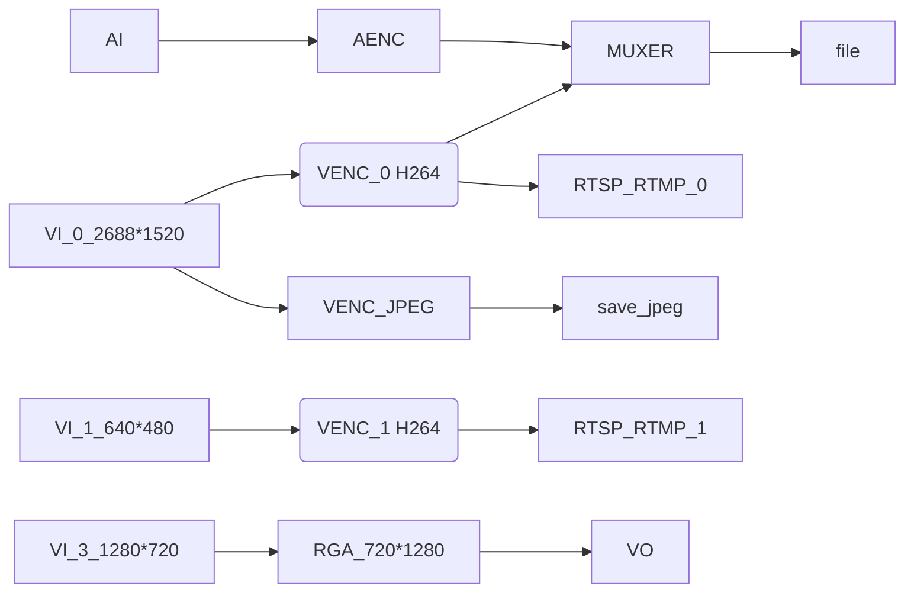

### RV1126 IPC Rockit

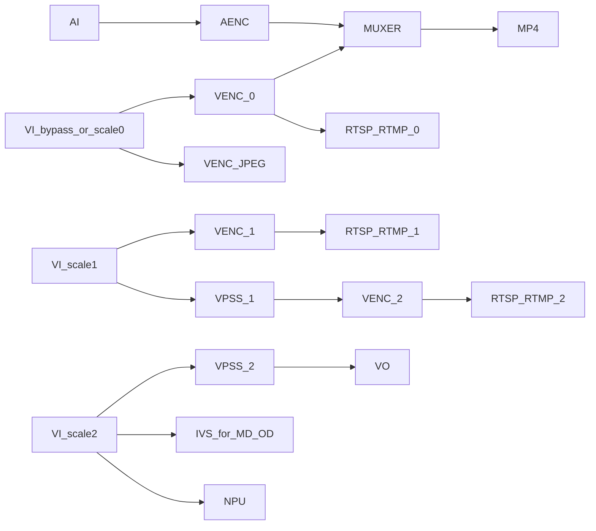

### RV1126 Battery IPC

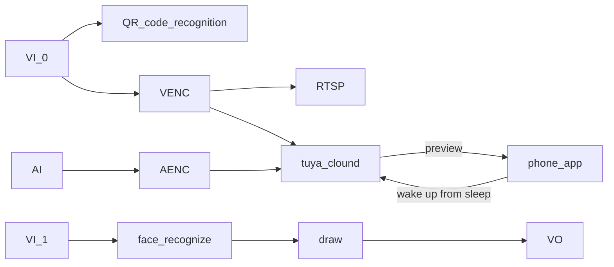

### RV1126 Dual-IPC


### RV1126 Snapshot

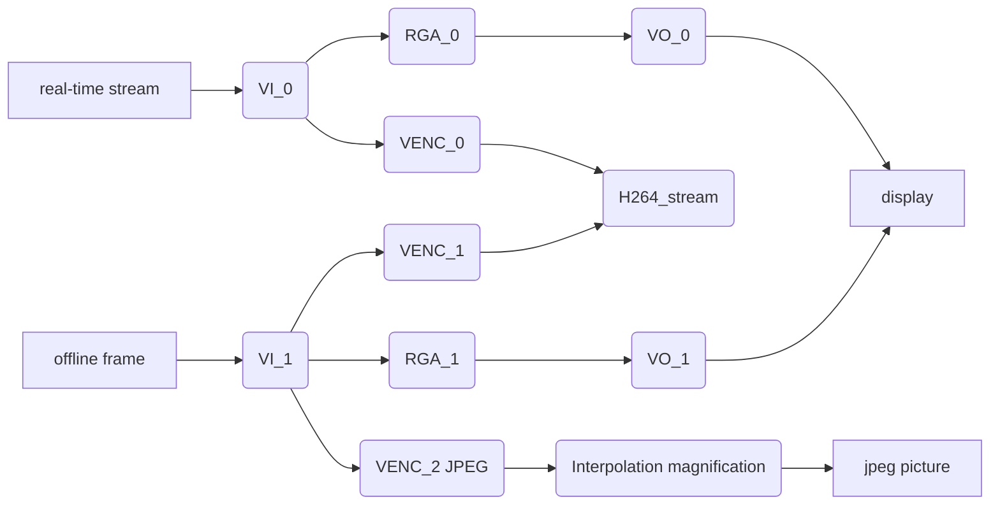

### RV1126 AIISP

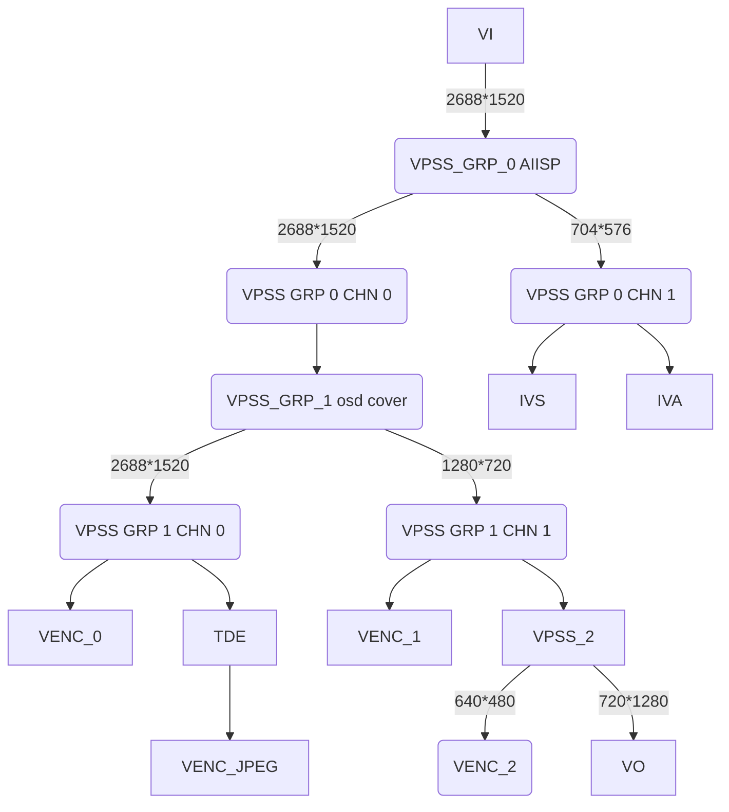

## Code Structure

```shell
├── CMakeLists.txt
├── common # Common Modules
│   ├── common.h # General utility functions
│   ├── event # Event handling modules
│   ├── isp # Image processing modules
│   │   ├── rk3588
│   │   ├── rv1106
│   │   └── rv1126
│   ├── log.h # Logging management
│   ├── network # Network modules
│   ├── osd # OSD modules
│   │   ├── image.bmp # Logo image
│   │   └── simsun_en.ttf # Font library
│   ├── param # Parameter management modules
│   ├── rkbar # QR code recognition module
│   ├── rockiva # Boundary algorithm module, face and body recognition
│   ├── rtmp # RTMP streaming module
│   ├── rtsp # RTSP streaming module
│   ├── storage # Storage modules
│   └── system # System management modules
│   └── tuya_ipc # Tuya IPC module
├── format.sh # Formatting script
├── lib # Prebuilt libraries of different toolchains，for 32/64-bit versions
│   ├── aarch64-rockchip1031-linux-gnu
│   └── arm-rockchip830-linux-gnueabihf
├── LICENSE # License statement
└── src
    ├── low_memory_ipc
    ├── rk3588_ipc
    │   ├── audio # Audio business logic
    │   ├── CMakeLists.txt
    │   ├── main.c
    │   ├── rkipc.ini # Parameter file
    │   ├── server # Socket server
    │   └── video # Video business logic
    │       ├── video.c
    │       └── video.h
    ├── rk3588_muliti_ipc
    ├── rv1126_battery_ipc
    ├── rv1126_ipc_rkmedia
    ├── rv1126_ipc_rockit
    └── rv1126_snapshot
```

## Development Rules

0. **Pure C Code Implementation**.

1. **Modular Design**: Keep the `main` function concise, calling the `init` and `deinit` functions of various modules. Modules manage their own functionality, and differentiated parts are implemented through registered callback functions.

2. **Use iniparser to manage parameters**: Avoid complex packages; modules decide when and how to read/write parameters in the ini file.

3. **Use common/log.h to output log**.

4. **Maximize Reusability**: Whenever possible, place reusable code in the `common` directory. If platform differences and business logic prevent reusability, each `src` directory should have its own copy to avoid excessive platform-specific macro checks.

5. **Prioritize Source Code Compilation**: First use source code compilation, then static libraries, and finally dynamic libraries.

## New Parameter Development Process

**Web Front-end → Web Back-end → RKIPC → Lower-level Modules → Parameter Saving**

Taking hue as an example, the front-end has been basically implemented and does not need to be modified. In the `app/ipcweb-backend/src/image_api.cpp` of the web back-end, a JSON string like "iHue":50 will be received.

Next, use the pre-existing functions in `app/ipcweb-backend/src/socket_client` to make a remote call to RKIPC.

In RKIPC, corresponding functions need to be packaged in `app/rkipc/src/server` to apply and save the settings.

**It is recommended to add functions in pairs (get/set).**

RKIPC is primarily used to package functions for external calls and for initialization.

Here are some examples:

### Adding the hue Field to the ini File

```ini
[isp.0.adjustment]
hue = 50
```

### Adding set/get Function to ISP Module

```diff
diff --git a/src/isp/isp.c b/src/isp/isp.c
index e59fdd3..7877ae9 100644
--- a/src/isp/isp.c
+++ b/src/isp/isp.c
@@ -165,6 +165,22 @@ int rk_isp_set_sharpness(int cam_id, int value) {
   return ret;
 }

+int rk_isp_get_hue(int cam_id, int *value) {
+  RK_ISP_CHECK_CAMERA_ID(cam_id);
+  int ret = rk_aiq_uapi_getHue(g_aiq_ctx[cam_id], value);
+  *value = (int)(*value / 2.55);
+
+  return ret;
+}
+
+int rk_isp_set_hue(int cam_id, int value) {
+  RK_ISP_CHECK_CAMERA_ID(cam_id);
+  int ret = rk_aiq_uapi_setHue(g_aiq_ctx[cam_id], (int)(value * 2.55)); // value[0,255]
+  rk_param_set_int("isp.0.adjustment:hue", value);
+
+  return ret;
+}
+
 // exposure
 // night_to_day
 // blc
@@ -180,6 +196,7 @@ int rk_isp_set_from_ini(int cam_id) {
   rk_isp_set_brightness(cam_id, iniparser_getint(g_ini_d_, "isp.0.adjustment:brightness", 50));
   rk_isp_set_saturation(cam_id, iniparser_getint(g_ini_d_, "isp.0.adjustment:saturation", 50));
   rk_isp_set_sharpness(cam_id, iniparser_getint(g_ini_d_, "isp.0.adjustment:sharpness", 50));
+  rk_isp_set_hue(cam_id, iniparser_getint(g_ini_d_, "isp.0.adjustment:hue", 50));
   LOG_INFO("end\n");

   return ret;
diff --git a/src/isp/isp.h b/src/isp/isp.h
index e77c9fc..0d3835a 100644
--- a/src/isp/isp.h
+++ b/src/isp/isp.h
@@ -9,4 +9,6 @@ int rk_isp_get_saturation(int cam_id, int *value);
 int rk_isp_set_saturation(int cam_id, int value);
 int rk_isp_get_sharpness(int cam_id, int *value);
 int rk_isp_set_sharpness(int cam_id, int value);
+int rk_isp_get_hue(int cam_id, int *value);
+int rk_isp_set_hue(int cam_id, int value);
 // exposure
```

### Package Socket Functions in the Server Module

```diff
diff --git a/src/server/server.c b/src/server/server.c
index 6613b90..52692c9 100644
--- a/src/server/server.c
+++ b/src/server/server.c
@@ -236,6 +236,40 @@ int ser_rk_isp_set_sharpness(int fd) {
   return 0;
 }

+int ser_rk_isp_get_hue(int fd) {
+  int err = 0;
+  int cam_id;
+  int value;
+
+  if (sock_read(fd, &cam_id, sizeof(cam_id)) == SOCKERR_CLOSED)
+    return -1;
+  err = rk_isp_get_hue(cam_id, &value);
+  LOG_DEBUG("value is %d\n", value);
+  if (sock_write(fd, &value, sizeof(value)) == SOCKERR_CLOSED)
+    return -1;
+  if (sock_write(fd, &err, sizeof(int)) == SOCKERR_CLOSED)
+    return -1;
+
+  return 0;
+}
+
+int ser_rk_isp_set_hue(int fd) {
+  int err = 0;
+  int cam_id;
+  int value;
+
+  if (sock_read(fd, &cam_id, sizeof(cam_id)) == SOCKERR_CLOSED)
+    return -1;
+  if (sock_read(fd, &value, sizeof(value)) == SOCKERR_CLOSED)
+    return -1;
+  LOG_DEBUG("value is %d\n", value);
+  err = rk_isp_set_hue(cam_id, value);
+  if (sock_write(fd, &err, sizeof(int)) == SOCKERR_CLOSED)
+    return -1;
+
+  return 0;
+}
+
 static const struct FunMap map[] = {
     {(char *)"rk_isp_set", &ser_rk_isp_set},
     {(char *)"rk_video_set", &ser_rk_video_set},
@@ -247,7 +281,9 @@ static const struct FunMap map[] = {
     {(char *)"rk_isp_get_saturation", &ser_rk_isp_get_saturation},
     {(char *)"rk_isp_set_saturation", &ser_rk_isp_set_saturation},
     {(char *)"rk_isp_get_sharpness", &ser_rk_isp_get_sharpness},
-    {(char *)"rk_isp_set_sharpness", &ser_rk_isp_set_sharpness}
+    {(char *)"rk_isp_set_sharpness", &ser_rk_isp_set_sharpness},
+    {(char *)"rk_isp_get_hue", &ser_rk_isp_get_hue},
+    {(char *)"rk_isp_set_hue", &ser_rk_isp_set_hue}
 };

 static void *rec_thread(void *arg) {
```

### Add Related Judgments to the Web Back-end

The ipcweb-backend is mainly used to judge the data incoming from the web front end, and then Get/Set data, the modification is as follows:

```diff
diff --git a/src/image_api.cpp b/src/image_api.cpp
index 475e17d..edac2de 100644
--- a/src/image_api.cpp
+++ b/src/image_api.cpp
@@ -20,15 +20,17 @@ nlohmann::json image_specific_resource_get(std::string string) {
       nlohmann::json::object(); /* one of all the same resources */
   minilog_debug("%s: string is %s\n", __func__, string.c_str());
   if (!string.compare(PATH_IMAGE_ADJUSTMENT)) {
-    int brightness, contrast, saturation, sharpness;
+    int brightness, contrast, saturation, sharpness, hue;
     rk_isp_get_brightness(0, &brightness);
     rk_isp_get_contrast(0, &contrast);
     rk_isp_get_saturation(0, &saturation);
     rk_isp_get_sharpness(0, &sharpness);
+    rk_isp_get_hue(0, &hue);
     specific_resource.emplace("iBrightness", brightness);
     specific_resource.emplace("iContrast", contrast);
     specific_resource.emplace("iSaturation", saturation);
     specific_resource.emplace("iSharpness", sharpness);
+    specific_resource.emplace("iHue", hue);
   } else if (!string.compare(PATH_IMAGE_EXPOSURE)) {

   } else if (!string.compare(PATH_IMAGE_NIGHT_TO_DAY)) {
@@ -84,6 +86,10 @@ void image_specific_resource_set(std::string string, nlohmann::json data) {
       value = atoi(data.at("iSharpness").dump().c_str());
       rk_isp_set_sharpness(0, value);
     }
+    if (data.dump().find("iHue") != data.dump().npos) {
+      value = atoi(data.at("iHue").dump().c_str());
+      rk_isp_set_hue(0, value);
+    }
   } else if (!string.compare(PATH_IMAGE_EXPOSURE)) {

   } else if (!string.compare(PATH_IMAGE_NIGHT_TO_DAY)) {
diff --git a/src/socket_client/client.cpp b/src/socket_client/client.cpp
index 448e847..7f84b4f 100644
--- a/src/socket_client/client.cpp
+++ b/src/socket_client/client.cpp
@@ -182,4 +182,36 @@ int rk_isp_set_sharpness(int cam_id, int value) {
   cli_end(fd);

   return ret;
 }
+
+int rk_isp_get_hue(int cam_id, int *value) {
+  int fd;
+  int ret = 0;
+
+  fd = cli_begin((char *)__func__);
+  /* Transmission parameters */
+  sock_write(fd, &cam_id, sizeof(cam_id));
+  sock_read(fd, value, sizeof(value));
+
+  sock_read(fd, &ret, sizeof(ret));
+  /* End transmission parameters */
+  cli_end(fd);
+
+  return ret;
+}
+
+int rk_isp_set_hue(int cam_id, int value) {
+  int fd;
+  int ret = 0;
+
+  fd = cli_begin((char *)__func__);
+  /* Transmission parameters */
+  sock_write(fd, &cam_id, sizeof(cam_id));
+  sock_write(fd, &value, sizeof(value));
+
+  sock_read(fd, &ret, sizeof(ret));
+  /* End transmission parameters */
+  cli_end(fd);
+
+  return ret;
+}
diff --git a/src/socket_client/client.h b/src/socket_client/client.h
index 11fdd1c..0c09913 100644
--- a/src/socket_client/client.h
+++ b/src/socket_client/client.h
@@ -8,4 +8,6 @@ int rk_isp_set_brightness(int cam_id, int value);
 int rk_isp_get_saturation(int cam_id, int *value);
 int rk_isp_set_saturation(int cam_id, int value);
 int rk_isp_get_sharpness(int cam_id, int *value);
 int rk_isp_set_sharpness(int cam_id, int value);
+int rk_isp_get_hue(int cam_id, int *value);
+int rk_isp_set_hue(int cam_id, int value);
\ No newline at end of file
```

### Add Related Judgments to the Web Front End

Modify html and ts files in the web front end , and add option layout and get/set.

The code can refer to the html and ts in app/ipcweb-ng/src/app/config/shared/isp, the main content are as follows:

```html
<form class="form" [formGroup]="imageForm">
      <div id=ispGrp role="tablist">
        <div class="card" *ngFor="let cardTitle of cardList">
          <div id="ispGrp1Header" class="card-header" (click)="onSelectCard(cardTitle)">
            <label>{{ groupNameDict[cardTitle] | translate }}</label>
          </div>
          <div class="card-body card-block form-group" [id]="cardTitle" [formGroupName]="groupNameDict[cardTitle]">
            <ng-container *ngIf="capDict[cardTitle][layoutKey]">
              <ng-container *ngFor="let layoutItem of capDict[cardTitle][layoutKey][cardTitle]">
                <div class="form-row my-1" *ngIf="checkType(capDict[cardTitle][pageLayoutKey][layoutItem], 'range')">
                  <label class="col-3">{{ transferControlName(layoutItem) | translate }}</label>
                  <input class="col-6 custom-range" [formControlName]="layoutItem" type="range" (ngModelChange)="onRangeChange($event, cardTitle, layoutItem)" (mouseup)="onSubmitPart(cardTitle, layoutItem, 'range')" [min]="getRange(capDict[cardTitle][pageLayoutKey][layoutItem], 'min')" [max]="getRange(capDict[cardTitle][pageLayoutKey][layoutItem], 'max')" [step]="getRange(capDict[cardTitle][pageLayoutKey][layoutItem], 'step')">
                  <input class="col-2 form-control" [formControlName]="layoutItem" type="number" (ngModelChange)="onRangeChange($event, cardTitle, layoutItem)" (blur)="onSubmitPart(cardTitle, layoutItem, 'number')" [id]="layoutItem">
                  <label class="alarm-tip pat1" *ngIf="imageForm.get(groupNameDict[cardTitle]).get(layoutItem).errors?.min || imageForm.get(groupNameDict[cardTitle]).get(layoutItem).errors?.max || imageForm.get(groupNameDict[cardTitle]).get(layoutItem).errors?.isNumberJudge">{{'ranges' | translate}}({{getRange(capDict[cardTitle][pageLayoutKey][layoutItem], 'min')}}~{{getRange(capDict[cardTitle][pageLayoutKey][layoutItem], 'max')}})</label>
                </div>
                <div class="form-row my-1" *ngIf="checkType(capDict[cardTitle][pageLayoutKey][layoutItem], 'options') && isItemEnable(layoutItem)">
                  <label class="col-3 form-group-text mt-1">{{ transferControlName(layoutItem) | translate }}</label>
                  <select class="custom-select col-md-8" [formControlName]="layoutItem" (ngModelChange)="updateDynamicCap(cardTitle, layoutItem, $event)" [id]="layoutItem">
                    <option *ngFor="let opItem of htmlOptionFilter(layoutItem, capDict[cardTitle][pageLayoutKey][layoutItem]['options'])" [value]="opItem">{{ htmlOptionTransfer(layoutItem, opItem) | translate }}</option>
                  </select>
                </div>
                <div class="form-row my-1" *ngIf="checkType(capDict[cardTitle][pageLayoutKey][layoutItem], 'input') && capDict[cardTitle][pageLayoutKey][layoutItem]['input']==='time'">
                  <label class="col-3">{{ transferControlName(layoutItem) | translate }}</label>
                  <input type="time" step=1 [formControlName]="layoutItem" (blur)="onSubmitPart(cardTitle, layoutItem, 'time')" [id]="layoutItem">
                </div>
              </ng-container>
            </ng-container>
          </div>
        </div>
      </div>
    </form>
```

```typescript
imageForm = this.fb.group({
    id: [''],
    imageAdjustment: this.fb.group({
      iBrightness: [''],
      iContrast: [''],
      iSaturation: [''],
      iSharpness: [''],
      iHue: ['']
    })
});

get imageAdjustment(): FormGroup {
    return this.imageForm.get('imageAdjustment') as FormGroup;
}

submitOne(groupName: string, isReboot: boolean = false, isAppRestart = false) {
    if (!this.isInit || this.lock.checkLock('submitOne')) {
      return;
    }
    this.lock.lock('submitOne');
    this.pfs.formatInt(this.imageForm.value[groupName]);
    const path = this.group2path[groupName];
    this.cfgService.setImageInterfacePart(this.imageForm.value[groupName], path, this.imageForm.value['id']).subscribe(
      res => {
        this.resError.analyseRes(res, 'saveFail');
        this.setAlarmTip(res, groupName);
        this.imageForm.get(groupName).patchValue(res);
        if (isReboot) {
          this.tips.setCTPara('restart');
        } else if (isAppRestart) {
          this.tips.setRbTip('appRestart');
        } else {
          this.tips.showSaveSuccess();
        }
        this.lock.unlock('submitOne');
      },
      err => {
        if (isReboot) {
          this.tips.setCTPara('close');
        }
        this.tips.showSaveFail();
        this.lock.unlock('submitOne');
      }
    );
  }
```

## Module API Introduction

### Network Module

| Function Name                   | Functionality                      |
| ------------------------------- | ---------------------------------- |
| rk_network_init                 | Initialize network module          |
| rk_network_deinit               | Deinitialize network module        |
| rk_network_ipv4_set             | Set IPv4 configuration             |
| rk_network_ipv4_get             | Get IPv4 configuration             |
| rk_network_dns_get              | Get current wired network DNS      |
| rk_network_dns_set              | Set current wired network DNS      |
| rk_network_get_mac              | Get device MAC address             |
| rk_network_set_mac              | Set device MAC address             |
| rk_network_nicspeed_get         | Get NIC speed                      |
| rk_network_nicspeed_set         | Set NIC speed                      |
| rk_network_nicspeed_support_get | Get supported NIC speeds           |
| rk_ethernet_power_set           | Turn on/off Ethernet               |
| rk_nic_state_get                | Get current NIC state              |
| rk_wifi_power_get               | Get current Wi-Fi state            |
| rk_wifi_power_set               | Turn on/off Wi-Fi                  |
| rk_wifi_scan_wifi               | Scan Wi-Fi immediately             |
| rk_wifi_get_list                | Get Wi-Fi network list             |
| rk_wifi_connect_with_ssid       | Connect to Wi-Fi network with SSID |
| rk_wifi_forget_with_ssid        | Forget Wi-Fi network with SSID     |

### Packaged Module

| Function Name             | Functionality             |
| ------------------------- | ------------------------- |
| rkmuxer_init              | Initialize muxer module   |
| rkmuxer_deinit            | Deinitialize muxer module |
| rkmuxer_write_video_frame | Write video frame         |
| rkmuxer_write_audio_frame | Write audio frame         |

### Storage Module

| Function Name                | Functionality               |
| ---------------------------- | --------------------------- |
| rk_storage_init              | Initialize storage module   |
| rk_storage_deinit            | Deinitialize storage module |
| rk_storage_write_video_frame | Write video frame           |
| rk_storage_write_audio_frame | Write audio frame           |
| rk_storage_record_start      | Start recording             |
| rk_storage_record_stop       | Stop recording              |
| rk_storage_record_status_get | Get recording status        |

### OSD Module

Due to differences in OSD implementation between rkmedia and rockit libraries, and to abstract the OSD module's business logic and decouple it from the video module, a callback registration approach is used.

By registering relevant functions, different implementations can be used while maintaining consistent upper-level logic.

| Function Name                          | Functionality                            |
| -------------------------------------- | ---------------------------------------- |
| rk_osd_cover_create_callback_register  | Register callback for creating a cover   |
| rk_osd_cover_destroy_callback_register | Register callback for destroying a cover |
| rk_osd_bmp_create_callback_register    | Register callback for creating a BMP     |
| rk_osd_bmp_destroy_callback_register   | Register callback for destroying a BMP   |
| rk_osd_bmp_change_callback_register    | Register callback for changing a BMP     |
| rk_osd_init                            | Initialize OSD module                    |
| rk_osd_deinit                          | Deinitialize OSD module                  |
| rk_osd_restart                         | Restart OSD module                       |
| fill_image                             | Fill image                               |
| fill_text                              | Generate and fill text image             |
| generate_date_time                     | Generate wide character timestamp        |
| rk_osd_get_font_size                   | Get font size                            |
| rk_osd_set_font_size                   | Set font size                            |
| rk_osd_get_font_color                  | Get font color                           |
| rk_osd_set_font_color                  | Set font color                           |
| rk_osd_get_font_path                   | Get font file path                       |
| rk_osd_set_font_path                   | Set font file path                       |
| rk_osd_get_enabled                     | Get enable state                         |
| rk_osd_set_enabled                     | Set enable state                         |
| rk_osd_get_position_x                  | Get X position                           |
| rk_osd_set_position_x                  | Set X position                           |
| rk_osd_get_position_y                  | Get Y position                           |
| rk_osd_set_position_y                  | Set Y position                           |
| rk_osd_get_height                      | Get height                               |
| rk_osd_set_height                      | Set height                               |
| rk_osd_get_width                       | Get width                                |
| rk_osd_set_width                       | Set width                                |
| rk_osd_get_display_text                | Get display text                         |
| rk_osd_set_display_text                | Set display text                         |
| rk_osd_get_image_path                  | Get image file path                      |
| rk_osd_set_image_path                  | Set image file path                      |

### System Module

Currently, the initial INI file is /usr/share/rkipc.ini by default. When there is no rkipc.ini in /userdata, the booting script will copy it there.

During a factory reset, /usr/share/rkipc.ini will be copied to /userdata/rkipc.ini.

| Function Name            | Functionality              |
| ------------------------ | -------------------------- |
| rk_system_init           | Initialize system module   |
| rk_system_deinit         | Deinitialize system module |
| rk_system_reboot         | Reboot                     |
| rk_system_factory_reset  | Factory reset              |
| rk_system_export_log     | Export logs                |
| rk_system_export_db      | Export configuration files |
| rk_system_import_db      | Import configuration files |
| rk_system_upgrade        | System upgrade             |
| rk_system_get_user_num   | Get user count             |
| rk_system_set_user_num   | Set user count             |
| rk_system_get_user_level | Get user permission level  |
| rk_system_set_user_level | Set user permission level  |
| rk_system_get_user_name  | Get username               |
| rk_system_set_user_name  | Set username               |
| rk_system_get_password   | Get password (encrypted)   |
| rk_system_set_password   | Set password (encrypted)   |
| rk_system_add_user       | Add user                   |
| rk_system_del_user       | Delete user                |

### Event Module

Currently only supported for rv1126_ipc_rkmedia.

| Function Name                     | Functionality                          |
| --------------------------------- | -------------------------------------- |
| rk_event_init                     | Initialize event module                |
| rk_event_deinit                   | Deinitialize event module              |
| rk_event_ri_get_enabled           | Get region intrusion enable status     |
| rk_event_ri_set_enabled           | Set region intrusion enable status     |
| rk_event_ri_get_position_x        | Get region intrusion X coordinate      |
| rk_event_ri_set_position_x        | Set region intrusion X coordinate      |
| rk_event_ri_get_position_y        | Get region intrusion Y coordinate      |
| rk_event_ri_set_position_y        | Set region intrusion Y coordinate      |
| rk_event_ri_get_width             | Get region intrusion width             |
| rk_event_ri_set_width             | Set region intrusion width             |
| rk_event_ri_get_height            | Get region intrusion height            |
| rk_event_ri_set_height            | Set region intrusion height            |
| rk_event_ri_get_proportion        | Get region intrusion proportion        |
| rk_event_ri_set_proportion        | Set region intrusion proportion        |
| rk_event_ri_get_sensitivity_level | Get region intrusion sensitivity level |
| rk_event_ri_set_sensitivity_level | Set region intrusion sensitivity level |
| rk_event_ri_get_time_threshold    | Get region intrusion time threshold    |
| rk_event_ri_set_time_threshold    | Set region intrusion time threshold    |

### RTMP Streaming Module

| Function Name             | Functionality            |
| ------------------------- | ------------------------ |
| rk_rtmp_init              | Initialize RTMP module   |
| rk_rtmp_deinit            | Deinitialize RTMP module |
| rk_rtmp_write_video_frame | Write video frame        |
| rk_rtmp_write_audio_frame | Write audio frame        |

### RTSP Streaming Module

| Function Name      | Functionality                |
| ------------------ | ---------------------------- |
| create_rtsp_demo   | Create handle                |
| rtsp_new_session   | Create session based on URL  |
| rtsp_set_video     | Set video stream format      |
| rtsp_set_audio     | Set audio stream format      |
| rtsp_sync_video_ts | Synchronize video timestamps |
| rtsp_sync_audio_ts | Synchronize audio timestamps |
| rtsp_del_session   | Delete session               |
| rtsp_del_demo      | Delete handle                |
| rtsp_tx_video      | Transmit video frame         |
| rtsp_tx_audio      | Transmit audio frame         |
| rtsp_do_event      | Execute operation            |

### ISP Module

| Function Name                        | Functionality                   |
| ------------------------------------ | ------------------------------- |
| rk_isp_init                          | Initialize single camera        |
| rk_isp_deinit                        | Deinitialize single camera      |
| rk_isp_group_init                    | Initialize multi-camera         |
| rk_isp_group_deinit                  | Deinitialize multi-camera       |
| rk_isp_set_frame_rate                | Set frame rate                  |
| rk_isp_get_contrast                  | Get contrast                    |
| rk_isp_set_contrast                  | Set contrast                    |
| rk_isp_get_brightness                | Get brightness                  |
| rk_isp_set_brightness                | Set brightness                  |
| rk_isp_get_saturation                | Get saturation                  |
| rk_isp_set_saturation                | Set saturation                  |
| rk_isp_get_sharpness                 | Get sharpness                   |
| rk_isp_set_sharpness                 | Set sharpness                   |
| rk_isp_get_hue                       | Get hue                         |
| rk_isp_set_hue                       | Set hue                         |
| rk_isp_get_exposure_mode             | Get exposure mode               |
| rk_isp_set_exposure_mode             | Set exposure mode               |
| rk_isp_get_gain_mode                 | Get gain mode                   |
| rk_isp_set_gain_mode                 | Set gain mode                   |
| rk_isp_get_exposure_time             | Get exposure time               |
| rk_isp_set_exposure_time             | Set exposure time               |
| rk_isp_get_exposure_gain             | Get exposure gain               |
| rk_isp_set_exposure_gain             | Set exposure gain               |
| rk_isp_get_hdr                       | Get HDR mode                    |
| rk_isp_set_hdr                       | Set HDR mode                    |
| rk_isp_get_blc_region                | Get backlight mode              |
| rk_isp_set_blc_region                | Set backlight mode              |
| rk_isp_get_hlc                       | Get highlight suppression mode  |
| rk_isp_set_hlc                       | Set highlight suppression mode  |
| rk_isp_get_hdr_level                 | Get HDR level                   |
| rk_isp_set_hdr_level                 | Set HDR level                   |
| rk_isp_get_blc_strength              | Get backlight strength          |
| rk_isp_set_blc_strength              | Set backlight strength          |
| rk_isp_get_hlc_level                 | Get highlight suppression level |
| rk_isp_set_hlc_level                 | Set highlight suppression level |
| rk_isp_get_dark_boost_level          | Get dark area enhancement level |
| rk_isp_set_dark_boost_level          | Set dark area enhancement level |
| rk_isp_get_white_blance_style        | Get white balance mode          |
| rk_isp_set_white_blance_style        | Set white balance mode          |
| rk_isp_get_white_blance_red          | Get white balance R gain        |
| rk_isp_set_white_blance_red          | Set white balance R gain        |
| rk_isp_get_white_blance_green        | Get white balance G gain        |
| rk_isp_set_white_blance_green        | Set white balance G gain        |
| rk_isp_get_white_blance_blue         | Get white balance B gain        |
| rk_isp_set_white_blance_blue         | Set white balance B gain        |
| rk_isp_get_noise_reduce_mode         | Get noise reduction mode        |
| rk_isp_set_noise_reduce_mode         | Set noise reduction mode        |
| rk_isp_get_dehaze                    | Get dehaze mode                 |
| rk_isp_set_dehaze                    | Set dehaze mode                 |
| rk_isp_get_gray_scale_mode           | Get grayscale range             |
| rk_isp_set_gray_scale_mode           | Set grayscale range             |
| rk_isp_get_distortion_correction     | Get distortion correction mode  |
| rk_isp_set_distortion_correction     | Set distortion correction mode  |
| rk_isp_get_spatial_denoise_level     | Get spatial denoise level       |
| rk_isp_set_spatial_denoise_level     | Set spatial denoise level       |
| rk_isp_get_temporal_denoise_level    | Get temporal denoise level      |
| rk_isp_set_temporal_denoise_level    | Set temporal denoise level      |
| rk_isp_get_dehaze_level              | Get dehaze level                |
| rk_isp_set_dehaze_level              | Set dehaze level                |
| rk_isp_get_ldch_level                | Get LDCH level                  |
| rk_isp_set_ldch_level                | Set LDCH level                  |
| rk_isp_get_power_line_frequency_mode | Get power line frequency mode   |
| rk_isp_set_power_line_frequency_mode | Set power line frequency mode   |
| rk_isp_get_image_flip                | Get image flip                  |
| rk_isp_set_image_flip                | Set image flip                  |
| rk_isp_get_af_mode                   | Get auto-focus mode             |
| rk_isp_set_af_mode                   | Set auto-focus mode             |
| rk_isp_get_zoom_level                | Get zoom level                  |
| rk_isp_set_zoom_level                | Set zoom level                  |
| rk_isp_af_zoom_in                    | Zoom in                         |
| rk_isp_af_zoom_out                   | Zoom out                        |
| rk_isp_af_focus_in                   | Focus in                        |
| rk_isp_af_focus_out                  | Focus out                       |

### Audio Module

| Function Name            | Functionality                        |
| ------------------------ | ------------------------------------ |
| rkipc_audio_init         | Initialize audio module              |
| rkipc_audio_deinit       | Deinitialize audio module            |
| rk_audio_restart         | Restart audio module                 |
| rk_audio_get_bit_rate    | Get bit rate                         |
| rk_audio_set_bit_rate    | Set bit rate                         |
| rk_audio_get_sample_rate | Get sample rate                      |
| rk_audio_set_sample_rate | Set sample rate                      |
| rk_audio_get_volume      | Get volume                           |
| rk_audio_set_volume      | Set volume                           |
| rk_audio_get_enable_vqe  | Get audio 3A algorithm enable status |
| rk_audio_set_enable_vqe  | Set audio 3A algorithm enable status |
| rk_audio_get_encode_type | Get encoding type                    |
| rk_audio_set_encode_type | Set encoding type                    |

### Video Module

| Function Name                 | Functionality                     |
| ----------------------------- | --------------------------------- |
| rk_video_init                 | Initialize video module           |
| rk_video_deinit               | Deinitialize video module         |
| rk_video_restart              | Restart video module              |
| rk_video_get_gop              | Get I-frame interval              |
| rk_video_set_gop              | Set I-frame interval              |
| rk_video_get_max_rate         | Get maximum bitrate               |
| rk_video_set_max_rate         | Set maximum bitrate               |
| rk_video_get_RC_mode          | Get rate control mode             |
| rk_video_set_RC_mode          | Set rate control mode             |
| rk_video_get_output_data_type | Get encoding type                 |
| rk_video_set_output_data_type | Set encoding type                 |
| rk_video_get_rc_quality       | Get rate control quality          |
| rk_video_set_rc_quality       | Set rate control quality          |
| rk_video_get_smart            | Get smart encoding status         |
| rk_video_set_smart            | Set smart encoding status         |
| rk_video_get_gop_mode         | Get GOP mode                      |
| rk_video_set_gop_mode         | Set GOP mode                      |
| rk_video_get_stream_type      | Get stream name                   |
| rk_video_set_stream_type      | Set stream name                   |
| rk_video_get_h264_profile     | Get H.264 profile                 |
| rk_video_set_h264_profile     | Set H.264 profile                 |
| rk_video_get_resolution       | Get resolution                    |
| rk_video_set_resolution       | Set resolution                    |
| rk_video_get_frame_rate       | Get input frame rate              |
| rk_video_set_frame_rate       | Set input frame rate              |
| rk_video_get_frame_rate_in    | Get output frame rate             |
| rk_video_set_frame_rate_in    | Set output frame rate             |
| rk_video_get_rotation         | Get rotation angle                |
| rk_video_set_rotation         | Set rotation angle                |
| rk_video_get_smartp_viridrlen | Get smartP virtual I-frame length |
| rk_video_set_smartp_viridrlen | Set smartP virtual I-frame length |

#### IVS Module

| Function Name               | Functionality                      |
| --------------------------- | ---------------------------------- |
| rk_video_get_md_switch      | Get motion detection switch status |
| rk_video_set_md_switch      | Set motion detection switch status |
| rk_video_get_md_sensebility | Get motion detection sensitivity   |
| rk_video_set_md_sensebility | Set motion detection sensitivity   |
| rk_video_get_od_switch      | Get privacy mask switch status     |
| rk_video_set_od_switch      | Set privacy mask switch status     |

#### JPEG Module

| Function Name                      | Functionality                    |
| ---------------------------------- | -------------------------------- |
| rk_video_get_enable_cycle_snapshot | Get timed snapshot switch status |
| rk_video_set_enable_cycle_snapshot | Set timed snapshot switch status |
| rk_video_get_image_quality         | Get image quality                |
| rk_video_set_image_quality         | Set image quality                |
| rk_video_get_snapshot_interval_ms  | Get snapshot interval            |
| rk_video_set_snapshot_interval_ms  | Set snapshot interval            |
| rk_video_get_jpeg_resolution       | Get JPEG resolution              |
| rk_video_set_jpeg_resolution       | Set JPEG resolution              |
| rk_take_photo                      | Capture a photo                  |

### Parameter Management Module

| Function Name       | Functionality                                     |
| ------------------- | ------------------------------------------------- |
| rk_param_get_int    | Get integer parameter                             |
| rk_param_set_int    | Set integer parameter                             |
| rk_param_get_string | Get string parameter                              |
| rk_param_set_string | Set string parameter                              |
| rk_param_save       | Save current parameters to a file                 |
| rk_param_init       | Initialize from specified ini file                |
| rk_param_deinit     | Deinitialize                                      |
| rk_param_reload     | Reload parameters without saving current settings |

## ini Parameter Introduction

**Note: Due to variations in product types and definitions, some parameters may be specific to certain products, and the meanings of some parameters may differ. This section is provided for reference only; please refer to comments in the actual ini file for accurate information.**

### Audio Module

```ini
[audio.0]
enable = 1 ; Enable audio functionality
card_name = hw:0,0 ; Sound card name
encode_type = G711A ; Encoding type
format = S16 ; Format
sample_rate = 8000 ; Sampling rate
channels = 1 ; Number of channels
frame_size = 1152 ; Sampling size
bit_rate = 16000 ; Bitrate
input = mic_in ; Input type, currently only supports mic_in
volume = 50 ; Input volume
enable_aed = 0 ; Enable sound detection
enable_bcd = 0 ; Enable cry detection
enable_vqe = 1 ; Enable audio 3A algorithms
vqe_cfg = /oem/usr/share/vqefiles/config_aivqe.json ; Path to audio 3A algorithm configuration file
```

### Video Module

The `video.source` section is used to control some data streams and module functionalities, as well as features that are applied to all streams, such as rotation.

The `video.x` sections contain detailed parameters for each module, depending on the application scenario.

```ini
[video.source]
enable_aiq = 1 ; Enable AIQ functionality
enable_vo = 0 ; Enable screen display functionality
vo_dev_id = 3 ; VO device ID, 0 for HDMI, 3 for MIPI, may vary by platform
enable_jpeg = 1 ; Enable JPEG capture functionality
enable_venc_0 = 1 ; Enable the first stream
enable_venc_1 = 1 ; Enable the second stream
enable_venc_2 = 0 ; Enable the third stream
enable_npu = 1 ; Enable NPU algorithms
npu_fps = 10 ; NPU algorithm input frame rate
enable_wrap = 1 ; Enable wrap function
buffer_line = 720 ; Number of lines for wrapping, it is half of the height by default, half-frame wrap
enable_rtsp = 1 ; Enable RTSP preview
enable_rtmp = 1 ; Enable RTMP preview
rotation = 0 ; Rotation angle, options: 0, 90, 180, 270

[video.0]
buffer_size = 1843200 ; Output buffer size, recommended value: w * h / 2
buffer_count = 4 ; Number of output buffers
enable_refer_buffer_share = 1 ; Enable reference frame and reconstruction frame sharing
stream_type = mainStream ; Stream name for web identification
video_type = compositeStream ; Stream type for web identification
max_width = 2560 ; Max width of main stream for buffer allocation
max_height = 1440 ; Max height of main stream for buffer allocation
width = 2560
height = 1440
rc_mode = CBR ; Rate control mode
rc_quality = high ; Rate control quality
src_frame_rate_den = 1 ; Input frame rate denominator
src_frame_rate_num = 25 ; Input frame rate numerator
dst_frame_rate_den = 1 ; Output frame rate denominator
dst_frame_rate_num = 25 ; Output frame rate numerator
target_rate = 0 ; Target bitrate, currently not used
mid_rate = 2048 ; Middle bitrate, please see rockit documentation for details
max_rate = 3072 ; Max bitrate, please see rockit documentation for details
min_rate = 0 ; Min bitrate, please see rockit documentation for details
output_data_type = H.265 ; Video encoding type
smart = close ; Enable smart encoding, Please note that it is not smartp，currently supported for RV1103 and RV1106 only
h264_profile = high ; H.264 profile
gop = 50 ; I-frame interval
smartp_viridrlen = 25 ; SmartP virtual I-frame length
gop_mode = normalP ; GOP mode
stream_smooth = 50 ; Stream smoothness, currently not used
enable_motion_deblur = 1 ; Enable motion deblurring，currently supported for RV1103 and RV1106 only
enable_motion_static_switch = 0 ; Dynamic/static switch, used to save bitrate in static scenes
frame_min_i_qp = 26 ; Frame-level minimum I-frame QP
frame_min_qp = 28 ; Frame-level minimum QP
frame_max_i_qp = 51 ; Frame-level maximum I-frame QP
frame_max_qp = 51 ; Frame-level maximum QP
scalinglist = 0 ; Please refer to rockit documentation for details

[video.1]
input_buffer_count = 1 ; Number of input buffers, RV1106 is unique, supports single buffer in wrap mode
```

#### IVS Module

```ini
[ivs]
smear = 0 ; Please refer to rockit documentation for details
weightp = 0 ; Please refer to rockit documentation for details
md = 1 ; Motion detection
od = 1 ; Occlusion detection
md_sensibility = 3 ; Motion detection sensitivity, options: 1 2 3
```

#### JPEG Module

```ini
[video.jpeg]
width = 1920 ; Width of jpeg, not effective in wrap mode
height = 1080 ; Height of jpeg, not effective in wrap mode
jpeg_buffer_size = 1048576 ; 1024KB
jpeg_qfactor = 70 ; JPEG image quality
enable_cycle_snapshot = 0 ; Enable cycle snapshot
snapshot_interval_ms = 1000 ; Cycle snapshot interval in milliseconds
```

### ISP Module

In `isp.0`, 0 represents the scenario number, scenario_id = cam_id * MAX_SCENARIO_NUM + current_scenario_id. For example, when MAX_SCENARIO_NUM is 2, the scene 2 for camera 0 has the scenario_id of `0*2+2=2`, and the scene 1 for camera 2 has the scenario_id of `2*2+1=5`.

`init_form_ini` is mainly used for IQ Tuning. When the value is 0, the parameters from the ini file won't override IQ parameters during initialization. The actual effect is based on IQ file parameters.

```ini
[isp]
scenario = normal ; normal or custom1
init_form_ini = 1 ; Whether to use ini parameters to override IQ parameters during initialization
normal_scene = day ; Corresponds to the sub_scene field of the first scene in the IQ file
custom1_scene = night ; Corresponds to the sub_scene field of the second scene in the IQ file
ircut_open_gpio = 71 ; gpio2 RK_PA7 (N=X*32+Y*8+Z; X:gpioX, Y:0/1/2/...(RK_PA/B/C/...) Z:RK_PYZ)
ircut_close_gpio = 70 ; gpio2 RK_PA6

; isp.0
[isp.0.adjustment]
contrast    = 50 ; Contrast
brightness  = 50 ; Brightness
saturation  = 50 ; Saturation
sharpness  = 50 ; Sharpness
fps = 25 ; Frame rate
hue = 50 ; Hue

[isp.0.exposure]
iris_type = auto
exposure_mode = auto ; Exposure mode
gain_mode = auto ; Gain mode
auto_iris_level = 5
auto_exposure_enabled = 1
auto_gain_enabled = 1
exposure_time = 1/6 ; Exposure time
exposure_gain = 1 ; Exposure gain

[isp.0.night_to_day]
night_to_day = day ; Day-to-night mode
night_to_day_filter_level = 5 ; Day-to-night transition sensitivity, not currently used
night_to_day_filter_time = 5 ; Day-to-night transition filtering time, not currently used
dawn_time = 07:00:00 ; Dawn time, not currently used
dusk_time = 18:00:00 ; Dusk time, not currently used
ircut_filter_action = day ; IR-cut filter trigger state, not currently used
over_exposure_suppress = open ; Over-exposure suppression, not currently used
over_exposure_suppress_type = auto ; Over-exposure suppression mode, not currently used
fill_light_mode = IR ; Fill light type, IR (infrared) or LED
brightness_adjustment_mode = auto ; Brightness adjustment mode, not currently used
light_brightness = 1 ; Fill light brightness
distance_level = 1 ; Distance level, not currently used

[isp.0.blc]
blc_region = close ; Backlight compensation
blc_strength = 1 ; Backlight compensation strength
wdr = close ; Wide dynamic range mode, not currently used
wdr_level = 0 ; Wide dynamic range strength, not currently used
hdr = close ; High dynamic range mode
hdr_level = 50 ; High dynamic range strength
hlc = close ; Highlight suppression
hlc_level = 0 ; Highlight suppression strength
dark_boost_level = 1 ; Dark area enhancement level
position_x = 0 ; Backlight compensation region X coordinate
position_y = 0 ; Backlight compensation region Y coordinate
blc_region_width = 120 ; Backlight compensation region width
blc_region_high = 92 ; Backlight compensation region height

[isp.0.white_blance]
white_blance_style = autoWhiteBalance ; White balance type
white_blance_red = 50 ; White balance red component
white_blance_green = 50 ; White balance green component
white_blance_blue = 50 ; White balance blue component

[isp.0.enhancement]
noise_reduce_mode = close ; Noise reduction mode
denoise_level = 50 ; Noise reduction level
spatial_denoise_level = 50 ; Spatial noise reduction level
temporal_denoise_level = 50 ; Temporal noise reduction level
dehaze = close ; Dehaze mode
dehaze_level = 0 ; Dehaze level
dis = close ; Digital image stabilization, not currently used
gray_scale_mode = [0-255] ; Gray scale range
image_rotation = close ; Image rotation angle, not currently used
distortion_correction = close ; Distortion correction
ldch_level = 0 ; Lateral distortion correction

[isp.0.video_adjustment]
image_flip = close ; Image flip function
scene_mode = indoor ; Scene mode: indoor or outdoor
power_line_frequency_mode = PAL(50HZ) ; Video power line frequency mode

[isp.0.auto_focus]
af_mode = semi-auto ; Auto focus mode
zoom_level = 0 ; Zoom level (enlargement/reduction)
focus_level = 0 ; Focus level
```

### Storage Module

```ini
[storage]
mount_path = /userdata ; Storage path
free_size_del_min = 500 ; When free space is less than this value, automatic file deletion starts, unit: MB
free_size_del_max = 1000 ; When free space is greater than this value, automatic file deletion stops, unit: MB
num_limit_enable = 1; Whether to limit by file quantity, prioritized over remaining space limit

[storage.0]
enable = 0 ; Whether to enable recording for this stream
folder_name = video0 ; Folder name
file_format = mp4 ; File format, e.g. mp4, flv, ts
file_duration = 60 ; File duration, unit: seconds
video_quota = 30 ; Video quota, currently not used
file_max_num = 300 ; Maximum file quantity
```

### Device Information Module

Used to store some device information, which is generally unchanged.

```ini
[system.device_info]
deivce_name = RK IP Camera
telecontrol_id = 88
model = RK-003
serial_number = RK-003-A
firmware_version = V0.2.6 build 202108
encoder_version = V1.0 build 202108
web_version = V2.12.2 build 202108
plugin_version = V1.0.0.0
channels_number = 1
hard_disks_number = 1
alarm_inputs_number = 0
alarm_outputs_number = 0
firmware_version_info = CP-3-B
manufacturer = Rockchip
hardware_id = c3d9b8674f4b94f6
user_num = 1
```

### Capability Set Module

This capability set is provided for use by the web frontend. If you need to modify options and ranges for parameters on the web page, you can manually convert them into JSON format, add them, and then split them apart before filling them into the INI file. Due to the default limit of 1024 characters per line in the INI file, it may need to be split.

```ini
[capability.video]
0 = {"disabled":[{"name":"sStreamType","options":{"subStream":{"sSmart":"close"},"thirdStream":{"sSmart":"close"}},"type":"disabled/limit"},{"name":"sSmart","options":{"open":{"iGOP":null,"iStreamSmooth":null,"sH264Profile":null,"sRCMode":null,"sRCQuality":null,"sSVC":null}},"type":"disabled"},{"name":"sRCMode","options":{"CBR":{"sRCQuality":null}},"type":"disabled"},{"name":"sOutputDataType","options":{"H.265":{"sH264Profile":null}},"type":"disabled"},{"name":"unspport","options":{"iStreamSmooth":null,"sVideoType":null},"type":"disabled"}],"dynamic":{"sSmart":{"open":{"iMinRate":{"dynamicRange":{"max":"iMaxRate","maxRate":1,"min":"iMaxRate","minRate":0.125},"type":"dynamicRange"}}},"sStreamType":{"mainStream":{"iMaxRate":{"options":[256,512,1024,2048,3072,4096,6144],"type":"options"},"sResolution":{"options":["2560*1440","1920*1080","1280*720"],"type":"options"}},"subStream":{"iMaxRate"
1 = :{"options":[128,256,512],"type":"options"},"sResolution":{"options":["704*576","640*480","352*288","320*240"],"type":"options"}},"thirdStream":{"iMaxRate":{"options":[256,512],"type":"options"},"sResolution":{"options":["416*416"],"type":"options"}}}},"layout":{"encoder":["sStreamType","sVideoType","sResolution","sRCMode","sRCQuality","sFrameRate","sOutputDataType","sSmart","sH264Profile","sSVC","iMaxRate","iMinRate","iGOP","iStreamSmooth"]},"static":{"iGOP":{"range":{"max":400,"min":1},"type":"range"},"iStreamSmooth":{"range":{"max":100,"min":1,"step":1},"type":"range"},"sFrameRate":{"dynamicRange":{"max":"sFrameRateIn","maxRate":1},"options":["1/2","1","2","4","6","8","10","12","14","16","18","20","25","30"],"type":"options/dynamicRange"},"sH264Profile":{"options":["high","main","baseline"],"type":"options"},"sOutputDataType":{"options"
2 = :["H.264","H.265"],"type":"options"},"sRCMode":{"options":["CBR","VBR"],"type":"options"},"sRCQuality":{"options":["lowest","lower","low","medium","high","higher","highest"],"type":"options"},"sSVC":{"options":["open","close"],"type":"options"},"sSmart":{"options":["open","close"],"type":"options"},"sStreamType":{"options":["mainStream","subStream","thirdStream"],"type":"options"},"sVideoType":{"options":["videoStream","compositeStream"],"type":"options"}}}

[capability.image_adjustment]
0 = {"layout":{"image_adjustment":["iBrightness","iContrast","iSaturation","iSharpness","iHue"]},"static":{"iBrightness":{"range":{"max":100,"min":0,"step":1},"type":"range"},"iContrast":{"range":{"max":100,"min":0,"step":1},"type":"range"},"iHue":{"range":{"max":100,"min":0,"step":1},"type":"range"},"iSaturation":{"range":{"max":100,"min":0,"step":1},"type":"range"},"iSharpness":{"range":{"max":100,"min":0,"step":1},"type":"range"}}}

[capability.image_blc]
0 = {"disabled":[{"name":"sHLC","options":{"open":{"sBLCRegion":null}},"type":"disabled"},{"name":"sBLCRegion","options":{"open":{"iDarkBoostLevel":null,"iHLCLevel":null,"sHLC":null}},"type":"disabled"}],"dynamic":{"sBLCRegion":{"open":{"iBLCStrength":{"range":{"max":100,"min":0,"step":1},"type":"range"}}},"sHDR":{"HDR2":{"iHDRLevel":{"range":{"max":100,"min":1,"step":1},"type":"range"}},"close":{"sBLCRegion":{"options":["close","open"],"type":"options"},"sHLC":{"options"
1 = :["close","open"],"type":"options"}}},"sHLC":{"open":{"iDarkBoostLevel":{"range":{"max":100,"min":0,"step":1},"type":"range"},"iHLCLevel":{"range":{"max":100,"min":0,"step":1},"type":"range"}}},"sWDR":{"open":{"iWDRLevel":{"range":{"max":100,"min":0,"step":1},"type":"range"}}}},"layout":{"image_blc":["sHDR","iHDRLevel","sBLCRegion","iBLCStrength","sHLC","iHLCLevel"]},"static":{"sHDR":{"options":["close","HDR2"],"type":"options"}}}

[capability.image_enhancement]
0 = {"dynamic":{"sDehaze":{"open":{"iDehazeLevel":{"range":{"max":10,"min":0,"step":1},"type":"range"}}},"sDistortionCorrection":{"FEC":{"iFecLevel":{"range":{"max":100,"min":0,"step":1},"type":"range"}},"LDCH":{"iLdchLevel":{"range":{"max":100,"min":0,"step":1},"type":"range"}}},"sNoiseReduceMode":{"2dnr":{"iSpatialDenoiseLevel":{"range":{"max":100,"min":0,"step":1},"type":"range"}},"3dnr":{"iTemporalDenoiseLevel":{"range":{"max":100,"min":0,"step":1},"type":"range"}},"mixnr":{"iSpatialDenoiseLevel":{"range":{"max":100,"min":0,"step":1},"type":"range"},"iTemporalDenoiseLevel":{"range":{"max":100,"min":0,"step":1},"type":"range"}}}},"layout"
1 = :{"image_enhancement":["sNoiseReduceMode","iSpatialDenoiseLevel","iTemporalDenoiseLevel","sDehaze","iDehazeLevel","sGrayScaleMode","sDistortionCorrection","iLdchLevel","iFecLevel","iImageRotation"]},"static":{"iImageRotation":{"options":[0,90,270],"type":"options"},"sDIS":{"options":["open","close"],"type":"options"},"sDehaze":{"options":["open","close","auto"],"type":"options"},"sDistortionCorrection":{"options":["LDCH","close"],"type":"options"},"sFEC":{"options":["open","close"],"type":"options"},"sGrayScaleMode":{"options":["[0-255]","[16-235]"],"type":"options"},"sNoiseReduceMode":{"options":["close","2dnr","3dnr","mixnr"],"type":"options"}}}

[capability.image_exposure]
0 = {"dynamic":{"sExposureMode":{"auto":{"iAutoIrisLevel":{"range":{"max":100,"min":0,"step":1},"type":"range"}},"manual":{"sExposureTime":{"options":["1","1/3","1/6","1/12","1/25","1/50","1/100","1/150","1/200","1/250","1/500","1/750","1/1000","1/2000","1/4000","1/10000","1/100000"],"type":"options"},"sGainMode":{"options":["auto","manual"],"type":"options"}}},"sGainMode":{"manual":{"iExposureGain":{"range":{"max":100,"min":1,"step":1},"type":"range"}}}},"layout":{"image_exposure":["sExposureMode","sExposureTime","sGainMode","iExposureGain"]},"static":{"sExposureMode":{"options":["auto","manual"],"type":"options"}}}

[capability.image_night_to_day]
0 = {"disabled":[{"name":"sNightToDay","options":{"day":{"iLightBrightness":null,"sFillLightMode":null},"night":{"iDarkBoostLevel":null,"iHDRLevel":null,"iHLCLevel":null,"sHDR":null,"sHLC":"close"}},"type":"disabled"}],"dynamic":{"sNightToDay":{"auto":{"iNightToDayFilterLevel":{"options":[0,1,2,3,4,5,6,7],"type":"options"},"iNightToDayFilterTime":{"range":{"max":10,"min":3,"step":1},"type":"range"}},"schedule":{"sDawnTime":{"input":"time","type":"input"},"sDuskTime":{"input":"time","type":"input"}}},"sOverexposeSuppress":{"open"
1 = :{"sOverexposeSuppressType":{"options":["auto","manual"],"type":"options"}}},"sOverexposeSuppressType":{"manual":{"iDistanceLevel":{"range":{"max":100,"min":0,"step":1},"type":"range"}}}},"layout":{"image_night_to_day":["sNightToDay","iNightToDayFilterLevel","iNightToDayFilterTime","sDawnTime","sDuskTime","sFillLightMode","iLightBrightness"]},"static":{"iLightBrightness":{"range":{"max":100,"min":0,"step":10},"type":"range"},"sNightToDay":{"options":["day","night"],"type":"options"},"sFillLightMode":{"type":"options","options":["IR"]}}}

[capability.image_video_adjustment]
0 = {"layout":{"image_video_adjustment":["sPowerLineFrequencyMode","sImageFlip"]},"static":{"sImageFlip":{"options":["close","flip","mirror","centrosymmetric"],"type":"options"},"sPowerLineFrequencyMode":{"options":["PAL(50HZ)","NTSC(60HZ)"],"type":"options"},"sSceneMode":{"options":["indoor","outdoor"],"type":"options"}}}

[capability.image_white_blance]
0 = {"dynamic":{"sWhiteBlanceStyle":{"manualWhiteBalance":{"iWhiteBalanceBlue":{"range":{"max":100,"min":0,"step":1},"type":"range"},"iWhiteBalanceGreen":{"range":{"max":100,"min":0,"step":1},"type":"range"},"iWhiteBalanceRed":{"range":{"max":100,"min":0,"step":1},"type":"range"}}}},"layout":{"image_white_blance":["sWhiteBlanceStyle","iWhiteBalanceRed","iWhiteBalanceGreen","iWhiteBalanceBlue"]},"static":{"sWhiteBlanceStyle":{"options":["manualWhiteBalance","autoWhiteBalance","lockingWhiteBalance","fluorescentLamp","incandescent","warmLight","naturalLight"],"type":"options"}}}

```

### User Module

```ini
[user.0]
user_name = admin ; Username
password = YWRtaW4= ; Encrypted user password
user_level = 1 ; User level, administrator=0 operator=1 user=2
```

### OSD Module

```ini
[osd.common]
enable_osd = 1 ; Enable OSD module
is_presistent_text = 1
attribute = transparent/not-flashing ; Transparency and blinking, not in use
font_size = 32 ; Font size
font_color_mode = customize ; Font color mode
font_color = fff799 ; Font color
alignment = customize ; Alignment mode
boundary = 0 ; Alignment boundary
font_path = /oem/usr/share/simsun_en.ttf ; Font library path
normalized_screen_width = 704 ; Normalized screen width for the web frontend
normalized_screen_height = 480 ; Normalized screen height for the web frontend

[osd.0]
type = channelName ; OSD region type for channel name
enabled = 0 ; Enable this OSD region
position_x = 1104 ; OSD region x-coordinate
position_y = 640 ; OSD region y-coordinate
display_text = Camera 01 ; Display text content

[osd.1]
type = dateTime ; OSD region type for timestamp
enabled = 1
position_x = 16
position_y = 16
date_style = CHR-YYYY-MM-DD ; Date format
time_style = 24hour ; 24/12-hour format
display_week_enabled = 0 ; Display week

[osd.2]
type = character ; OSD region type for custom text
enabled = 0
position_x = 0
position_y = 0
display_text = null

[osd.3]
type = character
enabled = 0
position_x = 0
position_y = 0
display_text = null

[osd.4]
type = privacyMask ; OSD region type for privacy mask
enabled = 0
position_x = 0
position_y = 0
width = 0
height = 0

[osd.5]
type = privacyMask
enabled = 0
position_x = 0
position_y = 0
width = 0
height = 0

[osd.6]
type = image ; OSD region type for image
enabled = 0
position_x = 16
position_y = 640
image_path = /usr/share/image.bmp ; Image path
```

### Event Module

Currently only supported for rv1126_ipc_rkmedia.

```ini
[event.regional_invasion]
enabled = 1 ; Enable regional invasion event
position_x = 0
position_y = 0
width = 700
height = 560
proportion = 1 ; Area proportion threshold, 1~100
sensitivity_level = 90 ; Sensitivity, 1~100
time_threshold = 1 ; Time threshold in seconds
```

### ROI Module

```ini
[roi.0]
stream_type = mainStream ; Stream type
id = 1 ; ROI ID
enabled = 0
name = test ; Custom ROI name
position_x = 0
position_y = 0
width = 0
height = 0
quality_level = 3 ; ROI quality level
```

### Region Clip Module

```ini
[region_clip.1]
enabled = 0
position_x = 0
position_y = 0
width = 640
height = 480
```

### Tuya Cloud Platform Module

```ini
[tuya]
enable = 0 ; Enable Tuya cloud platform functionality
use_ini_key = 0 ; Use device triplets from INI
product_key = 4wrrx6gmxh1czhcv
uuid = tuya943c2c4f36a4217c
auth_key = WZUXGSw3Mf0D8C1699rD0Tqi4JUO1M3B
```

### AVS Splicing Module

Note: Currently specific to RK3588, some options are consistent with the [video.source] module.

```ini
[avs]
format = 1 ; Compression format, 0 is nv12, 1 is fbc
sensor_num = 6 ; Number of cameras
source_width = 2560 ; Width per camera
source_height = 1520 ; Height per camera
; avs 2:5088*1520 4:5440*2700 6:8192*2700
avs_width = 8192 ; Width after splicing
avs_height = 2700 ; Height after splicing
avs_mode = 0 ; AVS splicing mode, 0 for blended splicing, 1 for vertical non-blended splicing, 2 for horizontal non-blended splicing, 3 for 2 x 2 grid non-blended splicing.
sync = 1 ; AVS synchronization mode, requires all frame sequence numbers to be synchronized
param_source = 0 ; Parameter source, 0 is LUT, 1 is CALIB
calib_file_path = /oem/usr/share/avs_calib/calib_file.pto ; PTO file path
mesh_alpha_path = /oem/usr/share/avs_calib/ ; Path to generated mesh table
middle_lut_path = /oem/usr/share/middle_lut/ ; Middle LUT file path
projection_mode = 0 ; 0 for equidistant cylindrical projection, 1 for rectilinear projection, 2 for cylindrical projection, 3 for cubic projection
center_x = 4096 ; Position of the projection center on the output image. The position is usually the center of the output image, indicating that the two centers coincide.
center_y = 1800
fov_x = 36000 ; Field of view of the spliced output area
fov_y = 8500
ori_rotation_roll = 0 ; Initial rotation angle attribute for spliced output
ori_rotation_pitch = 0
ori_rotation_yaw = 0
rotation_roll = 0 ; Rotation attribute for spliced output
rotation_pitch = 0
rotation_yaw = 0
enable_jpeg = 0
enable_venc_0 = 1
enable_venc_1 = 1
enable_venc_2 = 1
enable_vo = 0
vo_dev_id = 3 ; 0 is hdmi, 3 is mipi
enable_npu = 1
```

### Network Module

```ini
[network.ntp]
enable = 1 ; Enable network time synchronization
refresh_time_s = 60 ; NTP refresh time in seconds
ntp_server = 119.28.183.184 ; NTP server address
```
