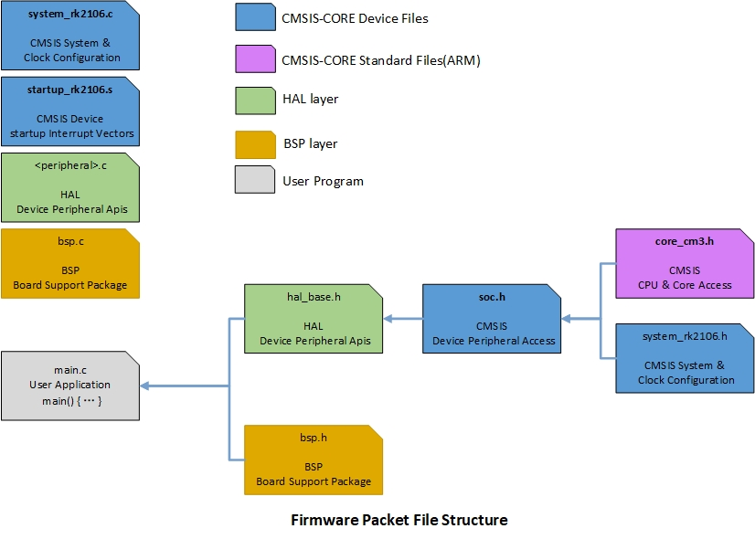
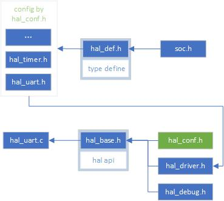
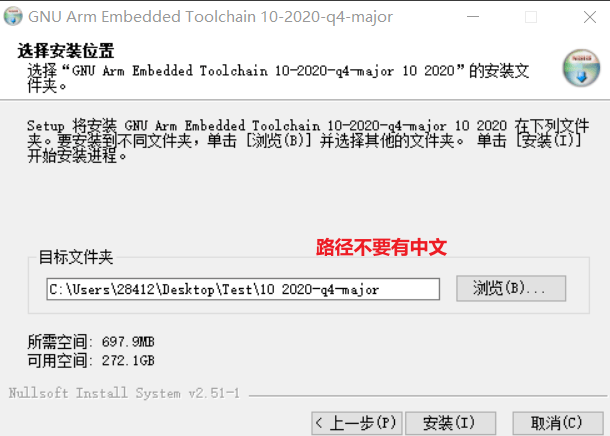
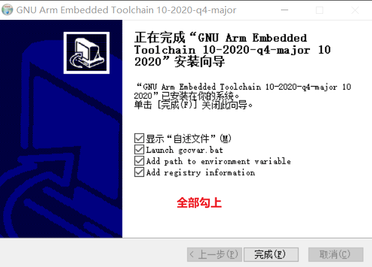

# Rockchip User Guide HAL

文件标识：RK-YH-YF-070

发布版本：V3.1.0

日期：2023-08-30

文件密级：□绝密   □秘密   □内部资料   ■公开

**免责声明**

本文档按“现状”提供，瑞芯微电子股份有限公司（“本公司”，下同）不对本文档的任何陈述、信息和内容的准确性、可靠性、完整性、适销性、特定目的性和非侵权性提供任何明示或暗示的声明或保证。本文档仅作为使用指导的参考。

由于产品版本升级或其他原因，本文档将可能在未经任何通知的情况下，不定期进行更新或修改。

**商标声明**

“Rockchip”、“瑞芯微”、“瑞芯”均为本公司的注册商标，归本公司所有。

本文档可能提及的其他所有注册商标或商标，由其各自拥有者所有。

**版权所有 © 2020 瑞芯微电子股份有限公司**

超越合理使用范畴，非经本公司书面许可，任何单位和个人不得擅自摘抄、复制本文档内容的部分或全部，并不得以任何形式传播。

瑞芯微电子股份有限公司

Rockchip Electronics Co., Ltd.

地址：     福建省福州市铜盘路软件园A区18号

网址：     [www.rock-chips.com](http://www.rock-chips.com)

客户服务电话： +86-4007-700-590

客户服务传真： +86-591-83951833

客户服务邮箱： [fae@rock-chips.com](mailto:fae@rock-chips.com)

---

**前言**

**概述**

本文提供 RK HAL 层的原理和详细开发介绍。

**产品版本**

| **芯片名称** | **内核版本** |
| ------------ | ------------ |
| RK2108       | 裸系统、RTOS |
| Pisces       | 裸系统、RTOS |
| RK2206       | 裸系统、RTOS |
| RV1126       | 裸系统、RTOS |
| RK625        | 裸系统、RTOS |
| RK3568       | 裸系统、RTOS |

**读者对象**

本文档（本指南）主要适用于以下工程师：

技术支持工程师

软件开发工程师

**修订记录**

| **版本号** | **作者** | **修改日期** | **修改说明**                           |
| ---------- | -------- | ------------ | -------------------------------------- |
| V0.0.1     | 2018.11  | Jon Lin      | 提供基础代码结构说明和基本规范         |
| V1.0.0     | 2018.11  | Kever Yang   | 重构文档并确定编程规范                 |
| V1.0.1     | 2019.03  | Kever Yang   | 新增和完善目录结构，代码规范，单元测试 |
| V2.0.0     | 2019.04  | Jon Lin      | 新增代码兼容性规范                     |
| V2.0.1     | 2019.05  | Jon Lin      | 新增 BSP 库规范                        |
| V2.0.2     | 2019.12  | Jon Lin      | 新增 hal_conf.h.template 文件规范      |
| V2.1.0     | 2020.01  | Jon Lin      | 修改文档规范                           |
| V2.2.0     | 2020.01  | Jon Lin      | 新增固件库裸系统移植说明               |
| V2.3.0     | 2020.06  | Tao Huang    | 调整格式                               |
| V2.3.1     | 2020.07  | Tao Huang    | 调整格式                               |
| V2.4.0     | 2020.07  | Tao Huang    | 强调排版风格遵守 MISRA-C               |
| V2.5.0     | 2021.03  | Jon Lin      | 增加 SOC 支持、修改 Doxygen 规范       |
| V2.6.0     | 2021.03  | Jon Lin      | 增加 middleware 目录       |
| V2.7.0     | 2021.03  | Jon Lin      | demo 示例由 RK2106 更改为 RK2108，优化文件布局章节 |
| V2.8.0     | 2021.05  | Jon Lin      | 增加 test_conf.h 说明、增加和修正模块缩写 |
| V2.9.0     | 2021.06  | Jon Lin      | 增加 Doxygen 中文注释规范，增加用户指南扩展，调整裸系统 Main 函数格式，优化单元测试章节说明，添加扩展开发包说明 |
| V3.0.0 | 2021.06 | Jon Lin | 增加多核相关编程规范 |
| V3.0.1 | 2023.06 | Cliff | 修改打印调试配置说明 |
| V3.1.0 | 2023.08 | Steven Liu | 增加芯片差异兼容性处理补充规范 |

---

**目录**

[TOC]

---

## 术语/缩写

| 缩写    | 详细描述                                    |
| ------- | ------------------------------------------- |
| ADC     | Analog-to-digital converter                 |
| CAN     | Controller area network                     |
| CPAL    | Core Peripheral Access Layer                |
| CRU     | Clock and Reset Unit                        |
| DMA     | Direct Memory Access                        |
| GPIO    | General purpose I/Os                        |
| GRF     | General Register File                       |
| HAL     | Hardware Abstract Layer                     |
| I2C     | Inter-integrated circuit                    |
| I2S     | Inter-integrated sound                      |
| NVIC    | Nested Vectored Interrupt Controller        |
| PWM     | Pulse Width Modulation                      |
| RTC     | Real-time clock                             |
| SFC     | Serial Flash Controller                     |
| SMCCC   | ARM SMC Calling Convention                  |
| SPI     | Serial Peripheral interface                 |
| SysTick | System tick timer                           |
| UART    | Universal asynchronous receiver/transmitter |
| USB     | Universal Serial Bus                        |
| VOP     | Video Output Processor                      |
| WDT     | watchdog                                    |

---

## 前言

该文档主要介绍 Rockchip MCU HAL(Hardware Abstract Layer)固件库的源码编程规范、结构体和宏定义规范、固件库文档目录结构、固件库涉及的核内访问、固件库提供的所有的设备驱动模块的接口，编程示例介绍。驱动开发人员需要详细阅读规范，并按照规范开发和维护相应驱动模块，使用该文档能够有效的提供开发效率，降低开发难度。

HAL 固件库中涉及核内外设访问层—CPAL(Core Peripheral Access Layer)使用 MISRA-C 标准。所有的外设驱动部分都有一组外设接口，所有的代码结构、函数名和参数命名都是按照规范设定。编程按照 ANSI-C 标准.

---

## 固件库概述

### 目录结构

```
.
├── doc
│   └── Rockchip_User_Guide_HAL_CN.md
├── lib
│   ├── CMSIS
│   │   ├── Device
│   │   │   └── RK2108
│   │   │       ├── Include
│   │   │       │   ├── soc.h
│   │   │       │   ├── rk2108.h
│   │   │       │   ├── rk2108_usb.h
│   │   │       │   └── system_rk2108.h
│   │   │       └── Source
│   │   │           ├── GCC
│   │   │           │   ├── gcc_arm.ld
│   │   │           │   └── startup_rk2108.S
│   │   │           └── system_rk2108.c
│   │   └── Include
│   │       ├── cmsis_compiler.h
│   │       ├── cmsis_gcc.h
│   │       ├── core_cm4.h
│   │        ...
│   ├── bsp
│   │   └── RK2108
│   │       ├── hal_bsp.c
│   │       └── hal_bsp.h
│   └── hal
│       ├── inc
│       │   ├── hal_base.h
│       │   ├── hal_def.h
│       │   ├── hal_nvic.h
│       │   ├── hal_uart.h
│       │   ...
│       └── src
│           ├── hal_base.c
│           ├── hal_nvic.c
│           ├── hal_uart.c
│           ...
├── project
│   └── rk2108
│       ├── GCC
│       └── src
│           ├── hal_conf.h
│           ├── main.c
│           └── main.h
└── middleware

```

| 目录      | 内容                                             |
| --------- | ------------------------------------------------ |
| doc       | 项目相关文档                                     |
| lib       | 用于集成到 rt-thread, zephyr 等 RTOS 的 lib 目录 |
| lib/CMSIS | 以 ARM CMSIS5 为 base, 加上 Rockchip SoC 定义    |
| lib/hal   | MCU 的 HAL 驱动库代码                            |
| lib/bsp   | MCU 的芯片公共 BSP 配置的代码                    |
| test      | HAL 驱动的驱动测试代码                           |
| middleware | 扩展开发包                             |

### 库组成预览

以 RK2108 为例：



### SOC 目录文件

lib/CMSIS/Device 目录存放 SoC 相关的硬件信息,寄存器定义文件以及芯片启动相关代码.

| 文件               | 描述                                                         |
| ------------------ | ------------------------------------------------------------ |
| startup_rk2108.S   | 包含重置处理程序和异常向量的工具链特定文件,根据需求调整堆栈大小。 |
| system_rk2108.c/.h | 包含：系统 start up 汇编文件中在跳转 main 前调用的 SystemInit()。 |
| gcc_arm.ld         | 链接脚本                                                     |
| soc.h              | 存放中断号、模块基地址、寄存器结构体、位宏信息的头文件，HAL 库统一引用 |
| rk2108.h           | 存放由 rxbb 工具生成的模块基地址、寄存器结构体、位宏信息的头文件 |
| rk2108_usb.h       | usb 模块寄存器结构体、位宏信息的头文件                       |

### HAL 目录文件

lib/hal 目录包含 HAL 库的代码主体，其中 src 目录直接包含所有模块的 C 代码, inc 目录包含对外 API 函数声明, 由于模块寄存器结构体和 BIT 定义都已包含在 SOC 头文件中, 各模块不再使用私有头文件, 如需要定义私有的宏或结构体, 可在 C 文件中直接定义。

| 文件                | 描述                                                         |
| ------------------- | ------------------------------------------------------------ |
| hal_ppp.c           | 主要外设/模块驱动文件,包括所有的 RK 设备通用的 API，例如：hal_adc.c, hal_spi.c。 |
| hal_ppp.h           | 主要驱动器 C 文件的头文件，它包括公共数据、句柄和枚举结构、定义语句和宏，以及导出的通用接口。例如：hal_adc.h, hal_spi.h。 |
| hal_ppp_ex.c        | 外围设备或模块驱动程序的扩展文件。这组文件中包含特定型号或者系列的芯片的特殊 API。以及如果该特定的芯片内部有不同的实现方式，则该文件中的特殊 API 将覆盖_ppp 中的通用 API。例如：hal_adc_ex.c, hal_spi_ex.c。 |
| hal_ppp_ex.h        | 外围设备或模块驱动程序的扩展文件头文件，它包括特定的数据和枚举结构，定义语句和宏，以及导出的设备部分，例如: hal_adc_ex.ah, hal_spi_ex.h。 |
| hal_base.c          | HAL 库初始化，包含 DEBUG 接口、基于 SysTick 接口的 Time Delay |
| hal_base.h          | hal_base.c 头文件                                            |
| hal_conf.h.template | HAL 库所有模块全功能的宏开关配置文件，需根据具体的芯片和设备来裁剪相应配置以输出目标设备的 hal_conf.h。<br />该文件有以下规范：<br />1.文件由 芯片配置、模块配置、模块次级配置组成<br />2.对于可选的配置需添加明确的注释说明 |
| hal_def.h           | 常见的 HAL 资源，如通用定义语句、枚举、结构体和宏定义。      |

### BSP 目录文件

bsp 库用来存放某个芯片公共的板级配置和 dev 资源，代码路径为./lib/bsp/project_name/hal_bsp.c/h。

| 文件      | 描述                                                         |
| --------- | ------------------------------------------------------------ |
| hal_bsp.c | 某个芯片公共的板级配置、HAL 驱动需求的可抽象化的相关模块资源（如 i2c_dev）。 |
| hal_bsp.h | hal_bsp.c 头文件                                             |

### test 目录文件

test 目录用于存放 HAL 的 unit test 相关实现，其中：
test/unity:　测试框架 Unity 的代码实现，来源于 <https://github.com/ThrowTheSwitch/Unity.git>.
test/hal: HAL 驱动的测试代码
test_runner.c: 测试骨架程序，用于用户主程序调用

### project 目录文件

project 目录基于板子或者项目建立工程，包含可运行的用户代码, 主要用于提供 main 函数调用各模块接口. 如 project/rk2108 是针对该板子的工程，里面需要实现所有板子特有的软硬件初始化和模块定义。

| 文件       | 描述                                                         |
| ---------- | ------------------------------------------------------------ |
| hal_conf.h | HAL 模块宏开关配置的头文件，通过重定义该文件可以裁剪 HAL 库。 |
| rkxx_bsp.c | 包含 BSP 初始化。                                            |
| main.c/.h  | 系统初始化：包括 HAL_Init()，系统时钟初始化，外设初始化，用户应用。 |

### middleware 目录文件

middleware 目录用于存放扩展开发包，例如：可用于存放 FatFs 实现代码 middleware/FatFs。

## 如何使用固件库

### 直接裸系统运行

HAL 裸系统开发较为简单，以下将以 RK2206 串口小程序作为例程对几个关键步骤进行说明，其他模块的开发原理与之相近，主要是基于 lib/hal 模块驱动的扩展。

#### 添加代码

以下为串口例程裸程序的文件目录：

```c
.
├── hal /* 完整的 HAL 开发包 */
│   ├── doc
│   ├── lib
│   ├── LICENSE
│   ├── project
│   ├── test
│   └── tools
├── hal_conf.h /* 根据 hal_conf.h.template 进行裁减的 HAL 库配置 */
└── main.c /* 串口测试程序源码 */
```

其中 main.c 如下：

```c
#include "hal_base.h"
#include "hal_bsp.h"

int Main(void);

static void BSP_UART_Init(void)
{
    /* UART0 m0 */
    WRITE_REG_MASK_WE(GRF->GPIO0B_IOMUX_H,
                      GRF_GPIO0B_IOMUX_H_GPIO0B4_SEL_MASK |
                      GRF_GPIO0B_IOMUX_H_GPIO0B5_SEL_MASK |
                      GRF_GPIO0B_IOMUX_H_GPIO0B6_SEL_MASK |
                      GRF_GPIO0B_IOMUX_H_GPIO0B7_SEL_MASK,
                      2 << GRF_GPIO0B_IOMUX_H_GPIO0B4_SEL_SHIFT |   // UART0_CTSN_M0
                      2 << GRF_GPIO0B_IOMUX_H_GPIO0B5_SEL_SHIFT |   // UART0_RTSN_M0
                      2 << GRF_GPIO0B_IOMUX_H_GPIO0B6_SEL_SHIFT |   // UART0_RX_M0
                      2 << GRF_GPIO0B_IOMUX_H_GPIO0B7_SEL_SHIFT);   // UART0_TX_M0
}

int Main(void)
{
    struct UART_REG *s_pUart;
    const struct HAL_UART_DEV *s_uartDev;

    HAL_Init();

    struct HAL_UART_CONFIG hal_uart_config = {
        .baudRate = UART_BR_115200,
        .dataBit = UART_DATA_8B,
        .stopBit = UART_ONE_STOPBIT,
        .parity = UART_PARITY_DISABLE,
    };

    s_pUart = UART0;
    s_uartDev = &g_uart0Dev; /* 依赖 HAL bsp 开发包里的 device 结构体资源 */

    BSP_UART_Init();
    HAL_UART_Init(s_uartDev, &hal_uart_config);
    HAL_UART_SerialOutChar(s_pUart, 'c');

    while (1)
        ;
}
```

hal_conf.h:

```c
#ifndef _HAL_CONF_H_
#define _HAL_CONF_H_

#define RKMCU_RK2206

#define HAL_UART_MODULE_ENABLED

#endif
```

#### 编译

系统编译主要分析以下几个内容：

**头文件依赖**

```c
. /* 根目录下的 hal_conf.h 文件 */
./hal/lib/hal/inc /* 模块驱动头文件，包括所需的 uart 模块 */
./hal/lib/bsp/RK2206 /* HAL 提供的芯片级 bsp 支持头文件，详见 BSP 目录文件章节说明 */
./hal/lib/CMSIS/Device/RK2206/Include /* 基于 CMSIS 开发的 core 层头文件，详见 SOC 目录文件章节说明 */
./hal/lib/CMSIS/Core/Include  /* CMSIS 头文件 */
```

**源代码目录**

```c
./hal/lib/hal/src/hal_base.c /* HAL 库初始化及基础支持包源码 */
./hal/lib/hal/src/hal_debug.c  /* HAL debug 支持源码 */
./hal/lib/hal/src/hal_uart.c /* HAL uart 模块驱动源码，如有其他模块开发需求，同理添加 */
./hal/lib/bsp/RK2206/hal_bsp.c /* HAL 提供的芯片级 bsp 支持源码 */
./hal/lib/CMSIS/Device/RK2206/Source/Templates/GCC/startup_rk2206.S /* start up 模板源码 */
./hal/lib/CMSIS/Device/RK2206/Source/Templates/system_rk2206.c /* CMSIS system_init 实现源码 */
./main.c /* uart 测试程序 */
```

**链接脚本**

```c
./hal/lib/CMSIS/Device/RK2206/Source/Templates/GCC/gcc_arm.ld /* HAL 开发包提供的链接脚本模板 */
```

**编译命令范例**

简单分析所需的编译要素后，就可以确定相应的编译命令了，以下为 GCC 交叉编译工具链下的简单编译命令，MDK 工程相近,编译选项中添加相应文件即可：

```shell
arm-none-eabi-gcc -mcpu=cortex-m4 -mthumb -std=c99 -I"." -I"./hal/lib/hal/inc" -I"./hal/lib/bsp/RK2206" -I"./hal/lib/CMSIS/Device/RK2206/Include" -I"./hal/lib/CMSIS/Core/Include"  -c -o ./hal_base.o hal/lib/hal/src/hal_base.c

arm-none-eabi-gcc -mcpu=cortex-m4 -mthumb -std=c99 -I"." -I"./hal/lib/hal/inc" -I"./hal/lib/bsp/RK2206" -I"./hal/lib/CMSIS/Device/RK2206/Include" -I"./hal/lib/CMSIS/Core/Include" -c -o ./hal_debug.o hal/lib/hal/src/hal_debug.c

arm-none-eabi-gcc -mcpu=cortex-m4 -mthumb -std=c99  -I"." -I"./hal/lib/hal/inc" -I"./hal/lib/bsp/RK2206" -I"./hal/lib/CMSIS/Device/RK2206/Include" -I"./hal/lib/CMSIS/Core/Include" -c -o ./hal_uart.o hal/lib/hal/src/hal_uart.c

arm-none-eabi-gcc -mcpu=cortex-m4 -mthumb -std=c99  -I"." -I"./hal/lib/hal/inc" -I"./hal/lib/bsp/RK2206" -I"./hal/lib/CMSIS/Device/RK2206/Include" -I"./hal/lib/CMSIS/Core/Include" -c -o ./hal_bsp.o hal/lib/bsp/RK2206/hal_bsp.c

arm-none-eabi-gcc -mcpu=cortex-m4 -mthumb -std=c99  -I"." -I"./hal/lib/hal/inc" -I"./hal/lib/bsp/RK2206" -I"./hal/lib/CMSIS/Device/RK2206/Include" -I"./hal/lib/CMSIS/Core/Include" -c -o ./startup_rk2206.o ./hal/lib/CMSIS/Device/RK2206/Source/Templates/GCC/startup_rk2206.S

arm-none-eabi-gcc -mcpu=cortex-m4 -mthumb -std=c99  -I"." -I"./hal/lib/hal/inc" -I"./hal/lib/bsp/RK2206" -I"./hal/lib/CMSIS/Device/RK2206/Include" -I"./hal/lib/CMSIS/Core/Include" -c -o ./system_rk2206.o ./hal/lib/CMSIS/Device/RK2206/Source/Templates/system_rk2206.c

arm-none-eabi-gcc -mcpu=cortex-m4 -mthumb -std=c99  -I"." -I"./hal/lib/hal/inc" -I"./hal/lib/bsp/RK2206" -I"./hal/lib/CMSIS/Device/RK2206/Include" -I"./hal/lib/CMSIS/Core/Include" -c -o ./main.o ./main.c

arm-none-eabi-gcc  ./hal_base.o ./hal_debug.o ./hal_bsp.o ./hal_uart.o ./startup_rk2206.o ./system_rk2206.o  ./main.o -mcpu=cortex-m4 -mthumb -Wl,-gc-sections --specs=nosys.specs -lm -lgcc -nostartfiles  --specs=nano.specs -mcpu=cortex-m4 -mthumb -std=c99 -Os -g -T./hal/lib/CMSIS/Device/RK2206/Source/Templates/GCC/gcc_arm.ld -Wl,-Map=./TestDemo.map,-cref -o TestDemo.elf

arm-none-eabi-objcopy -O binary TestDemo.elf TestDemo.bin
```

#### 程序执行

编译出来的 TestDemo.bin\elf 可以通过 J-link 工具下载到设备中，或通过 RK MCU 打包工具打包下载，详细可联系 RK 工程师。

### 与 RTOS 集成

#### 集成到 rt-thread OS

### Power Management

## 编程规范

本章提供必要的编程规范.

### 命名规则

芯片相关的以芯片型号为关键字标识,如 start up 汇编“*startup_rk2108.S*”，驱动相关的硬件抽象层文件以模块简写开头，如“*hal_uart.c*”.

#### 函数命名

**函数名：**每一个函数命名以驼峰式为基础, 加上以下划线分隔的全大写前缀或后缀, 包括以下部分：

```c
int PRE_MODULE_FuncFeature_SUB(void)
```

- 前缀：'PRE_', 全大写
- HAL 库对外提供的函数接口，应以"*HAL_*"开头，例如：*HAL_UART_ReadByte()*；
    - HAL 库对外提供的宏定义函数接口，应以"\_\__HAL\__"开头，例如："*\_\_HAL_UART_SetIntEnabled*"；
- 模块名缩写：'MODULE_'；
- 功能组合缩写：FuncFeature：按首字母大写区分单词的**驼峰式**组合；
- 后缀：'_SUB()'：如果接口定义相近，但需要区分方式，可以添加后缀，例如，“_IT”中断模式。

合法函数命名示例:

```c
/* HAL API Level function */
HAL_Status HAL_USB_Init(void);
HAL_Status HAL_USB_RequestEnqueue();
HAL_Status HAL_RTC_SetTime(eTIMER HAL_TIMER0, int32 time);

/* Module internal function */
HAL_Status USB_Reset(void);
HAL_Status USB_StartTransfer();
```

#### 变量命名

变量的命名尽量在有意义的前提下尽量简写，如：
推荐用 clk, cnt, msg, 而不推荐 clock, count, message．

变量和函数参数使用驼峰式间隔, 但第一个单词仍使用小写, 以便与函数区别,同时便于书写简单变量, 如 tmp, ret 等.

```c
int i, j;
int tmp;
int ret;
int retValue, varNum;
```

##### 全局变量

全局变量需要以'g_'作为前缀.

##### 静态变量

静态变量需要以's_'作为前缀.

##### 指针

指针变量需要以'p'为前缀。

#### 宏定义, 枚举类型命名

所有宏定义及枚举类型使用全大写，下划线分隔单词．

#### 寄存器命名

寄存器结构体中命名使用全大写，下划线分隔单词．
寄存器名主体一致，但 ID 不一致的，合并为数组。

### 版权及 License

版权和 License 会使用 Linux Foundation 的 ACT 工具进行检查.

#### 使用 SPDX 格式 License

在所有文件第一行, 加入如下 Licnse 信息, MCU-HAL 主体使用 BSD3-Clause 授权.

```c
/* SPDX-License-Identifier: BSD-3-Clause */
```

#### 版权部分使用如下信息

```c
/*
 * Copyright (c) 2020 Rockchip Electronics Co., Ltd.
 */
```

### 排版

项目使用 uncrustify 工具辅助排版, 整体排版风格包括空行，空格，括号等的使用参考 Linux kernel 的 coding style, 但如果和 MISRA-C 标准冲突，则使用 MISRA-C 标准的要求。本文档仅单独说明不一样的部分.

```shell
# Ubuntu/Debian下面直接安装
sudo apt-get install uncrustify

# 建议使用0.66.1以上版本，如果版本过低，可以使用源码安装
git clone https://github.com/uncrustify/uncrustify.git

cd uncrustify
git checkout uncrustify-0.68.1
mkdir build
cd build

cmake -DCMAKE_BUILD_TYPE=Release ..
make
sudo make install

# 检查版本号
uncrustify --version

# 运行命令检查coding style合法性
uncrustify -c .uncrustify.cfg --replace --no-backup files
```

Jenkins 也会使用以上命令进行校验，原则上需要通过校验才合并代码。

#### 缩进

全文不使用 TAB 分隔, 默认使用 4 个空格取代 TAB.

### 注释及文档

项目将使用 Doxygen 工具来自动化生成文档, 文件及 HAL API 函数的注释需要按照 Doxygen 的要求来写.

所有需要详细注释的内容，应出现在定义处，如函数 API 注释在 C 文件内，宏 API 注释在头文件内，两边都出现的只需要定义处详细注释即可。

#### Doxygen 注释及其布局

##### Doxygen 关键字

| 关键字                           | 简介                                                         |
| -------------------------------- | ------------------------------------------------------------ |
| @defgroup                        | 指示注释块包含一组类、文件或命名空间的文档。可用于对类、文件或命名空间进行分类，并记录这些类别。还可以将组用作其他组的成员，从而构建组的层次结构。与@}成组使用。 |
| @addtogroup                      | 定义组与@defgroup 相同，但不同的是，使用相同名字的命令，多次将不会导致警告，而是一组文档合并。与@}成组使用。 |
| @verbatim                        | 块注释且 doxygen 关键字无效，与@endverbatim 配合使用。       |
| @endverbatim                     | 与@verbatim 配合使用。                                       |
| @brief                           | 简要描述                                                     |
| @parm                            | 函数参数定义                                                 |
| @return                          | 函数返回值定义                                               |
| @attention                       | 需要注意的信息                                               |
| /** to-do */                     | 代码块前的注释                                               |
| /**< to-do */                    | 置于代码右侧的注释，包括成员变量注释，例如：结构体内成员的注释（优先使用） |
| /*!< to-do */                    | 置于代码右侧的注释，包括成员变量注释，例如：结构体内成员的注释 |
| /~english<br />/~chinese<br />/~ | 通过 Doxygen 配置 OUTPUT_LANGUAGE= 来选中对应关键字后的注释内容 |

##### RK_HAL_Driver 库

文件注释统一输出到 RK_HAL_Driver 库，用法如下：

```c
/** @addtogroup RK_HAL_Driver
 *  @{
 */

...

/** @} */
```

###### 定义外设模块

```c
/** @addtogroup DEMO
 *  @{
 */

/** @} */
```

###### HOW-TO-USE

每个模块都应有完整、简明的介绍，用以说明如何使用该模块。

```c
/** @defgroup How_To_Use How To Use
 @verbatim

 ==============================================================================
                    #### How to use ####
 ==============================================================================
 The DEMO driver can be used as follows:

 @endverbatim
 */
```

对于复杂模块需要详细说明的情况，可以考虑单独将 How_To_Use 说明写成用户指南文档并存放在 doc/guides 目录下。

扩展 How_To_Use 规范如下：

- doc/guides 添加说明文档，例如，doc/guides/Rockchip_User_Guide_HAL_SPI_MEM_CN.md，要求：

    - 文档一级目录添加 lable，例如 lable Rockchip_User_Guide_HAL_SPI_MEM：

```markdown
# Rockchip HAL SPI_MEM 用户指南 {#Rockchip_User_Guide_HAL_SPI_MEM}
```

- doc/guides/Guides.h mainpage 添加 subpage 引用。如果仅提供中文或英文文档，则应在 subpage 前添加对应 \\~chinese 或 \\~english 关键字

```c
/*!
\~chinese \mainpage 指南
\~english \mainpage Guides
\~ - \subpage Rockchip_User_Guide_HAL_SPI_MEM
*/
```

- 模块代码内添加链接，原有 How_To_Use 处添加以下说明：

```c
/** @defgroup MODULE_How_To_Use How To Use
 *  @{

\~chinese 有关详细信息，请参阅 @ref Rockchip_User_Guide_HAL_SPI_MEM 。
\~english See @ref Rockchip_User_Guide_HAL_SPI_MEM for more info.
\~

 @} */
```

详细可参考 SPI_MEM 模块扩展文档 doc/guides/Rockchip_User_Guide_HAL_SPI_MEM_CN.md

###### 外设驱动公共定义

所有公共的枚举、宏定义、宏定义函数、定义类型、结构体都添加到该组。

```c
/** @defgroup DEMO_Exported_Definition_Group1 Basic Definition
 *  @{
 */

/** @} */
```

###### 外设驱动函数子模块

驱动文件接口如果属于以下分组，需添加到相应的子模块：

- 休眠唤醒接口

```c
/** @defgroup DEMO_Exported_Functions_Group1 Suspend and Resume Functions
 @verbatim

 ===============================================================================
             #### Suspend and Resume functions ####
 ===============================================================================
 This section provides functions allowing to suspend and resume the module:

 ...to do or delete this row

 @endverbatim
 *  @{
 */

/** @} */
```

- 获取状态接口

```c
/** @defgroup DEMO_Exported_Functions_Group2 State and Errors Functions
 @verbatim

 ===============================================================================
             #### State and Errors functions ####
 ===============================================================================
 This section provides functions allowing to get the status of the module:

 @endverbatim
 *  @{
 */

/** @} */
```

- IO 操作

```c
/** @defgroup DEMO_Exported_Functions_Group3 IO Functions
 @verbatim

 ===============================================================================
             #### IO functions ####
 ===============================================================================
 This section provides functions allowing to IO controlling:

 @endverbatim
 *  @{
 */

/** @} */
```

- 初始化反初始化

```c
/** @defgroup DEMO_Exported_Functions_Group4 Init and DeInit Functions
 @verbatim

 ===============================================================================
             #### Init and deinit functions ####
 ===============================================================================
 This section provides functions allowing to init and deinit the module:

 ...to do or delete this row

 @endverbatim
 *  @{
 */

/** @} */
```

- 其他接口

```c
/** @defgroup DEMO_Exported_Functions_Group5 Other Functions
 *  @{
 */

/** @} */
```

- 自定义子模块

```c
/** @defgroup DEMO_Exported_Functions_Group5 XXXX Functions
 *  @{
 */

/** @} */
```

##### 代码注释

单行注释

```c
/** This is a multi line comment */
```

多行注释

```c
/**
 *  This is a multi line comment;
 *  Comment line 2.
 */
```

##### 函数注释

函数注释在函数定义处，通常为.c 文件中，如函数有多处定义处，可将注释置于函数声明处。

```c
/**
 * @brief  Stop TIMER counter.
 * @param  timerNum: Choose TIMER.
 * @return HAL_Status.
 * Just disable TIMER, and keep TIMER configuration.
 */
```

##### 中文注释

**规范**

- 如英文注释能符合用户理解，仅使用英文注释
- 如英文注释对于中文用户来说有较大理解难度，适当改用或补充中文注释

**用法**

```c
\~english English notes
\~chinese 中文注释内容
\~
```

**实例**

```c
struct GPIO_IRQ_GROUP_PRIO_GROUP {
    uint32_t cpuGroup[PLATFORM_CORE_COUNT]; /**< mask bits for groups of PINs */
    IRQn_Type GIRQId[PLATFORM_CORE_COUNT];  /**<
                                             * \~english a GIRQ is a GPIO HWIRQ or DIR to dispatching
                                             * IRQ for a group of PINs assigned in cpuGroup[]
                                             *
                                             * \~chinese 每个 cpuGroup[] 项指定的一组 PINs 对应的分发中
                                             *（DIRQ）的中断 ID。如：prioGroup[0].cpuGroup[1] 的一组 PINs
                                             * 对应的分发中断为 prioGroup[0].GIRQId[1]；对应的优先级为
                                             * prioGroup[0].prio。由于 GPIO 的物理中断(HWIRQ)也需要负责一
                                             * 组 PINs 的中断分发，并且对应的中断优先级最高；所以只能分配到
                                             * prioGroup[0] 对应的 GIRQId[]
                                             *
                                             * \~
                                             */
    uint32_t prio;                          /**< irq priority of GIRQId[] of this struct  */
};
```

##### Doxygen 工具使用

该库 HAL 驱动文件相应文档由 doxygen 工具生成，所以需要对文档注释检校是否符合 doxygen 文档规范。

linux

- 安装 doxygen，参考链接 <http://www.doxygen.nl/download.html>，ubuntu 下可以直接使用命令：sudo apt-get install doxygen，如果出现‘sh: 1: dot: not found’，请安装 sudo apt-get install graphviz。

- 当前最新版本 1.8.17

- 执行命令

  ```shell
  cat tools/Doxyfile tools/doxyfile_rk3568 | doxygen - # 生成中文文档（默认）
  cat tools/Doxyfile tools/doxyfile_rk3568 | sed "s/Chinese/English/;s/_CN.md/_EN.md/" | doxygen - # 生成英文文档
  ```

  其中 “doxyfile_rk3568” 应替换为对应芯片的配置文件。

- 检查是否存在 warning 和 error 关键字。

#### 通用代码注释

单行注释不接受双斜杠 `//`，必须使用如下风格：

```c
/* This is a comment */
```

多行注释请使用如下风格：

```c
/*
 * This is a multi line comment;
 * Comment line 2.
 */
```

#### 通用函数注释

所有函数按照 doxygen 标准注释，且所有公共 api 都应有相应注释。

### 函数

#### API 参数要求

简单 IP 的 API 传参可以直接使用结构体指针作为控制器 ID。
如

```c
/* Define in SoC header */
#define UART0               ((struct UART_REG *) UART0_BASE)

/* hal_uart.c */
HAL_Status HAL_UART_WriteByte(void *pUART, uint8_t *pdata, uint32_t cnt);

/* drv_uart.c or other user code */
HAL_UART_WriteByte(UART0, buf, 1);
```

须使用如下参数合法性检查，因改检查代码占用较多代码，只在 Init 做常规检查，其他入口以 Assert 形式检查(release 时会关闭)。

```c
#define IS_UART_INSTANCE(INSTANCE) (((INSTANCE) == UART1) || ((INSTANCE) == UART2) || ((INSTANCE) == UART3) || ((INSTANCE) == UART4)
```

I2C/I2S/SPI/UART/PWM/ADC/DMA 建议使用这种模式。

如果硬件信息不足，需要额外变量作为状态辅助，可以使用结构体，如 MMC 的 mmc_host 结构体形式；

#### 参数检查要求

必须在合理范围内对参数做合法性检查，代码使用异常情况使用 ASSERT()进行检查，只在 debug 版本生效，实际使用也可能碰到的出错类型，请使用普通代码检查参数合法性．

#### 出错码

所有函数调用, 返回值使用有效出错码, 请不要自定义出错码, 出错码的值和含义参考自 Linux kernel.
无特定返回值时使用 0 表示函数执行成功.

```c
typedef enum
{
    HAL_OK       = 0x00U,
    HAL_ERROR    = (-1),
    HAL_BUSY     = (-16),
    HAL_NODEV    = (-19),
    HAL_INVAL    = (-22),
    HAL_TIMEOUT  = (-110)
} HAL_Status;
```

#### 注意点

- 为了降低模块间的耦合性、降低误调用的导致并发问题的可能，HAL 库公共函数应被设计为仅由上层调用的结构，即 HAL 层间不进行相互调用接口；
- 如该接口函数、或该组接口函数可供 HAL 层互相调用，请在函数接口注释处、或函数分组注释处相应添加@attention 关键字，并附上“this API allow direct use in the HAL layer” 或 “these APIs allow direct use in the HAL layer”。

```c
/**
 * @brief Set clk freq.
 * @param  clockName: CLOCK_Name id.
 * @param  rate: clk rate.
 * @return HAL_Status.
 * @attention this API allow direct use in the HAL layer.
 */
HAL_Status HAL_CRU_ClkSetFreq(eCLOCK_Name clockName, uint32_t rate)
{
	...
}
```

```c
/** @defgroup HAL_BASE_Exported_Functions_Group5 Other Functions
 *  @attention these APIs allow direct use in the HAL layer.
 *  @{
 */

```

### 变量，结构

#### 数据类型

编码请使用位数明确的数据类型, 不推荐使用 long, short 等可能产生不同结果的类型, 一律使用 stdint 的*_t 类型，如下:

```c
typedef	unsigned char            uint8_t
typedef	signed char              int8_t
typedef	unsigned short int       uint16_t
typedef	signed short int         int16_t
typedef	unsigned int             uint32_t
typedef	signed int               int32_t
typedef	unsigned long long       uint64_t
typedef	signed long long         int64_t
typedef	unsigned char            bool
```

#### 结构体定义

结构体定义推荐使用类 linux kernel 普通类型，主要有以下规范：

- 不使用 typedef 以明确具体类型；
- 结构体大写命名；
- 结构体成员命名为小驼峰，包括变量，数组和函数指针，其中函数指针内的参数亦为小驼峰命名

```c
struct STRUCT_A {
uint32_t member1;
uint32_t memberTest;
uint32_t (*memTest)(struct GPIO_REG *pReg, uint32_t pinNum);
};
```

#### 枚举类型定义

只用实例好的定义，命名规则"eMODULE_小驼峰":

```c
typedef enum
{
    UART_ONE_STOPBIT,
    UART_ONE_AND_HALF_OR_TWO_STOPBIT
} eUART_stopBit;
```

#### 寄存器结构体定义

寄存器结构体使用全局变量，如驱动有私有结构，可以包含在私有结构中。

```c
struct CRU_REG {
    __IO uint32_t CRU_APLL_CON[3];
    __IO uint32_t RESERVED1[1];
    __IO uint32_t CRU_MODE_CON;
    __IO uint32_t CRU_CLKSEL_CON[13];
    __IO uint32_t RESERVED2[2];
    __IO uint32_t CRU_CLK_FRACDIV_CON[2];
    __IO uint32_t RESERVED3[10];
    __IO uint32_t CRU_CLKGATE_CON[10];
    __IO uint32_t RESERVED4[6];
    __IO uint32_t CRU_SOFTRST[4];
    __IO uint32_t RESERVED5[4];
    __IO uint32_t CRU_STCLK_CON[2];
    __IO uint32_t RESERVED6[3];
    __IO uint32_t CRU_GLB_SRST_FST_VALUE;
    __IO uint32_t CRU_GLB_CNT_TH;
};

struct CRU_REG * const pCRU = (struct CRU_REG *)CRU_BASE;
```

访问寄存器原则上使用结构体指针访问，如有特殊需求可以使用宏定义。
寄存器设置值使用预定义的宏，不推荐使用立即数；带 mask 寄存器如 CRU, GRF，使用专用接口处理数值:

```c
/* SOC OPS Marco */
#define SET_BIT(REG, BIT)    ((*(volatile uint32_t *)&(REG)) |= (BIT))
#define CLEAR_BIT(REG, MASK) ((*(volatile uint32_t *)&(REG)) &= ~(MASK))
#define READ_BIT(REG, MASK)  ((*(volatile uint32_t *)&(REG)) & (MASK))
#define CLEAR_REG(REG)       ((*(volatile uint32_t *)&(REG)) = (0x0))
#define WRITE_REG(REG, VAL)  ((*(volatile uint32_t *)&(REG)) = (VAL))
#define READ_REG(REG)        ((*(volatile uint32_t *)&(REG)))
#define MODIFY_REG(REG, CLEARMASK, SETMASK) \
        WRITE_REG((REG), (((READ_REG(REG)) & (~(CLEARMASK))) | (SETMASK)))
#define POSITION_VAL(VAL) (__CLZ(__RBIT(VAL)))

#define RK_CLRSET_BITS(CLR, SET) ((((CLR) | ((SET))) << 16) | ((SET)))
#define RK_SET_BITS(SET)         RK_CLRSET_BITS(0, SET)
#define RK_CLR_BITS(CLR)         RK_CLRSET_BITS(CLR, 0)
#define RK_CLRSET_REG_BITS(REG, CLR, SET) \
        WRITE_REG(REG, ((CLR) | (SET)) << 16 | ((SET)))
```

#### 寄存器位宏定义

寄存器 BIT 定义包括 SHIFT, MASK, 以及对应的数值定义，格式为：

```c
#define UART_RBR_DATA_INPUT_SHIFT                          (0U)
#define UART_RBR_DATA_INPUT_MASK                           (0xFFU << UART_RBR_DATA_INPUT_SHIFT)
```

### 文件布局

#### C 代码源文件

驱动代码要求私有宏, 结构体, 变量等定义放 C 代码开头部分, 然后是私有函数, 然后是公共的 API 函数。

参考文件 hal_demo.c：

```c
/* SPDX-License-Identifier: BSD-3-Clause */                                                     // License 及 copyright
/*
 * Copyright (c) 2020-2021 Rockchip Electronics Co., Ltd.
 */

#include "hal_base.h"                                                                          // HAL 库引用

#ifdef HAL_DEMO_MODULE_ENABLED                                                                 // 模块宏保护

/** @addtogroup RK_HAL_Driver                                                                  // Doxygen 所属库声明
 *  @{
 */

/** @addtogroup DEMO                                                                           // Doxygen 所属模块声明
 *  @{
 */

/** @defgroup DEMO_How_To_Use How To Use                                                       // Doxygen 模块应用说明
 *  @{

 The DEMO driver can be used as follows:

 @} */

/** @defgroup DEMO_Private_Definition Private Definition                                       // Doxygen 模块内所属分组声明
 *  @{
 */
/********************* Private MACRO Definition ******************************/

/********************* Private Structure Definition **************************/

/********************* Private Variable Definition ***************************/

/********************* Private Function Definition ***************************/

/** @} */
/********************* Public Function Definition ****************************/
/** @defgroup DEMO_Exported_Functions_Group1 Suspend and Resume Functions                     // Doxygen 模块内所属分组声明

 This section provides functions allowing to suspend and resume the module:

 ...to do or delete this row

 *  @{
 */

/**
 * @brief  It is for test.
 * @param  inputTest: for test.
 * @return HAL_Status
 * ...to do or delete this row
 */
HAL_Status HAL_DEMO_Supsend(uint32_t inputTest)
{
    /* ...to do */
}

/**
 * @brief  It is for test.
 * @param  inputTest: for test.
 * @return HAL_Status
 * ...to do or delete this row
 */
HAL_Status HAL_DEMO_Resume(uint32_t inputTest)
{
    /* ...to do */
}

/** @} */

/** @defgroup DEMO_Exported_Functions_Group2 State and Errors Functions                       // Doxygen 模块内所属分组声明

 This section provides functions allowing to get the status of the module:

 *  @{
 */

/**
 * @brief  It is for test.
 * @param  inputTest: for test.
 * @return HAL_Status
 * ...to do or delete this row
 */
HAL_Status HAL_DEMO_GetXXXState(uint32_t inputTest)
{
    /* ...to do */
}

/** @} */

/** @defgroup DEMO_Exported_Functions_Group3 IO Functions                                     // Doxygen 模块内所属分组声明

 This section provides functions allowing to IO controlling:

 *  @{
 */

/**
 * @brief  It is for test.
 * @param  inputTest: for test.
 * @return HAL_Status
 * ...to do or delete this row
 */
HAL_Status HAL_DEMO_WriteByte_DMA(uint32_t inputTest)
{
    /* ...to do */
}

/** @} */

/** @defgroup DEMO_Exported_Functions_Group4 Init and DeInit Functions                       // Doxygen 模块内所属分组声明

 This section provides functions allowing to init and deinit the module:

 ...to do or delete this row

 *  @{
 */

/**
 * @brief  It is for test.
 * @param  inputTest: for test.
 * @return HAL_Status
 * ...to do or delete this row
 */
HAL_Status HAL_DEMO_Init(uint32_t inputTest)
{
    /* ...to do */
}

/**
 * @brief  It is for test.
 * @param  inputTest: for test.
 * @return HAL_Status
 * ...to do or delete this row
 */
HAL_Status HAL_DEMO_DeInit(uint32_t inputTest)
{
    /* ...to do */
}

/** @} */

/** @defgroup DEMO_Exported_Functions_Group5 Other Functions                                // Doxygen 模块内所属分组声明
 *  @{
 */

/**
 * @brief  It is for test.
 * @param  inputTest: for test.
 * @return HAL_Status
 * ...to do or delete this row
 */
HAL_Status HAL_DEMO_CommonFunction(uint32_t inputTest)
{
    /* ...to do */
}

/** @} */

/** @} */

/** @} */

#endif /* HAL_DEMO_MODULE_ENABLED */

```

#### 头文件

模块头文件 lib/hal/inc/hal_ppp.h 作为对外 API 头文件声明, 应包含对外 API 函数声明, 及其需要使用的结构提和枚举类型，不可包含私有变量，宏或结构体。

参考文件 hal_demo.h：

```c
/* SPDX-License-Identifier: BSD-3-Clause */                                        // License 及 copyright
/*
 * Copyright (c) 2021 Rockchip Electronics Co., Ltd.
 */

#include "hal_conf.h"                                                              // HAL 芯片及模块宏开关

#ifdef HAL_DEMO_MODULE_ENABLED                                                     // 模块宏保护

/** @addtogroup RK_HAL_Driver                                                      // Doxygen 所属库声明
 *  @{
 */

/** @addtogroup DEMO                                                               // Doxygen 所属模块声明
 *  @{
 */

#ifndef _HAL_DEMO_H_
#define _HAL_DEMO_H_

#include "hal_def.h"

/***************************** MACRO Definition ******************************/
/** @defgroup DEMO_Exported_Definition_Group1 Basic Definition                     // Doxygen 模块内所属分组声明
 *  @{
 */

/** Add brief to here */
#define DEMO_TEST_DEFINE 0

/***************************** Structure Definition **************************/

/**
 *  Add multi line brief to here
 *  ...
 */
typedef enum {
    TEST_ENUM_ONE,
    TEST_ENUM_TWO,
    TEST_ENUM_THREE
} eDEMO_Test;

/** @} */
/***************************** Function Declare ******************************/
/** @defgroup DEMO_Public_Function_Declare Public Function Declare                 // Doxygen 模块内所属分组声明
 *  @{
 */

HAL_Status HAL_DEMO_Supsend(uint32_t inputTest);
HAL_Status HAL_DEMO_Resume(uint32_t inputTest);
HAL_Status HAL_DEMO_GetXXXState(uint32_t inputTest);
HAL_Status HAL_DEMO_WriteByte_DMA(uint32_t inputTest);
HAL_Status HAL_DEMO_Init(uint32_t inputTest);
HAL_Status HAL_DEMO_DeInit(uint32_t inputTest);
HAL_Status HAL_DEMO_CommonFunction(uint32_t inputTest);

/** @} */

#endif

/** @} */

/** @} */

#endif /* HAL_DEMO_MODULE_ENABLED */
```

头文件包含关系示例如下：



其中芯片的选择和模块选择统一位于 hal_conf.h。

### 模块驱动

#### 内容要求

覆盖模块硬件所有功能(以公司发布 TRM 为准)，如有暂未覆盖内容，请填写 todo list；
模块驱动使用的设备 ID 由外部提供，驱动内部不设定义或限制，仅做合法性检查；
模块本身独立存在，除 base 内容(delay, 开关中断等)，不依赖任何其他模块
跨模块调用内容，属于 OS 适配层, 如 clock 初始化，中断注册，互斥锁等，
OS 支持(如 RT-Thread)部分，利用控制器状态防重入，原子操作可关中断，锁由 OS 适配层提供, HAL 层不提供。

#### API 接口内容要求

每个驱动应提供如下接口：

- 模块初始化／反初始化
- IO 访问函数
    - 阻塞
    - 非阻塞
- Suspend/Resume
- 状态查询

#### 注释

使用 doxygen 的分组功能，对内容进行分组并分别提供文档，详细参考 [注释及文档](#注释及文档) 章节, 每个驱动提供以下注释：

- 驱动使用指南(how to use this driver)
- 初始化反初始化流程
- IO 访问流程
- Suspend/Resume 流程及内容
- 设备状态，错误，模式描述

#### 中断 callback

由于中断是由上一层代码做注册，所以 HAL 层不提供 callback(需要记录函数指针和参数)，需要 callback 的实现形式为：
上层(如 rt-thread driver)须实现一个 IrqHandler, 注册到对应模块中断，该 IrqHandler 包含 HAL 的 IrqHandler 用于硬件相关处理，另外加入软件逻辑完成锁，完成量，重复操作等功能。

#### 外部引用 HAL 代码

hal 代码对外的头文件引用是统一的'hal_base.h'，不是各个驱动的头文件如'hal_uart.h'，否则可能会有包含错误出现。
HAL 对外的 API 需出现在各自头文件，如 UART 对外 API 出现在 hal_uart.h，然后 hal_uart.h 被 hal_base.h 包含，参考 [文件布局](#文件布局) 的包含关系。

#### C 标准库库函数要求

c 库函数使用过程需注意是否库函数仅能在特定情景下使用。

**禁止使用 memcpy 或类似函数操作模块寄存器**

因 memcpy 存在字节访问的可能，这样会导致不对齐的访问寄存器行为，最终导致系统出现异常，如有批量操作模块寄存器的行为，建议使用循环语句，自行确保访问对齐。

### 模块兼容性处理

HAL 设计以工程师自身对模块的理解为出发点，然而部分 IP 存在差异导致代码存在兼容性的问题，针对该问题提供以下规范（以下直接将 os driver 调用 hal driver 的行为具体到 rt-thread 和 hal 之间的调用关系）。

注意：该部分并不包含驱动将本身对 soc.h 的依赖，如 PD 模块将 PD id 差异化的部分直接放在 soc.h 中。

#### 驱动兼容、芯片间有差异

> I2S、PDM

将差异的部分的配置（通常为结构体）放到 bsp 中定义，实现多 os 复用 bsp 中声明的结构体配置。

#### 驱动不兼容、芯片间有差异

> GPIO、CRU、PMU

将驱动中公用的部分抽离出来复用，驱动中差异的部分根据芯片不同放在另外一个文件，类似 hal_cru.c 与 hal_cru_pisces.c。

#### 子模块

> USB、SFC、SDIO

针对公用部分设计出 core、子模块复用 core，类似 hal_pcd.c <- hal_usb_core.c   hal_hcd.c <- hal_usb_core.c。

#### IP 完全不同

抽象为两个概念的模块。

#### IP 小改动的处理

> USB

模块在 IP 升级上，导致新增了部分功能，出现原有接口的新的组合方式，可以考虑新增 extend 接口，如 hal_pcd_ex.c。

### 核间差异的兼容性处理

#### 核间差异依赖信息

核间差异主要考虑以下几个层级：

| 应用 | 指令集        | 处理器系列 | 处理器                                  | 芯片                                                         |
| ---- | ------------- | ---------- | --------------------------------------- | ------------------------------------------------------------ |
| AP   | ARM64         | Cortex-A   | e.g. Cortex-A55                         | e.g. RK3568 **Quad-core Cortex-A55** and RISC-V MCU          |
| AP   | ARM(即 ARM32) | Cortex-A   | e.g. Cortex-A7、Cortex-A55（兼容ARM32） | e.g. RV1126 **Quad-core Cortex-A7** and RISC-V MCU、RK3568 **Quad-core Cortex-A55** and RISC-V MCU |
| MCU  | \             | Cortex-M   | e.g. Cortex-M4                          | e.g. RK2108 Cortex-M4                                        |
| MCU  | \             | RISC-V     | \                                       | e.g. RV1126 Quad-core Cortex-A7 and **RISC-V MCU**           |

表格注释：

- ”\“ 标记：代表暂时不考虑相关情形
- e.g.  项为列举，非穷举
- "应用"：异构核 SOC 方案基本为主芯片 AP + MCU 的应用组合方案，所以增加此信息以遍异构核的兼容性扩展

#### 核间差异默认宏定义

RK HAL 支持 CMSIS 标准的 CPAL 库，所以芯片级定义沿用或参考 CMSIS 标准。

##### 处理器系列

处理器系列宏定义，主要用以区分 ARM A core、ARM M core 与 RISC-V，应用于 CMSIS 标准库函数及HAL 层库函数编写。

| 处理器系列 | 宏定义     | 定义处                                  | 规范来源          |
| ---------- | ---------- | --------------------------------------- | ----------------- |
| Cortex-A   | __CORTEX_A | ./lib/CMSIS/Device/RKxxxx/Include/soc.h | CMSIS             |
| Cortex-M   | __CORTEX_M | ./lib/CMSIS/Device/RKxxxx/Include/soc.h | CMSIS             |
| RISC-V     | __RISC_V   | ./lib/CMSIS/Device/RKxxxx/Include/soc.h | HAL（参考 CMSIS） |

##### 处理器

处理器宏定义，主要用以区分同一处理器系列下的不同处理器型号，与"处理器系列"宏为同一处定义。

| 处理器                 | 宏定义                                | 定义处                                  | 规范来源 |
| ---------------------- | ------------------------------------- | --------------------------------------- | -------- |
| Cortex-A55、 Cortex-A7 | \_\_CORTEX_A = 55U、\_\_CORTEX_A = 7U | ./lib/CMSIS/Device/RKxxxx/Include/soc.h | CMSIS    |
| Cortex-M4、Cortex-M3   | \_\_CORTEX_M = 4U、\_\_CORTEX_M = 3U  | ./lib/CMSIS/Device/RKxxxx/Include/soc.h | CMSIS    |

#### 核间差异兼容性处理默认规范

##### 处理器系列差异

**资源完全无法复用**

新增对应"处理器系列"所需的文件，文件名定义参考以下表格：

| 处理器系列 | 文件名命名      | 文件内添加宏限制  | 实例                     |
| ---------- | --------------- | ----------------- | ------------------------ |
| Cortex-A   | \               | #ifdef __CORTEX_A | e.g. hal_pm_rk3568.S     |
| Cortex-M   | 添加"_mcu" 尾缀 | #ifdef __CORTEX_M | e.g. hal_pm_rkxxxx_mcu.S |
| RISC-V     | 添加"_mcu" 尾缀 | #ifdef __RISC_V   | e.g. hal_pm_rk3568_mcu.S |

注释：

- Cortex-A 系列处理器在此类问题里为大核，使用默认命名

**资源部分无法复用**

通过对应"处理器系列"默认宏定义进行区分，例如：

```c
#if defined(__CORTEX_A) || defined(__CORTEX_M)
static void CPUCycleLoop(uint32_t cycles)
{
	/* To-Do */
}
#elif defined(__RISC_V)
static void CPUCycleLoop(uint32_t cycles)
{
	/* To-Do */
}
#endif
```

##### 处理器差异

**资源完全无法复用**

新增对应"处理器"所需的文件，文件名定义及宏限制参考以下表格：

| 处理器系列 | 文件名命名             | 文件内添加宏限制               | 实例               |
| ---------- | ---------------------- | ------------------------------ | ------------------ |
| Cortex-A   | 仅作为大核、不添加尾缀 | e.g. #if (__CORTEX_A55 == 55U) | start_rk3568.c     |
| Cortex-M   | 添加"_mcu" 尾缀        | e.g. #if (__CORTEX_M == 4U)    | start_rkxxxx_mcu.c |

注释：

- 异构核中主芯片不添加后缀
- RISC-V 芯片方案目前暂不考虑使用准确的"处理器"信息，沿用"处理器系列"信息

**资源部分无法复用**

通过对应"处理器"默认宏定义进行区分，例如：

```c
#if defined(__CORTEX_A) || defined(__CORTEX_M)
#if (__CORTEX_M == 0U)								// 此处为 ARM M0 处理器 HAL_BASE 资源部分无法复用的处理示例。
static void CPUCycleLoop(uint32_t cycles)
{
    uint32_t count;

    if (cycles < 100U) {
        return;
    }

    count = cycles / 3;
    while (count-- > 0) {
        __asm volatile ("nop");
    }
}
#else
static void CPUCycleLoop(uint32_t cycles)
{
	/* To-Do */
}
#endif
#elif defined(__RISC_V)
static void CPUCycleLoop(uint32_t cycles)
{
	/* To-Do */
}
#endif
```

#### 异构核核间差异扩展宏定义

强调，该规范仅在异构核方案中使用。

由上可知，"核间差异的默认宏定义"参考 CMSIS 标准定义于 soc.h 文件中，无法传参，所以仅用默认规范的异构核工程存在以下问题：

- 无法灵活选定"核间差异的默认宏定义"
- CPAL 内的异构资源没有引用 soc.h，无法感知相关信息

为了解决以上问题，通过 hal_conf.h 新增宏定义来描绘核间差异，通过引用 hal_conf.h 来获知相应信息。

##### 应用

| 应用 | 宏定义       | 定义处     | 规范来源 |
| ---- | ------------ | ---------- | -------- |
| AP   | HAL_AP_CORE  | hal_conf.h | HAL      |
| MCU  | HAL_MCU_CORE | hal_conf.h | HAL      |

#### 异构核核间差异兼容性处理补充规范

强调，该规范仅在异构核方案中使用。

不同规格的处理器组成的异构核 SOC 方案，主要为 AP 应用 + MCU 应用大小核，所以仅添加"应用"信息即可补充所需的核间差异。

##### 应用差异

**资源完全无法复用**

仅通过新增对应"应用"所需的文件，文件名定义参考以下表格：

| 应用 | 文件名命名             | 文件内添加宏限制    | 实例                    |
| ---- | ---------------------- | ------------------- | ----------------------- |
| AP   | 默认为大核，不添加尾缀 | #ifdef HAL_AP_CORE  | e.g. start_rk3568.c     |
| MCU  | 添加"_mcu" 尾缀        | #ifdef HAL_MCU_CORE | e.g. start_rkxxxx_mcu.c |

例如：

```
start_rk3568_mcu.S:
#ifndef HAL_AP_CORE
...
#endif

start_rk3568.S
#ifdef HAL_AP_CORE
...
#endif
```

**资源可部分复用**

仅通过新增对应"应用"扩展宏定义进行区分，例如：

```c
#ifdef HAL_AP_CORE
#define __CORTEX_A
...
#elif defined(HAL_MCU_CORE)
#define __RISC_V
...
#else
#error "Please define HAL_AP_CORE or HAL_MCU_CORE on hal_conf.h"
#endif
```

#### 芯片差异兼容性处理补充规范

芯片带来的差异，只能使用 "SOC_" 前缀加芯片名进行区分，例如"SOC_RK3568"。

强调：RTOS上的芯片差异宏定义，例如RT-Thread使用"BSP_RK3568"，不应该在HAL中使用。

## HAL Common 资源

### DEBUG 相关

代码实现参考 lib/hal/inc/hal_debug.h。

#### 打印调试

##### 打印开关

打印开关通过`HAL_DBG_ON`这个宏定义来实现，我们需要把它放到`hal_conf.h`头文件里。

##### 打印模式

我们需要通过钩子函数来把HAL的打印转发到串口上，目前有三种模式选择：

- HAL_DBG_USING_RTT_SERIAL：转发到RT-Thread的`rt_kprintf`函数。
- HAL_DBG_USING_LIBC_PRINTF：转发到C库的`printf`函数，因为它依赖于`malloc`函数，所以务必确保堆初始化好以后，才能调用打印函数，否则会出现崩溃卡死。
- HAL_DBG_USING_HAL_PRINTF：转发到HAL内部的精简打印函数`HAL_DBG_Printf`，code size控制在1KB以内，所以只支持`%s`、`%d`、`%ld`和`%lld`这些最常见的格式。可以通过`HAL_PRINTF_BUF_SIZE`来控制最大单次打印的字符串长度，默认是128字节，需要调整的话可以在`hal_conf.h`里定义这个宏。

##### 打印等级

系统提供下面几个级别的宏，用于日常 debug 使用，在产品阶段可关闭，不占用空间：
HAL_DBG(), 对应普通 info 级别；
HAL_DBG_WRN()
HAL_DBG_ERR()

##### 配置例子

```c
#define HAL_DBG_ON                    /* 打开打印总开关 */
#ifdef HAL_DBG_ON
#define HAL_DBG_USING_HAL_PRINTF      /* 配置打印模式：转发到HAL内部的精简打印函数 */
#define HAL_PRINTF_BUF_SIZE  128      /* 配置打印buffer大小，在HAL_DBG_USING_RTT_SERIAL和HAL_DBG_USING_LIBC_PRINTF模式下不起作用 */
#define HAL_DBG_INFO_ON               /* 打印等级配置：启用HAL_DBG_INFO */
#define HAL_DBG_WRN_ON                /* 打印等级配置：启用HAL_DBG_WRN */
#define HAL_DBG_ERR_ON                /* 打印等级配置：启用HAL_DBG_ERR */
#endif
```

### ASSERT()

API 入口及其他需要检查参数合法性的地方使用 HAL_ASSERT()进行检查，该接口仅在 debug 模式启用，非 debug 模式不占用代码空间．

HAL_ASSERT()使用了 weak 函数 AssertFailed，位于 lib/hal/src/hal_debug.c，用户实现代码有不同需求时可以自己实现函数来 override.

### 延时系统

HAL base 提供基于 rk timer 或者 CPU loop 的延时系统，接口统一为 HAL_DelayUs() 和 HAL_DelayMs()，可在 HAL 层中直接使用。

### 系统时间及超时等待

可以通过 HAL_GetTick() 接口获取基于 rk timer 或者 system timer 的计时系统，返回为 ms 计时，用户可以通过 HAL_GetTick() 做超时等待，例如：

```c
uint32_t start, timeoutMs = 1000;

start = HAL_GetTick();
while (PD_ReadAck(pd) != idle) {
    if ((HAL_GetTick() - start) > timeoutMs)
        return HAL_TIMEOUT;
}
```

## CPAL 库

核内访问移植 CMSIS-CORE 库，按照 CMSIS 标准移植了启动代码和系统初始化代码，并将外设寄存器置于该级别，核外访问函数使用 CMSIS 标准库文件，CPAL 所有相关文件在 CMSIS/文件目录下，包括以下几个内容：

### 启动代码

该部分代码移植 cmsis 标准库启动代码。

```c
startup_<device>.c		//：如startup_rk2108.c
```

### 外设寄存器

```c
<device>.h		//如：rk2108.h, HAL库由hal_bash.h索引。
```

- 外设寄存器基地址

- 外设寄存器结构体

- 位宏
- CPAL库索引，按照CMSIS规范，关于芯片特性的定义和CPAL库接口索引统一在这个文件里：

```c
/* ================================================================================ */
/* ================      Processor and Core Peripheral Section     ================ */
/* ================================================================================ */

#define __CM4_REV                 0x0001U  /* Core revision r0p1                    */
#define __MPU_PRESENT             1U       /* RK2108 provides an MPU                */
#define __VTOR_PRESENT            1U       /* VTOR present */
#define __NVIC_PRIO_BITS          3U       /* RK2108 uses 3 Bits for the Priority Levels   */
#define __Vendor_SysTickConfig    0U       /* Set to 1 if different SysTick Config is used */
#define __FPU_PRESENT             1U       /* FPU present                                  */

#ifndef __ASSEMBLY__
#include "core_cm4.h"             /* Cortex-M4 processor and core peripherals */
#include "system_rk2108.h"
#endif /* __ASSEMBLY__ */
#include "rk2108.h"
#include "rk2108_usb.h"
```

### 系统初始化

该部分代码移植 cmsis 标准库系统初始化代码。

```c
system_<device>.c/.h
```

例如：

```c
system_rk2108.c/.h
```

主要包括以下部分：

- PLL 设置
- 系统时钟更新

### CMSIS-CORE 库

```c
core_<cpu>.h	//如：core_cm3.h
```

- CMSIS 版本信息
- ARM m 核寄存器基地址，结构体，位宏

```c
/* Memory mapping of Core Hardware */
#define SCS_BASE            (0xE000E000UL)                            /*!< System Control Space Base Address */
#define ITM_BASE            (0xE0000000UL)                            /*!< ITM Base Address */
#define DWT_BASE            (0xE0001000UL)                            /*!< DWT Base Address */
#define TPI_BASE            (0xE0040000UL)                            /*!< TPI Base Address */
#define CoreDebug_BASE      (0xE000EDF0UL)                            /*!< Core Debug Base Address */
#define SysTick_BASE        (SCS_BASE +  0x0010UL)                    /*!< SysTick Base Address */
#define NVIC_BASE           (SCS_BASE +  0x0100UL)                    /*!< NVIC Base Address */
#define SCB_BASE            (SCS_BASE +  0x0D00UL)                    /*!< System Control Block Base Address */

#define SCnSCB              ((SCnSCB_Type    *)     SCS_BASE      )   /*!< System control Register not in SCB */
#define SCB                 ((SCB_Type       *)     SCB_BASE      )   /*!< SCB configuration struct */
#define SysTick             ((SysTick_Type   *)     SysTick_BASE  )   /*!< SysTick configuration struct */
#define NVIC                ((NVIC_Type      *)     NVIC_BASE     )   /*!< NVIC configuration struct */
#define ITM                 ((ITM_Type       *)     ITM_BASE      )   /*!< ITM configuration struct */
#define DWT                 ((DWT_Type       *)     DWT_BASE      )   /*!< DWT configuration struct */
#define TPI                 ((TPI_Type       *)     TPI_BASE      )   /*!< TPI configuration struct */
#define CoreDebug           ((CoreDebug_Type *)     CoreDebug_BASE)   /*!< Core Debug configuration struct */

#if defined (__MPU_PRESENT) && (__MPU_PRESENT == 1U)
  #define MPU_BASE          (SCS_BASE +  0x0D90UL)                    /*!< Memory Protection Unit */
  #define MPU               ((MPU_Type       *)     MPU_BASE      )   /*!< Memory Protection Unit */
#endif
```

- 核内寄存器访问

## BSP 库

为了提高板级配置的通用性，固件库提供通用的板级配置以针对”同一芯片不同开发板”的通用板级配置，将对同一芯片在不同产品形态或不同的 OS 上的开发提供便捷，而差异化的板级配置，由应用层自行设计或增加上层。 BSP 提供以下资源：

- 各个模块通用的硬件初始化函数。如 SFC 的 IO MUX、CLK 等，在同一芯片中的不同开发板中的实现是相同的；
- 模块驱动中涉及的设备结构体资源，要求仅依赖于具体芯片而实现。

### 硬件初始化函数

提供函数来完成模块通用的硬件初始化流程，如 IOMUX，CLOCK 配置等。

内部函数接口为相应的模块初始化的全局函数，且添加 weak 属性以允许上层重写接口，调用次序则由应用层或上层 BSP 具体规划，如：

```c
__weak void BSP_SFC_Init(void)
{
    CRU->CRU_CLKSEL_CON[9] = (1 << 15) | (0 << 8) | (((0x1 << 15) | (0x3F << 8)) << 16);
    GRF->GPIO_IO2MUX[1] = (1 << 10) | ((3 << 10) << 16);
}
```

### 设备结构体

HAL 层模块驱动中涉及的设备结构体资源，如 AUDIOPWM 驱动中使用到的 PWM，其配置依赖于具体芯片，如 AUDIOPWM_BASE，DMA_BASE，mclk。

**结构体实例**

hal_bsp.c 中实现 HAL 层驱动所需结构体的，需有相应模块宏开关，结构体前缀为 g_以提示为全局变量，建议存放寄存器基地址的地方直接使用寄存器结构体实例的指针。

```C
#ifdef HAL_AUDIOPWM_MODULE_ENABLED
const struct HAL_AUDIOPWM_DEV g_audioPwmDev =
{
    .pReg = AUDIOPWM,
    .mclk = CLK_AUDPWM,
    .hclk = HCLK_AUDPWM_GATE,
    .txDmaData =
    {
        .addr = (uint32_t)&(AUDIOPWM->FIFO_ENTRY),
        .addrWidth = DMA_SLAVE_BUSWIDTH_4_BYTES,
        .maxBurst = 8,
        .dmaReqCh = DMA_REQ_AUDIOPWM,
        .dmac = DMA,
    },
};
#endif
```

**结构体引用**

hal_bsp.h 中提供结构体声明，需有相应模块宏开关。

```C
#ifdef HAL_AUDIOPWM_MODULE_ENABLED
extern const struct HAL_AUDIOPWM_DEV g_audioPwmDev;
#endif
```

## 单元测试

### 框架

RK HAL 单元测试方案使用 Unity 框架，具体实现可参考 test/hal/test_timer.c，Unity 框架可用接口请查看 test/unity/extras/fixture/src/unity_fixture.h 和 test/unity/src/unity.h

### 代码集成

Unity 框架下的 test 测试程序以 test 开发包的形式管理，可以集成到 HAL 裸系统或其他 HAL 相关工程开发，以下为相应步骤：

- 获取 test 开发包并置于 HAL 开发包根目录

- 参考或直接引用 Makefile 文件 build_test.mk 来引用 test 库

- 定义 UNITY_INCLUDE_CONFIG_H 全局宏来开启 Unity configuration 的支持

- 添加宏开关 test_conf.h 文件，相应的宏开关在 unity_runner.c 中选择，默认 SDK 提供所有可用开关

- 引用 test_main，例如：

```c
#include "unity_runner.h"
void main(void)
{
    /* Unity Test */
    test_main();
}
```

以 RK2108 为例：

```diff
diff --git a/project/common/GCC/Cortex-M.mk b/project/common/GCC/Cortex-M.mk
index 594ee754..fc44a2bb 100644
--- a/project/common/GCC/Cortex-M.mk
+++ b/project/common/GCC/Cortex-M.mk
@@ -67,6 +67,8 @@ export HAL_PATH := $(ROOT_PATH)
 include $(HAL_PATH)/tools/build_lib.mk
 SRC_DIRS += $(HAL_LIB_SRC)
 INCLUDES += $(HAL_LIB_INC)
+include $(HAL_PATH)/test/build_test.mk
+CFLAGS += -DUNITY_INCLUDE_CONFIG_H

 SRCS += $(basename $(foreach dir,$(SRC_DIRS),$(wildcard $(dir)/*.[cS])))
 OBJS += $(addsuffix .o,$(basename $(SRCS)))
diff --git a/project/rk2108/src/main.c b/project/rk2108/src/main.c
index 1ef4dfd4..62e4f127 100644
--- a/project/rk2108/src/main.c
+++ b/project/rk2108/src/main.c
@@ -5,6 +5,7 @@

 #include "hal_bsp.h"
 #include "hal_base.h"
+#include "unity_runner.h"

 /********************* Private MACRO Definition ******************************/

@@ -162,6 +163,9 @@ void main(void)

     HAL_UART_Init(&g_uart0Dev, &hal_uart_config);

+    /* Unity Test  */
+    test_main();
+
     while (1) {
         ;
     }
diff --git a/project/rk2108/src/test_conf.h b/project/rk2108/src/test_conf.h
new file mode 100644
index 00000000..93791078
--- /dev/null
+++ b/project/rk2108/src/test_conf.h
@@ -0,0 +1,14 @@
+/* SPDX-License-Identifier: BSD-3-Clause */
+/*
+ * Copyright (c) 2021 Rockchip Electronics Co., Ltd.
+ */
+
+#ifndef _TEST_CONF_H_
+#define _TEST_CONF_H_
+
+/* Unity HAL Test Config */
+#define UNITY_HAL_SPIFLASH
+
+/* Unity HAL Test Sub Config */
+
+#endif
\ No newline at end of file
(END)
```

说明：

- HAL project/ 目录下的裸系统工程默认添加该单元测试，所以要去掉测试集成只需要将相应的代码去除即可

### 测试代码编写规范

**规范：**

- 测试代码文件引用"hal_base.h"和"unity_fixture.h"，测试目标主要包括：
    - HAL driver 的所有 API
    - 部分驱动可作为 driver 参考代码
- 测试代码存放在 test/hal/目录，'test_'作为前缀对应驱动测试代码
- test_main.c 中引用每个模块的测试入口函数，test_main() 由板级流程调用，例如 ./project/rk2108/src/main.c

- 标准宏开关 HAL_DEMO_MODULE_ENABLED，通过与 HAL 模块一致的宏开关来自动添加相应测试项
- 扩展宏开关 UNITY_HAL_DEMO，开关在对应工程的 test_conf.h 文件中定义，由 unity_config.h 引用，通过扩展宏开关来达到以下目的：
    - 部分性能测试，没有模块宏可用作开关，可新增宏来限定
    - 新平台测试完，没有递归回旧平台测试，可新增宏来限定
    - 部分模块存在同一主控的不同应用，且相互逻辑冲突，可 hal_conf.h 为全功能开关（检验编译），新增宏来限定，例如：
        - 主控 FSPI 支持 spiflash 和 qpipsram 两种器件，两者测试代码逻辑冲突

**示例：**

详细可以参考 hal/test_demo.c 的编写。

## 扩展开发包

RK 提供基于 RK HAL 开发的扩展包，支持组件功能的进一步扩展，例如裸系统下支持 OpenAMP。

### 代码集成

middleware 开发包可以集成到 HAL 裸系统或其他 HAL 相关工程开发，步骤如下：

- 获取 middleware 开发包并置于 HAL 开发包根目录
- 定义工程路径 HAL_PATH 环境变量，例如：HAL 裸系统在 project/common/gcc 目录下的 Makefile 脚本中提供该环境变量
- 参考或直接引用指定开发包路径下的 Makefile 文件，例如引用 OpenAMP/openamp.mk 来引用 OpenAMP 库
- 根据第三插件库要求添加相应配置

以 RK3568 添加 OpenAMP 支持 为例：

```diff
diff --git a/project/rk3568/GCC/Makefile b/project/rk3568/GCC/Makefile
index 13702c6b..b828eec7 100644
--- a/project/rk3568/GCC/Makefile
+++ b/project/rk3568/GCC/Makefile
@@ -6,5 +6,8 @@ PROJECT := RK3568
 SOC := RK3568
 CPU = -march=armv8-a -mtune=cortex-a55

+include ../../../middleware/OpenAMP/openamp.mk
+CFLAGS += -DMETAL_INTERNAL -DMETAL_MAX_DEVICE_REGIONS=2
+
 include ../../../middleware/sdhci/sdhci.mk
 include ../../common/GCC/Cortex-A.mk
(END)
```

### 添加第三方插件库规范

- 路径下添加统一的 Makefile 编译脚本以方便用户集成，以 .mk 结尾：
    - 添加所有需要编译的源文件所在路径到 SRC_DIRS 变量中
    - 添加所有所需的头文件目录到 INCLUDES 变量中
- 根据需求添加说明文档

## HAL 模块详细文档

HAL 库使用 Doxygen 生成的注释文档作为 HAL 模块文档，详细参考“Doxygen注释及其布局”章节。

## 附录

### doxygen 工具使用

<http://doxygen.nl>

### Unity

<http://www.throwtheswitch.org/unityz>

### 使用Windows环境编译

以RK3568为例，从ARM官网（[点击进入](https://developer.arm.com/tools-and-software/open-source-software/developer-tools/gnu-toolchain/gnu-rm/downloads)）下载ARM交叉编译工具链安装程序（版本信息：gcc-arm-none-eabi-10-2020-q4-major-win32.exe）。安装流程如下：





下载安装MinGW。如果已下载，可跳过此步骤。确保安装路径下有MinGW\bin\mingw32-make.exe编译程序。复制此程序重命名为make.exe。

使用Windows命令行切换工作路径到hal\project\rk3568\GCC下。使用以下命令编译：

```shell
make -j8
```

新建Windows批处理文件clean.bat用于清除编译产物，内容如下：

```shell
del TestDemo*
del ..\..\..\*.o /s
```
