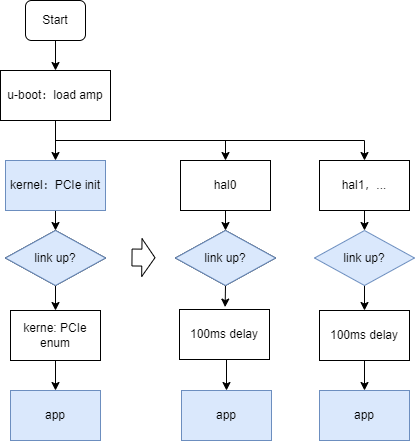
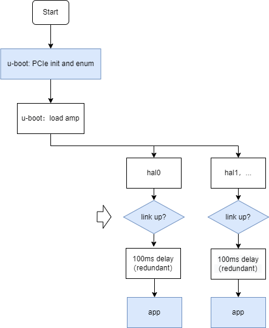

# Rockchip HAL PCIe User Guide {#Rockchip_User_Guide_HAL_PCIe}

Release Version: V1.0.0

Release Date: 2023-04-04

Security Level: □Top-Secret   □Secret   □Internal   ■Public

**DISCLAIMER**

THIS DOCUMENT IS PROVIDED “AS IS”. ROCKCHIP ELECTRONICS CO., LTD.(“ROCKCHIP”)DOES NOT PROVIDE ANY WARRANTY OF ANY KIND, EXPRESSED, IMPLIED OR OTHERWISE, WITH RESPECT TO THE ACCURACY, RELIABILITY, COMPLETENESS,MERCHANTABILITY, FITNESS FOR ANY PARTICULAR PURPOSE OR NON-INFRINGEMENT OF ANY REPRESENTATION, INFORMATION AND CONTENT IN THIS DOCUMENT. THIS DOCUMENT IS FOR REFERENCE ONLY. THIS DOCUMENT MAY BE UPDATED OR CHANGED WITHOUT ANY NOTICE AT ANY TIME DUE TO THE UPGRADES OF THE PRODUCT OR ANY OTHER REASONS.

**Trademark Statement**

"Rockchip", "瑞芯微", "瑞芯" shall be Rockchip’s registered trademarks and owned by Rockchip. All the other trademarks or registered trademarks mentioned in this document shall be owned by their respective owners.

**All rights reserved. ©2023. Rockchip Electronics Co., Ltd.**

Beyond the scope of fair use, neither any entity nor individual shall extract, copy, or distribute this document in any form in whole or in part without the written approval of Rockchip.

Rockchip Electronics Co., Ltd.

No.18 Building, A District, No.89, software Boulevard Fuzhou, Fujian,PRC

Website:     [www.rock-chips.com](http://www.rock-chips.com)

Customer service Tel:  +86-4007-700-590

Customer service Fax:  +86-591-83951833

Customer service e-Mail:  [fae@rock-chips.com]

---

**Preface**

**Overview**

This article introduces the instructions for using HAL PCIe. The HAL source code can be used in baremetal or RTOS system environments and only supports simple functional operations.

**Product Version**

| **Chipset** | **Kernel Version** |
| ----------- | ------------------ |
| RK2206      | FreeRTOS V10.0.1   |

**Intended Audience**

This document (this guide) is mainly intended for:

Technical support engineers

Software development engineers

---

**Revision History**

| **Version** | **Author** | **Date**   | **Change Description** |
| ----------- | ---------- | ---------- | ---------------------- |
| V1.0.0      | Jon Lin    | 2023-04-04 | Initial version        |

---

**目录**

[TOC]

---

## Introduction

Due to the lack of complete PCIe framework code under the bare metal or RTOS project, it is necessary to rely on the PCIe initialization and enumeration process under u-boot or Linux. Under bare metal or RTOS, only the following simple functions are supported:

- Access to controller registers
- CPU access to peripherals, mainly Bar and CFG spaces
- uDMA transfer
- INTx legacy interrupt

Refer to the detailed interface in the application note.

## Specification

### Booting Process

**PCIe Initialization Scheme with Kernel (Recommended)**



Explanation:

- The "100 ms delay" in the process is a redundant time waiting for the PCIe peripheral driver to load and can be replaced by a handshake protocol in the business code.
- Refer to the "Rockchip_Developer_Guide_PCIe_CN.pdf" document for kernel PCIe development, and important information such as bdf and bar mapping can be obtained using the lspci command.

**PCIe Initialization Scheme with u-boot**



- The "100 ms delay" in the process is a redundant time waiting for the PCIe peripheral driver to load. In fact, u-boot has completed this process, and the redundant delay can be manually deleted.
- Refer to the "Rockchip_Developer_Guide_UBoot_Nextdev_CN.pdf" document, PCIe chapter, for u-boot PCIe development, mainly involving:
    - Configuration instructions for "using PCIe before loading kernel dtb"
    - Pci cmd to obtain PCIe peripheral information, including important information such as bdf and bar mapping.

### Resource Allocation

In addition to CPU accessing Bar resources, other resources involved in PCIe usually involve competition. Therefore, when multiple systems share the same PCIe controller, resources should be allocated in advance:

| Resource                    | Explanation                                                  |
| --------------------------- | ------------------------------------------------------------ |
| CPU access to Bar resources | No competition, multi-core access by bus arbitration         |
| CPU access to CFG space     | Read does not involve competition, write involves consistency issues |
| uDMA                        | Supports 2 channels, independent between channels, but multi-core access to the same DMA channel involves competition |
| INTx                        | Involves competition                                         |
| Controller Registers        | Avoid simultaneous access as much as possible, and refine analysis according to actual situation |
| MSI                         | Only supported in kernel                                     |

## Application Note

### CPU Access to Peripheral CFG Space

Refer to the test_pcie.c code, mainly including the following interface usage:

- Mapping CFG space, "PCIe Initialization Scheme with u-boot" needs to add this processing. For example, enumerate device 01.00.00 in u-boot:

```c
#define TEST_DEVICE                 PCI_BDF(0x01, 0x00, 0x00)

index = HAL_PCIE_OutboundConfigCFG0(&g_pcieDev, TEST_DEVICE, 0x100000);
```

- Read and write CFG space, other interfaces refer to the hal_pch.h file:

```c
HAL_PCI_ReadConfigWord(cfg, PCI_VENDOR_ID, &vid);
HAL_PCI_ReadConfigWord(cfg, PCI_DEVICE_ID, &did);
```

### CPU Access to Peripheral Bar Space

Refer to the specification for obtaining peripheral information, and refer to the test_pcie.c code to complete Bar space CPU access by calling the following interfaces:

```c
memset_io()
memcpy_fromio()
memcpy_toio()
```

### uDMA Transfer

Refer to the PCIE_How_To_Use description in the doxygen comments in hal_pcie.c documentation and refer to the test_pcie.c example for actual usage.

### INTx Interrupt

Refer to the test_pcie.c code to register INTx interrupts, as follows:

```c
HAL_IRQ_HANDLER_SetIRQHandler(g_pcieDev.legacyIrqNum, PCIE_INTxIsr, NULL);
```

Explanation:

- In the AMP environment, the Linux system only enables MSI/MSI-X interrupts, so legacy interrupts can be used for allocation planning in the HAL environment:
    - Core A uses Linux with exclusive MSI/MSI-X interrupt
    - Core B uses HAL/RTOS, exclusive legacy INTx interrupt
    - Other Cores, no exclusive interrupt resources, can only be notified by CoreA/B
- Since INTX interrupts are level interrupts, the HAL legacy interrupt callback function needs to clear the interrupt. Usually, it clears the FPGA-triggered INTX level through the register mapped by Bar. Users need to implement interfaces according to the PCIe peripheral being docked.
- Since the HAL framework does not allocate INTX numbers to peripherals, the default value is used. Users need to allocate INTx interrupt numbers to peripherals according to actual applications.
